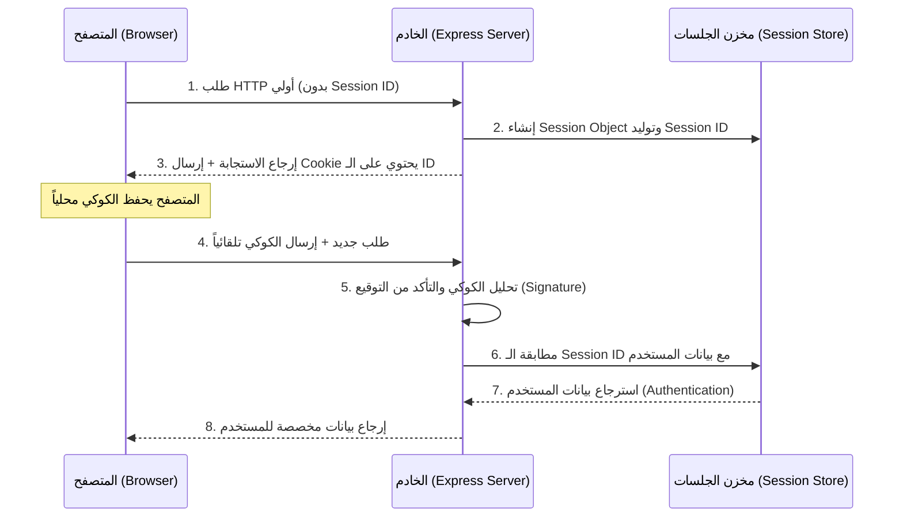

## إدارة الجلسات (Sessions) في إطار العمل Express.js

### المفاهيم الأساسية (Core Concepts)

#### 1. الجلسات (Sessions) وبروتوكول HTTP عديم الحالة (Stateless)
**التعريف:** 
الجلسات (Sessions) هي تقنية تمثل مدة بقاء المستخدم وتفاعله مع موقع الويب أو التطبيق.

**الفكرة الأساسية ولماذا نستخدمها؟**
بشكل افتراضي، يُعد بروتوكول HTTP بروتوكولاً "عديم الحالة" (Stateless). هذا يعني أن الخادم (Server) لا يعرف من يقوم بإرسال الطلبات إليه، ولا يمتلك ذاكرة لربط الطلبات المتتالية بنفس المستخدم. 
نستخدم الجلسات لتتبع هذه الطلبات ومعرفة مصدرها، وأحد أشهر الاستخدامات لذلك هو **إدارة مصادقة المستخدمين (User Authentication)** (مثل أنظمة تسجيل الدخول).

**كيف تعمل دورة حياة الجلسة؟**
1. عندما يرسل العميل (Web Browser) طلباً للخادم، يقوم الخادم بإنشاء كائن جلسة (Session Object) فريد وتوليد **مُعرّف جلسة (Session ID)**.
2. يُرجع الخادم استجابة (Response) تحتوي على تعليمات للمتصفح بحفظ ملف تعريف ارتباط (Cookie) يحتوي على هذا الـ Session ID.
3. في الطلبات اللاحقة (Subsequent requests)، يقوم المتصفح تلقائياً بإرسال هذا الكوكي إلى الخادم.
4. يقوم الخادم بتحليل (Parsing) الكوكي، واستخراج الـ Session ID، ثم التحقق من صحته، والبحث في سجلاته لمعرفة المستخدم المرتبط بهذه الجلسة (حيث يحتفظ الخادم بخريطة تربط كل Session ID بالمستخدم الخاص به)  .

**رسم توضيحي لدورة الجلسة (Session Flow Architecture):**


---

### إعداد مكتبة Express Session (Setup & Implementation)

للبدء في استخدام الجلسات، نعتمد على حزمة خارجية شهيرة تُسمى `express-session`.

#### `‏` Step 1: التثبيت (Installation)
في موجه الأوامر (Terminal) الخاص بالمشروع، نقوم بتثبيت الحزمة:
```bash
npm i express-session
```

#### `‏` Step 2: الاستيراد والتسجيل كـ Middleware
تعمل هذه المكتبة كبرمجية وسيطة (Middleware function). يجب استيرادها في الملف الرئيسي (مثل `index.mjs`) وتسجيلها باستخدام `()app.use`.

> `‏` **Important Note**
> **ترتيب التسجيل (Registration Order):**
> يجب التأكد من استدعاء `app.use(session(...))` **قبل** تسجيل أي مسارات (Routes) في تطبيقك. إذا قمت بتسجيلها بعد المسارات، فلن يتم تطبيق الجلسات على تلك المسارات ولن تتمكن من تتبع المستخدمين .

#### `‏` Step 3: ضبط إعدادات الجلسة (Configuration Options)

تتطلب الدالة `session()` تمرير كائن إعدادات (Configuration Object). 
إليك شرح لأهم الخصائص :

|         الخاصية         |                                                  الشرح والاستخدام (Explanation & Usage)                                                  |
| :---------------------: | :--------------------------------------------------------------------------------------------------------------------------------------: |
|      **`secret`**       |                                     عبارة عن نص (String) يُستخدم لتوقيع (Sign) الكوكي الخاص بالجلسة.                                     |
| **`saveUninitialized`** |           قيمة منطقية (Boolean). تحدد ما إذا كان يجب حفظ الجلسات "غير المُهيأة" (التي لم يتم تعديل بياناتها) في مخزن الجلسات.            |
|      **`resave`**       | قيمة منطقية (Boolean). تُجبر الخادم على إعادة حفظ الجلسة في مخزن الجلسات حتى لو لم يطرأ عليها أي تعديل (يُنصح بتعيينها `false` حالياً) . |
|      **`cookie`**       |                            كائن (Object) للتحكم بخصائص ملف الارتباط، مثل `maxAge` لتحديد مدة صلاحية الجلسة .                             |

> `‏` **Important Note**
> **خطورة الـ Secret:** 
> في بيئة الإنتاج الحقيقية، يجب أن يكون الـ `secret` معقداً وصعب التخمين (مثل كلمات المرور). إذا كان ضعيفاً، يمكن للمخترقين استخدامه لفك تشفير (Decode) الكوكيز الموقعة.

> `‏`  **Important Note**
> **حفظ الذاكرة (Memory Optimization):**
> يُنصح بشدة بتعيين `saveUninitialized: false`. إذا تم تعيينها `true`، فإن أي زائر يفتح موقعك (حتى لو لم يسجل دخوله أو يفعل أي شيء) سيتم حفظ كائن جلسة فارغ له في الخادم. هذا سيؤدي إلى استهلاك هائل للذاكرة (Memory) بلا أي فائدة .

#### الكود العملي للإعداد (Code Implementation):

```javascript
// استيراد الحزمة
import session from 'express-session';

// تسجيل البرمجية الوسيطة وضبط الإعدادات (قبل المسارات)
app.use(session({
    // 1. المفتاح السري لتوقيع الكوكي
    secret: 'my_super_secret_key_in_dev', 
    
    // 2. منع حفظ الجلسات الفارغة لتوفير الذاكرة
    saveUninitialized: false, 
    
    // 3. عدم إجبار الحفظ التلقائي إذا لم تتغير الجلسة
    resave: false, 
    
    // 4. إعدادات الكوكي
    cookie: {
        // تحديد مدة الصلاحية (بالمللي ثانية)
        // 60,000 مللي ثانية = 60 ثانية (دقيقة واحدة) * 60 = 1 ساعة
        maxAge: 60000 * 60 
    }
}));
```
شرح المدة `maxAge`: بمجرد انتهاء هذه المدة، يصبح الكوكي منتهي الصلاحية (Expired) وغير صالح. عندما يرسله العميل مجدداً، سيرى الخادم أنه غير صالح وسيعتبر المستخدم غير مسجل الدخول.

---

### تتبع المستخدمين وتعديل كائن الجلسة (Session Tracking & Modification)

#### المشكلة: توليد معرفات متكررة (Regeneration Issue)
إذا قمت بتشغيل الخادم الآن وطبعت `request.session.id` عند كل طلب، ستلاحظ أن الخادم يقوم بتوليد Session ID جديد كلياً مع كل طلب ترسله! هذا السلوك يمنعنا من تتبع المستخدم .

**لماذا يحدث هذا؟**
لأن كائن الجلسة (Session Object) لم يتم تعديله (Not Modified). وبما أننا وضعنا `saveUninitialized: false`، فإن الخادم يرفض حفظ هذه الجلسة الفارغة، وبالتالي ينسى العميل ويولد جلسة جديدة في الطلب التالي .

#### الحل: تعديل بيانات الجلسة (Modifying Session Data)
لكي يقوم الخادم بإنشاء الكوكي وإرساله للعميل، ثم حفظ الجلسة في مخزن الجلسات، **يجب عليك إضافة بيانات ديناميكية (Dynamic Properties)** إلى كائن الجلسة .

```javascript
app.get('/', (request, response) => {
    
    // تعديل كائن الجلسة بإضافة خاصية جديدة (مثلاً: visited)
    // هذا التعديل سيجعل الخادم يحفظ الجلسة ويُرسل الكوكي للعميل
    request.session.visited = true; 
    
    response.send('Session Modified and Cookie Set');
});
```

**كيف يتغير السلوك الآن؟**
1. عند زيارة المسار `/`، يتم إضافة `visited: true` لكائن الجلسة.
2. تقوم مكتبة Express Session بضبط الكوكي وإرساله للعميل (المتصفح أو Thunder Client).
3. العميل يحفظ الكوكي.
4. إذا ذهبت الآن إلى مسار آخر (مثلاً `/api/users`)، سيقوم العميل بإرسال الكوكي.
5. سيمر الطلب عبر البرمجية الوسيطة للجلسة، وسيتأكد الخادم من صحة الكوكي وأنه غير منتهي الصلاحية.
6. سيقوم الخادم بمطابقة الـ Session ID، ولن يُولد ID جديد. بدلاً من ذلك، ستقوم `request.session` بإرجاع نفس الكائن القديم محتوياً على `visited: true` .

هكذا تماماً يتم بناء أنظمة المصادقة؛ حيث يتم حفظ بيانات المستخدم (مثل رقمه التعريفي) داخل `request.session` عند تسجيل الدخول الناجح. 

> `‏` **Important Note**
> **تشريح كائن الكوكي:**
> عند فحص الكوكي المستلم في المتصفح أو (Thunder Client)، ستجد أن قيمة الـ Session ID تبدأ بعد أول 4 أحرف (والتي تكون عادة `s%3A` لتدل على أنه Signed) وتستمر حتى أول نقطة (`.`). ما يتبقى بعد النقطة هو "التوقيع" (Signature) الخاص بالكوكي .

---

### مخزن الجلسات (Session Store) والمشكلة المعمارية

**التعريف:** 
هو المكان (Data Structure) الذي يقوم الخادم بحفظ بيانات الجلسات فيه لكي يسترجعها لاحقاً ويطابقها مع الكوكيز القادمة .

#### المشكلة: التخزين في الذاكرة (In-Memory Store)
بشكل افتراضي، تستخدم مكتبة `express-session` الذاكرة المؤقتة (Memory) للخادم كمخزن للجلسات.

**العيوب:**
*   **متطاير (Volatile):** إذا توقف الخادم عن العمل، أو قمت بإعادة تشغيله (مثلاً عبر Nodemon أثناء التطوير)، سيتم مسح الذاكرة بالكامل (Wiped out). هذا يعني فقدان كل بيانات الجلسات المحفوظة، وسيطالب جميع المستخدمين بتسجيل الدخول مرة أخرى وإنشاء جلسات جديدة .

**الحل المستقبلي:**
في التطبيقات الحقيقية، يجب استبدال مخزن الذاكرة بمخزن يعتمد على قاعدة بيانات حقيقية (Persistent Data Store) مثل MongoDB أو Redis، لضمان استعادة الجلسات حتى لو توقف الخادم.

#### كيفية فحص مخزن الجلسات برمجياً:
لإثبات أن الجلسات محفوظة فعلاً في هيكل بيانات داخل الخادم، يمكنك استخدام دالة `get` الخاصة بمخزن الجلسات `request.sessionStore.get()` وتمرير الـ Session ID إليها:

```javascript
app.get('/api/users', (request, response) => {
    
    // استدعاء دالة get من كائن sessionStore
    // المعامل الأول: الـ Session ID الحالي
    // المعامل الثاني: دالة Callback لاستقبال النتيجة أو الخطأ
    request.sessionStore.get(request.session.id, (error, sessionData) => {
        
        // رمي خطأ في حال حدوث مشكلة أثناء الجلب
        if (error) throw error; 
        
        // طباعة البيانات المحفوظة فعلياً في الذاكرة لهذا الـ ID
        console.log(sessionData); 
    });
    
    response.send('Check server console for session data');
});
```
*النتيجة:* سيطبع الخادم كائن الجلسة الذي يتضمن إعدادات الكوكي والخصائص الديناميكية (مثل `visited: true`)، مما يؤكد أن البيانات تُحفظ وتُسترجع من الذاكرة بنجاح .