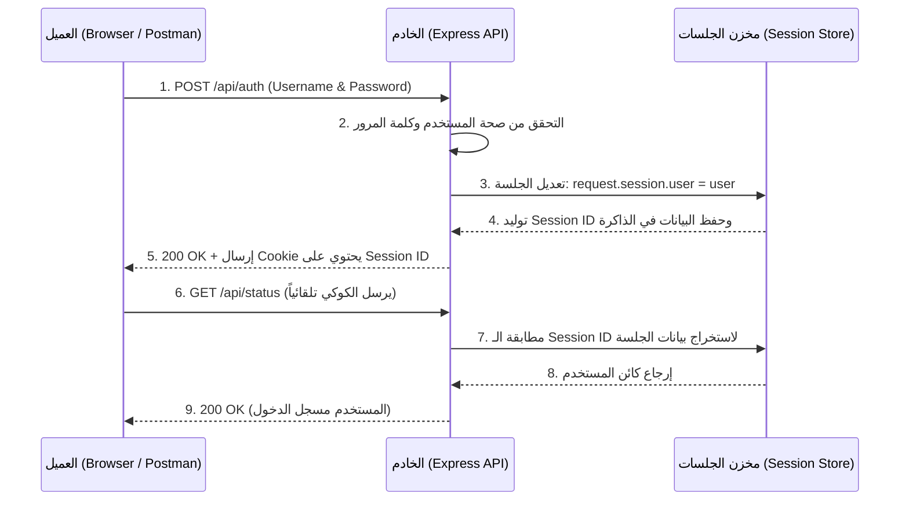

## المصادقة وإدارة الجلسات المتقدمة (Advanced Sessions & Authentication) في Express.js

### المفاهيم الأساسية (Core Concepts)

#### 1. نظام المصادقة المبني على الجلسات (Session-based Authentication)
**التعريف:** 
هو نمط هندسي يُستخدم للتحقق من هوية المستخدمين (Authentication) وتتبع حالتهم عبر طلبات HTTP المتعاقبة باستخدام "مُعرّف الجلسة" (Session ID) المخزن في ملف تعريف الارتباط (Cookie).

**الفكرة الأساسية وكيف تعمل؟**
الهدف الرئيسي من هذا النظام هو إنشاء خريطة (Mapping) تربط بين "مُعرّف جلسة" (Session ID) واحد وبين مستخدم حقيقي (Realistic User) موجود في قاعدة بيانات التطبيق. 
عندما يقوم المستخدم بإرسال بيانات اعتماده (Credentials) الصحيحة، يقوم الخادم بتعديل كائن الجلسة (Session Object) الخاص به. هذا التعديل يوجه مكتبة `express-session` لتوليد مُعرّف جلسة فريد، ووضعه داخل كوكي، وإرساله لمتصفح العميل ليتم استخدامه في جميع الطلبات المستقبلية .

**لماذا نستخدمه؟**
للسماح للمستخدم بتسجيل الدخول مرة واحدة فقط، ثم تصفح المسارات المحمية (Protected Routes) وإضافة عناصر إلى سلة المشتريات دون الحاجة لإدخال كلمة المرور في كل طلب.

> `‏` **Important Note**
> **تحذير أمني حول كلمات المرور:**
> في هذا التطبيق التعليمي، تتم مقارنة كلمات المرور كنصوص خام (Raw Passwords). في بيئة العمل الحقيقية، يُعد هذا خطأً أمنياً فادحاً. يجب دائماً استخدام خوارزميات التشفير (Hashing) لتشفير كلمات المرور قبل حفظها في قاعدة البيانات ومقارنتها.

---

### هندسة دورة حياة المصادقة (Authentication Lifecycle Architecture)

الرسم التوضيحي التالي يشرح مسار الاتصال عند تسجيل الدخول والتحقق من الحالة:



---

### التطبيق العملي 1: بناء مسار تسجيل الدخول (Login Route)

لبناء نظام المصادقة، نحتاج إلى إنشاء  (Endpoint) تستقبل بيانات المستخدم وتتحقق منها.

#### الخطوات البرمجية (Steps)

`‏` **Step 1: إعداد المسار واستخراج البيانات**
إنشاء مسار POST `/api/auth` واستخراج `username` و `password` من جسم الطلب (`request.body`). 

`‏`**Step 2: البحث عن المستخدم (User Lookup)** 
استخدام دالة `()find` للبحث في المصفوفة الوهمية `mockUsers` عن المستخدم الذي يتطابق اسمه مع الاسم المُرسل في الطلب . الدالة الممررة لـ `find` تُسمى دالة شرطية (Predicate Function).

`‏`**Step 3: التحقق من البيانات (Verification)**
التحقق مما إذا كان المستخدم غير موجود (`undefined`) أو إذا كانت كلمة المرور لا تتطابق. في كلتا الحالتين نرجع كود الحالة `401` (Unauthenticated - غير مصادق عليه) مع رسالة خطأ .

`‏` **Step 4: تعديل الجلسة (Modifying the Session)**
وهي الخطوة الأهم! نقوم بإضافة خاصية ديناميكية (Dynamic Property) اسمها `user` إلى كائن `request.session` ونسند إليها بيانات المستخدم الذي تم العثور عليه. هذا الإجراء هو ما يجعل الخادم يُنشئ الكوكي ويحفظ الجلسة.

#### الشرح التفصيلي للكود (Code Block)

```javascript
// استيراد مصفوفة المستخدمين الوهمية
import { mockUsers } from './utils/constants.mjs';

// Step 1: تعريف مسار المصادقة (بدون Middleware للتحقق من الصحة للتبسيط)
app.post('/api/auth', (request, response) => {
    
    // استخراج اسم المستخدم وكلمة المرور من جسم الطلب
    const { username, password } = request.body; //
    
    // Step 2: البحث عن المستخدم باستخدام Predicate Function
    const findUser = mockUsers.find(user => user.username === username); //
    
    // Step 3: التحقق من وجود المستخدم وصحة كلمة المرور
    if (!findUser || findUser.password !== password) {
        // إرجاع 401 في حال الفشل (Bad Credentials)
        return response.status(401).send({ message: 'Bad Credentials' }); //
    }
    
    // Step 4: جوهر المصادقة - تعديل كائن الجلسة
    // إرفاق كائن المستخدم بالكامل داخل كائن الجلسة الخاص بالطلب
    // هذا سيخبر express-session بضرورة حفظ الجلسة وتوليد Cookie
    request.session.user = findUser; //
    
    // إرجاع استجابة بنجاح العملية مع بيانات المستخدم
    return response.status(200).send(findUser); //
});
```

> `‏` **Important Note**
> **التحقق من صحة المدخلات (Data Validation):**
> يشدد المحاضر على أنه تخطى خطوة التحقق من صحة جسم الطلب (Request Body Validation) في هذا المثال لتبسيط الشرح فقط، ولكنه يوصي بشدة بالقيام بذلك في أي تطبيق حقيقي باستخدام مكتبات مثل `express-validator` للتأكد من وجود حقلي `username` و `password` وصيغتهما.

---

### التطبيق العملي 2: التحقق من حالة المصادقة (Status Route)

بعد تسجيل الدخول، نحتاج إلى مسار يسمح للعميل بالتحقق مما إذا كانت جلسته لا تزال صالحة ومفتوحة.

```javascript
// تعريف مسار GET للتحقق من الحالة
app.get('/api/status', (request, response) => {
    
    // التحقق مما إذا كانت خاصية user مُعرفة داخل كائن الجلسة
    // يعتمد هذا على الكوكي المُرسل من العميل، والذي سيقوم الخادم بتحليله لربطه بالجلسة
    if (request.session.user) {
        // إذا كان المستخدم مصادقاً عليه، نُرجع كود 200 وبياناته
        return response.status(200).send(request.session.user); //
    }
    
    // إذا لم تكن الجلسة صالحة (أو لم يرسل العميل الكوكي)
    return response.status(401).send({ message: 'Not authenticated' }); //
});
```

> `‏` **Important Note**
> **تأثير حذف ملفات الارتباط (Clearing Cookies):**
> إذا قمت بحذف الكوكي يدوياً من المتصفح أو أداة الاختبار (مثل Thunder Client)، ثم حاولت الوصول إلى مسار `/api/status`، سيقوم الخادم بإرجاع `401 Unauthorized`. 
> **السبب:** الخادم استلم الطلب بدون الكوكي الصالح، وبالتالي لم يتمكن من إجراء المطابقة (Mapping) بين الطلب وبين أي بيانات جلسة محفوظة في مخزن الجلسات (Session Store).

---

### مخزن الجلسات (Session Store) والتحقق الداخلي

لإثبات أن الجلسات لا تعمل كالسحر بل تعتمد على تخزين فعلي في الذاكرة، سنقوم باستدعاء دالة داخلية من مخزن الجلسات لجلب البيانات المحفوظة وطباعتها في سطر الأوامر (Console) .

```javascript
// فحص ما يوجد داخل مخزن الجلسات في الذاكرة (In-Memory Store)
// نمرر مُعرّف الجلسة الحالي (Session ID) ودالة رد نداء (Callback)
request.sessionStore.get(request.session.id, (error, sessionData) => {
    if (error) throw error;
    
    // سيطبع هذا الكائن في الـ Console، وسيحتوي على خاصيتين أساسيتين:
    // 1. cookie: معلومات حول الكوكي (تاريخ الانتهاء، إلخ)
    // 2. user: كائن المستخدم الذي قمنا بإرفاقه في مسار تسجيل الدخول
    console.log(sessionData); //
});
```

---

### إدارة الجلسات المتعددة (Managing Multiple Sessions)

ال framework لديه القدرة علي إدارة جلسات منفصلة لمستخدمين مختلفين في نفس الوقت عبر استخدام عميلين (Clients) مختلفين لإرسال الطلبات:

|        وجه المقارنة        |                                           العميل الأول (Thunder Client)                                           |  العميل الثاني (Postman)   |
| :------------------------: | :---------------------------------------------------------------------------------------------------------------: | :------------------------: |
|    **المستخدم المسجل**     |                                                       Anson                                                       |            Jack            |
|  **كلمة المرور المُرسلة**  |                                                    `hello123`                                                     |         `hello124`         |
|   **حالة ملف الارتباط**    |                                             يحصل على Cookie خاص ومميز                                             | يحصل على Cookie آخر تماماً |
| **نتيجة مسار /api/status** |                                            يُرجع بيانات المستخدم Anson                                            | يُرجع بيانات المستخدم Jack |
|    **حالة مخزن الخادم**    | الخادم يحتفظ بكلا الجلستين في الذاكرة، ويقوم بالمطابقة (Mapping) بدقة متناهية لكل طلب بناءً على الكوكي المرفق به. |                            |

---

### التطبيق العملي 3: بناء نظام سلة المشتريات (Virtual Cart System)

بعد إثبات نجاح المصادقة، سننتقل لتطبيق عملي متقدم: كيف نستخدم الجلسات لحفظ بيانات ديناميكية خاصة بكل مستخدم، مثل سلة المشتريات (Cart).

#### 1. مسار إضافة عناصر للسلة (POST /api/cart)

```javascript
app.post('/api/cart', (request, response) => {
    
    // 1. التحقق من المصادقة: يمنع إضافة عناصر إذا لم يكن المستخدم مسجلاً
    if (!request.session.user) {
        return response.sendStatus(401); //
    }
    
    // 2. استخراج بيانات العنصر من جسم الطلب وإعادة تسمية المتغير إلى item
    const { body: item } = request; // يحتوي على name و price
    
    // 3. استخراج السلة الحالية من الجلسة (إن وُجدت)
    const { cart } = request.session; //
    
    // 4. منطق إضافة العنصر للسلة
    if (cart) {
        // إذا كانت السلة موجودة مسبقاً، أضف العنصر الجديد إليها
        cart.push(item); //
    } else {
        // إذا لم تكن موجودة، قم بإنشائها كمصفوفة وضع العنصر كأول قيمة
        request.session.cart = [item]; //
    }
    
    // إرجاع كود 201 (تم الإنشاء) وبيانات العنصر
    return response.status(201).send(item); //
});
```

#### 2. مسار جلب محتويات السلة (GET /api/cart)

```javascript
app.get('/api/cart', (request, response) => {
    
    // 1. التحقق من المصادقة
    if (!request.session.user) {
        return response.sendStatus(401); //
    }
    
    // 2. إرجاع السلة أو مصفوفة فارغة
    // نستخدم المشغل (??) Nullish Coalescing Operator 
    // والذي يعني: إذا كان الطرف الأيسر undefined أو null، قم بإرجاع الطرف الأيمن (المصفوفة الفارغة)
    return response.send(request.session.cart ?? []); //
});
```

#### ملاحظات هامة على التطبيق العملي:
*   **استقلالية البيانات (Data Isolation):** عندما قام المستخدم (Anson) بإضافة عناصر مثل (Orange و Gatorade) إلى سلته، ظهرت في مسار الجلب الخاص به. وعندما قام المستخدم (Jack) بطلب مسار سلته، وجدها فارغة، ثم أضاف عنصر (Broccoli).
*   هذا يثبت أن **كل جلسة ترتبط بمستخدمها الخاص، وترتبط بسلة المشتريات الافتراضية الخاصة به فقط**، وأي بيانات أخرى نريد إضافتها مستقبلاً يمكن ربطها بكائن الجلسة بنفس السهولة.