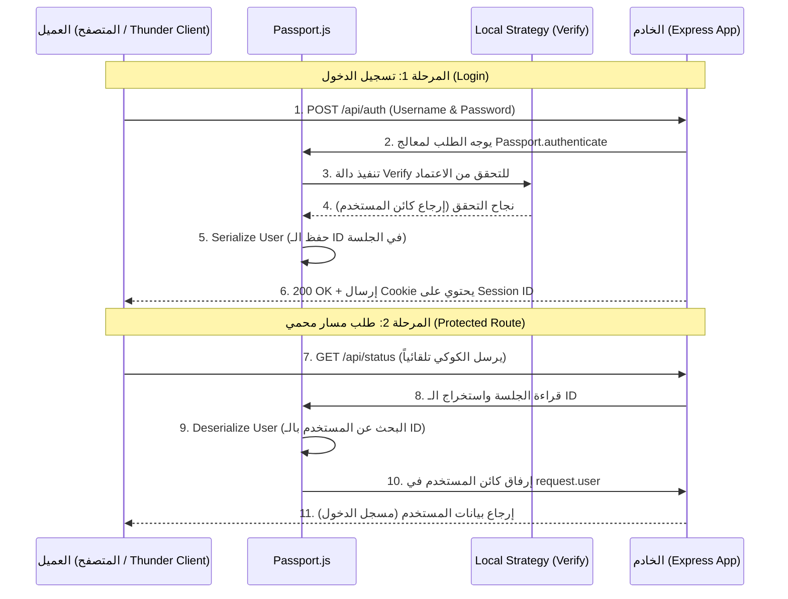

## الـAuthentiacation وإدارة الهوية باستخدام (Passport.js) في إطار العمل Express.js

### المفاهيم الأساسية (Core Concepts)

#### 1. مكتبة Passport.js
**التعريف:** هي برمجية وسيطة (Middleware) شائعة جداً في بيئة Node.js تُستخدم لإدارة عمليات الAuthentiacationوالتحقق من هوية المستخدمين بسهولة ومرونة فائقة .
**لماذا نستخدمها؟** بدلاً من كتابة منطق الAuthentiacationوالتحقق من كلمات المرور وإدارة الجلسات يدوياً من الصفر، توفر هذه المكتبة إطاراً موحداً وآمناً للقيام بذلك.
**علاقتها بالجلسات:** تتكامل Passport بشكل مثالي مع مكتبة `express-session`، حيث تتولى Passport مهمة ربط المستخدم الذي قام بتسجيل الدخول بـ "مُعرّف الجلسة" (Session ID) بشكل تلقائي.

#### 2. الإستراتيجية المحلية (Local Strategy)
**التعريف:** هي آلية Authentiacationتعتمد على التحقق من بيانات الاعتماد (Credentials) كاسم المستخدم وكلمة المرور المحفوظة في قاعدة البيانات (Database) الخاصة بالتطبيق (أو مصفوفة البيانات كما في حالتنا).
**بماذا تختلف؟** الإستراتيجية المحلية تختلف عن إستراتيجيات الطرف الثالث (Third-party Providers) مثل بروتوكول **OAuth2** الذي يسمح بتسجيل الدخول عبر منصات خارجية (مثل Google, Facebook, Discord, Twitter).

#### 3. التسلسل وإلغاء التسلسل (Serialization & Deserialization)
*   **تسلسل المستخدم (Serialize User):** هي العملية التي تُخبر Passport بكيفية تخزين بيانات المستخدم داخل كائن الجلسة (Session Data) بعد نجاح الAuthentiacationالأولية.
*   **إلغاء التسلسل (Deserialize User):** هي العملية العكسية. تأخذ المُعرّف المخزن في الجلسة، وتقوم بالبحث عن المستخدم الكامل في قاعدة البيانات، ثم ترفق بياناته داخل كائن الطلب `request.user` ليكون متاحاً للاستخدام في المسارات الأخرى.

> `‏` **Important Note**
> **تحذير أمني وتنويه هام:**
> في هذا الشرح، تتم مقارنة كلمات المرور كنصوص مكشوفة (Raw Passwords). في بيئات العمل الحقيقية، هذا الإجراء يُعد خطأً فادحاً. يجب دائماً استخدام تقنيات التشفير (Hashing) لتشفير كلمات المرور قبل حفظها ومقارنتها.

---

### هندسة دورة حياة الAuthentiacationباستخدام Passport.js

الرسم التوضيحي التالي يشرح التسلسل الزمني لتدفق البيانات أثناء عملية تسجيل الدخول وبعدها:



---

### الإعداد والتثبيت (Setup & Installation)

#### `‏` Step 1: تثبيت الحزم المطلوبة
يجب تثبيت مكتبة Passport بالإضافة إلى حزمة الإستراتيجية المحلية :
```bash
npm i passport passport-local
```

#### `‏` Step 2: تهيئة Passport في الملف الرئيسي
في ملف التطبيق الرئيسي (مثل `index.mjs`)، يجب استيراد المكتبة وتهيئتها (Initialize) كبرمجيات وسيطة.

> `‏` **Important Note**
> **ترتيب التسجيل (Order of Operations):**
> يجب تسجيل برمجيات Passport الوسيطة **بعد** تهيئة `express-session`، و **قبل** تسجيل مسارات التطبيق (Routes) لضمان عملها بشكل سليم .

```javascript
// استيراد المكتبة
import passport from 'passport';

// ... (إعدادات express-session السابقة) ...

// تهيئة المكتبة وربطها بالتطبيق
app.use(passport.initialize()); //
// تمكين تكامل Passport مع الجلسات
app.use(passport.session()); //
```

---

### بناء إستراتيجية الAuthentiacation(Building the Local Strategy)

نقوم بإنشاء مجلد باسم `strategies` وداخله ملف `local-strategy.mjs` لنعزل فيه منطق الAuthentiacation.

#### الخطوة الأولى: تعريف دالة التحقق (Verify Function)
هذه الدالة مسؤولة عن التحقق الفعلي: هل المستخدم موجود؟ هل كلمة المرور صحيحة؟.

```javascript
// ملف: strategies/local-strategy.mjs
import passport from 'passport';
import { Strategy } from 'passport-local'; // استيراد كلاس الاستراتيجية
import { mockUsers } from '../utils/constants.mjs'; // استيراد البيانات الوهمية

// إخبار Passport باستخدام هذه الاستراتيجية المحددة
export default passport.use(
    // إنشاء مثيل (Instance) جديد من استراتيجية الAuthentiacationالمحلية
    new Strategy((username, password, done) => {
        // تعمل هذه الدالة (Verify Function) عند استقبال طلب تسجيل الدخول
        // Passport يستخرج username و password تلقائياً من جسم الطلب ويمررهما هنا
        
        try {
            // 1. البحث عن المستخدم في المصفوفة
            const findUser = mockUsers.find(user => user.username === username); //
            
            if (!findUser) {
                // إذا لم يُعثر على المستخدم، نرمي خطأ
                throw new Error('User not found'); //
            }
            
            // 2. التحقق من مطابقة كلمة المرور
            if (findUser.password !== password) {
                // إذا كانت خاطئة، نرمي خطأ
                throw new Error('Invalid credentials'); //
            }
            
            // 3. حالة النجاح المطلق
            // المعامل الأول هو كائن الخطأ (نمرر null لعدم وجود أخطاء)
            // المعامل الثاني هو كائن المستخدم الذي تم التحقق منه
            done(null, findUser); //
            
        } catch (err) {
            // حالة الفشل
            // نمرر كائن الخطأ، ونمرر null لكائن المستخدم لأنه لم ينجح
            done(err, null); //
        }
    })
);
```

#### تخصيص أسماء الحقول (Options Configuration)
إذا كان تطبيقك يستخدم البريد الإلكتروني (Email) لتسجيل الدخول بدلاً من كلمة "username"، أو إذا كان حقل اسم المستخدم مُسمى `user_name`، يجب إخبار Passport بذلك عبر تمرير كائن "الخيارات" (Options) كمعامل أول لكلاس `Strategy` .

```javascript
// تخصيص الحقل المستخدم للبحث
new Strategy({ usernameField: 'email' }, (email, password, done) => {
    // الآن سيقوم Passport بالبحث عن حقل "email" في جسم الطلب بدلاً من "username"
    // ...
})
```

---

### عمليات التسلسل وإلغاء التسلسل (Serialization & Deserialization)

لتتمكن Passport من التعامل مع الجلسات بشكل صحيح وتجنب المشاكل المعمارية، يجب تنفيذ دالتين أساسيتين داخل ملف الاستراتيجية `local-strategy.mjs`.

#### 1. دالة التسلسل (Serialize User)
وظيفتها: تحديد **ما هي البيانات** التي يجب حفظها في الجلسة عن هذا المستخدم بعد نجاح تسجيل الدخول.

```javascript
passport.serializeUser((user, done) => {
    // المعامل الأول: المستخدم الذي اجتاز دالة التحقق بنجاح
    // نمرر null للخطأ، ونمرر المُعرّف الفريد (ID) فقط ليتم حفظه في الجلسة
    done(null, user.id); //
});
```

#### 2. دالة إلغاء التسلسل (Deserialize User)
وظيفتها: أخذ المُعرّف المحفوظ من الجلسة (عند استلام طلب جديد)، والبحث عن المستخدم الكامل، وإرفاقه بالطلب.

```javascript
passport.deserializeUser((id, done) => {
    // المعامل الأول: الـ ID الذي قمنا بتمريره في دالة serializeUser
    try {
        // البحث الفعلي عن المستخدم باستخدام المُعرّف (ID)
        const findUser = mockUsers.find(user => user.id === id); //
        
        if (!findUser) throw new Error('User not found'); //
        
        // عند النجاح، سيقوم Passport بإرفاق هذا الكائن داخل request.user
        done(null, findUser); //
        
    } catch (err) {
        done(err, null); //
    }
});
```

#### جدول مقارنة: حفظ المستخدم كاملاً مقابل حفظ المُعرّف فقط

يناقش المحاضر سبب قيامنا بحفظ المُعرّف (ID) فقط في دالة `serializeUser` بدلاً من حفظ كائن المستخدم بالكامل (User Object) .

|             السمة              |                  تخزين المُعرّف فقط (ID) - المُوصى به                   |                                   تخزين كائن المستخدم كاملاً (Entire Object)                                   |
| :----------------------------: | :---------------------------------------------------------------------: | :------------------------------------------------------------------------------------------------------------: |
| **تحديث البيانات (Data Sync)** | يتزامن دائماً مع أحدث البيانات (لأنه يبحث في قاعدة البيانات في كل طلب). | مُعرض لخطر البيانات القديمة (Stale Data). إذا تغير الاسم في قاعدة البيانات، ستبقى الجلسة محتفظة بالاسم القديم. |
|  **استهلاك الذاكرة (Memory)**  |                        خفيف جداً ومثالي للأداء .                        |                            ثقيل ويؤدي إلى ازدحام مخزن الجلسات ببيانات لا حاجة لها.                             |

---

### إنشاء نقاط النهاية للAuthentiacation(Authentication Endpoints)

#### 1. مسار تسجيل الدخول (Login Route)
نستخدم البرمجية الوسيطة `passport.authenticate('local')` لحماية هذا المسار. كلمة `'local'` تشير إلى اسم الاستراتيجية التي نستخدمها .

```javascript
// ملف: index.mjs
// استيراد ملف الاستراتيجية لضمان عملها
import './strategies/local-strategy.mjs'; //

// مسار تسجيل الدخول
app.post('/api/auth', passport.authenticate('local'), (request, response) => {
    // إذا وصل الطلب إلى هنا، فهذا يعني أن دالة Verify نجحت وأن Passport قام بAuthentiacationالمستخدم
    // نُرسل رد بنجاح العملية (200)
    response.sendStatus(200); //
});
```
*مسار العمل:* العميل يرسل POST يحتوي على `{ "username": "...", "password": "..." }` -> Passport يحللها -> ينفذ Verify -> ينفذ Serialize -> يرجع الاستجابة.

#### 2. مسار فحص الحالة (Status Route)
كيف نتحقق من أن المستخدم مسجل الدخول فعلاً؟ نستخدم الكائن الديناميكي `request.user` الذي يتم توليده بواسطة دالة `deserializeUser` .

```javascript
// مسار محمي لفحص حالة المصادقة
app.get('/api/status', (request, response) => {
    // إذا كان request.user موجوداً، فالمستخدم مصادق عليه (Authenticated)
    // يمكننا إرجاع بياناته بأمان
    return request.user ? response.send(request.user) : response.sendStatus(401); //
});
```

#### 3. مسار تسجيل الخروج (Logout Route)
لتسجيل الخروج وتدمير الجلسة، توفر Passport دالة مدمجة تُسمى `logout` على كائن الطلب.

```javascript
// مسار تسجيل الخروج
app.post('/api/auth/logout', (request, response) => {
    
    // التحقق أولاً من أن المستخدم مسجل الدخول
    if (!request.user) return response.sendStatus(401); //
    
    // استدعاء دالة تسجيل الخروج
    request.logout((err) => { //
        // في حالة وجود خطأ أثناء تدمير الجلسة
        if (err) return response.sendStatus(400); //
        // في حالة النجاح
        response.sendStatus(200); //
    });
});
```

> `‏` **Important Note**
> **حالة ملفات الارتباط بعد تسجيل الخروج:**
> عند استدعاء `request.logout()`، يتم إلغاء وتدمير الجلسة من جهة الخادم (Server-side). حتى لو احتفظ متصفح العميل (Client) بملف الارتباط (Cookie) القديم وقام بإرساله مجدداً، سيرفضه الخادم فوراً ويُرجع حالة `401 Unauthorized` لأن الجلسة المرتبطة به لم تعد صالحة أو موجودة .