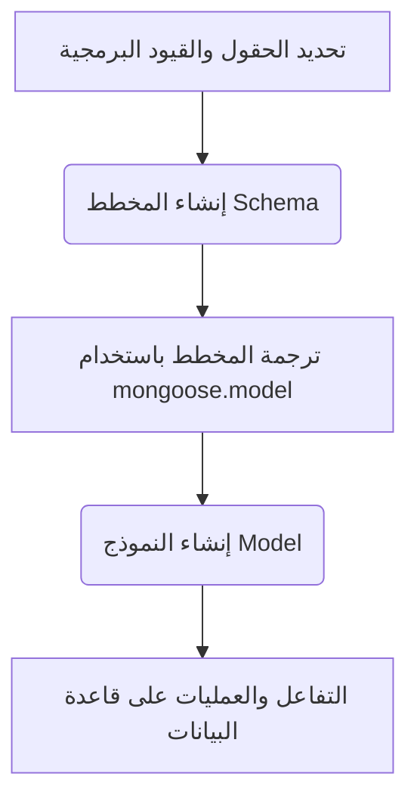
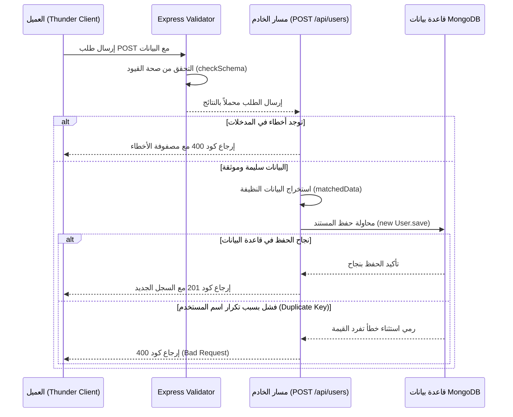

# مرجع دراسي احترافي: ربط تطبيقات Express.js بقواعد البيانات MongoDB باستخدام مكتبة Mongoose

يركز هذا الدرس على الانتقال العملي والمنهجي بتطبيقات **Express.js** من مرحلة استخدام الذاكرة العشوائية المؤقتة (In-Memory Arrays) لحفظ البيانات والـAuthentication ، إلى استخدام قاعدة بيانات حقيقية مستمرة وهي **MongoDB** بالاستعانة بطبقة التجريد (abstraction layer) البرمجية **Mongoose** .

---

### القسم الأول: بنيان وقيمة مكتبة Mongoose في هندسة البرمجيات

#### 1. تعريف مكتبة Mongoose
`‏` **Mongoose** هي مكتبة برمجية لبيئة **Node.js** تعمل كـ **ODM** (اختصار لـ **Object Document Mapper** - مخطط كائنات المستندات) . وهي بمثابة مترجم ينظم عملية تبادل البيانات وتشكيلها بين الكود البرمجي وقاعدة بيانات **MongoDB** .

#### 2. الفكرة الأساسية ولماذا نستخدمها؟
على الرغم من أن قاعدة بيانات **MongoDB** هي قاعدة بيانات غير رابطية (NoSQL) وتتميز بمرونة شكل الـستندات (Schemaless)، إلا أن بناء تطبيقات تجارية واقعية يتطلب هيكلة واضحة وآمنة للبيانات لمنع الفوضى البرمجية . تمنحنا **Mongoose** القدرة على فرض قيود وهياكل تنظيمية محددة على البيانات قبل دخولها لقاعدة البيانات، مما يجعل الكود البرمجية أكثر أماناً وأسهل في الصيانة.

**متى نستخدمها؟** 
تُستخدم في كافة المشاريع الحقيقية والواقعية (Realistic Projects) التي تعتمد على stack التقنيات **MERN** أو **Node.js/Express/MongoDB** لضمان سلامة البيانات وهيكلتها.

#### 3. مقارنة علمية: Mongoose مقابل MongoDB Driver الأساسي (Native Driver)

|        وجه المقارنة (Feature)         |                             مكتبة Mongoose (ODM)                             |                    مُشغّل MongoDB الأساسي (Native Driver)                    |
| :-----------------------------------: | :--------------------------------------------------------------------------: | :--------------------------------------------------------------------------: |
| **هيكلة البيانات (Data Structuring)** |   تُجبر البيانات على اتباع هيكل محدد وصارم لكل مستند (Document Structure).   |    مرنة بالكامل وبدون قيود هيكلية، مما قد يسمح بتخزين بيانات غير متناسقة.    |
|   **كتابة الاستعلامات (Querying)**    | توفر دوال مدمجة وعالية التجريد وسهلة الاستخدام (مثل `findOne` و `findById`). |      تتطلب كتابة استعلامات قاعدة بيانات خام ومعقدة في المشاريع الكبيرة.      |
|   **مستوى الأمان البرمجي (Safety)**   | آمنة جداً لبيئة العمل المشتركة وتمنع الأخطاء غير المقصودة في بنية البيانات.  | تعتمد بالكامل على دقة المطور أثناء الكتابة ولا تمنع الأخطاء الهيكلية ذاتياً. |
|        **الشعبية والاعتمادية**        |        شعبية جارفة وتتعدى **2 مليون تنزيل أسبوعياً** من مستودع الحزم.        |   تُستخدم غالباً في الحالات الخاصة التي تتطلب تحكماً منخفض المستوى للغاية.   |

---

### القسم الثاني: هندسة الاتصال بقاعدة البيانات (Database Connection Setup)

تعتمد عملية الاتصال بـ **MongoDB** عبر **Mongoose** على بروتوكول اتصال مخصص وصيغة اتصال تدعم استرجاع الوعود (Promises) لمعالجة البيانات بشكل غير متزامن.

#### خطوات تفعيل الاتصال برمجياً:

* `‏`   **Step 1:** التأكد من تثبيت قاعدة بيانات **MongoDB** وتشغيلها محلياً في الخلفية.
* `‏`  **Step 2:** تثبيت حزمة **Mongoose** عبر موجه الأوامر باستخدام الأمر `npm i mongoose`.
* `‏`  **Step 3:** استيراد المكتبة في ملف التطبيق الرئيسي وتحديد رابط المعرف الموحد للموارد (URI) .
* `‏`  **Step 4:** الاتصال باستخدام دالة `connect` ومعالجة الاستجابة أو الخطأ .

```javascript
// استيراد مكتبة Mongoose من حزمة المودولات الواردة
import mongoose from 'mongoose'; //

// استدعاء دالة الاتصال وتمرير رابط الـ URI
// mongodb: هو بروتوكول الاتصال لقاعدة البيانات
// localhost: هو اسم المضيف المحلي للخادم
// express_tutorial: هو الاسم المختار لقاعدة البيانات التي سيتم إنشاؤها تلقائياً
mongoose.connect('mongodb://localhost/express_tutorial') //
    .then(() => {
        // بما أن دالة connect تعود بـ Promise، نستخدم then لمعالجة النجاح
        console.log('Connected to database'); //
    })
    .catch((error) => {
        // التقاط أي فشل أو خطأ في الاتصال وطباعته لمعالجته
        console.log(`Error: ${error}`); //
    });
```

> `‏` **Important Note**
> **المنفذ الافتراضي لسيرفر MongoDB:**
> البورت الافتراضي للاتصال بقاعدة بيانات **MongoDB** هو `27017`. يقوم تطبيق **Mongoose** بالاتصال بهذا البورت افتراضياً دون الحاجة لتحديده في الرابط. ولكن، إذا كانت قاعدة البيانات الخاصة بك تعمل على بورت مخصص ومختلف، **يجب** عليك كتابته صراحة في الرابط لتجنب فشل الاتصال.

---

### القسم الثالث: المخططات (Schemas) والنماذج (Models)

في هندسة **Mongoose**، تنقسم دورة تمثيل البيانات إلى مرحلتين أساسيتين:



*   **المخطط (Schema):** هو القالب الإرشادي الذي يحدد شكل وسمات البيانات داخل المجموعة (Collection) في قاعدة البيانات.
*   **النموذج (Model):** هو الفئة (Class) التي تم تجميعها من المخطط، وهي التي تمنح المبرمج القدرة على إجراء عمليات الاستعلام والإنشاء والتعديل والحذف مباشرة على قاعدة البيانات.

#### التطبيق العملي: بناء المخطط وترجمته لنموذج المستخدم (`user.mjs`)

يُنصح بتنظيم مجلدات المشروع عبر إنشاء مجلد `mongo` وداخله مجلد فرعي `schemas` لعزل كود المخططات.

```javascript
// ملف: mongoose/schemas/user.mjs
import mongoose from 'mongoose'; //

// 1. إنشاء مخطط المستخدم الجديد وتحديد الحقول والقيود الهيكلية
const userSchema = new mongoose.Schema({
    // حقل اسم المستخدم مع إضافة قيود التحقق والأمان
    username: {
        // إجبار نوع البيانات ليكون نصاً باستخدام أنواع Mongoose المحددة
        type: mongoose.Schema.Types.String, //
        required: true, // القيمة إجبارية ولا يمكن إتمام الحفظ بدونها
        unique: true    // قيد تفرد القيمة؛ يمنع تكرار اسم المستخدم في قاعدة البيانات
    },
    // حقل الاسم المعروض
    displayName: {
        type: mongoose.Schema.Types.String, //
        required: true // حقل إجباري لتجنب البيانات الناقصة
    },
    // حقل كلمة المرور
    password: {
        type: mongoose.Schema.Types.String, //
        required: true
    }
});

// 2. ترجمة المخطط (Schema) إلى نموذج (Model)
// المعامل الأول: اسم النموذج المقترن بالمجموعة ('User')
// المعامل الثاني: المخطط الهيكلي المقترن به (userSchema)
const User = mongoose.model('User', userSchema); //

// تصدير النموذج ليتم استخدامه في طبقة المسارات
export default User; //
```

---

### القسم الرابع: مسار الإنشاء الآمن والتحقق من البيانات (POST Route & Validation)

يوضح هذا القسم عملية استقبال طلب إنشاء مستخدم جديد، وتمريره عبر نظام التحقق من البيانات **Express Validator**، ثم حفظه بأمان داخل قاعدة البيانات باستخدام دالة حفظ المستندات غير المتزامنة (`save`).

#### دورة تدفق بيانات التحقق والإنشاء:



#### الكود البرمجي للمسار بعد إعادة الهيكلة والتكامل:

```javascript
// ملف المسارات الرئيسي
import { Router } from 'express';
import { checkSchema, validationResult, matchedData } from 'express-validator';
import { createUserValidationSchema } from '../utils/validationSchemas.mjs'; // مخطط التحقق السابق
import User from '../mongoose/schemas/user.mjs'; // استيراد نموذج مستخدم Mongoose

const router = Router();

// تعريف مسار الإنشاء وجعله غير متزامن (async) للتعامل مع عمليات قاعدة البيانات
router.post('/api/users', checkSchema(createUserValidationSchema), async (request, response) => { //
    
    // 1. استخراج وفحص أخطاء التحقق القادمة من الـ Middleware
    const result = validationResult(request); //
    if (!result.isEmpty()) {
        // إذا احتوت مصفوفة الأخطاء على مشاكل، يتم قطع العملية وإرجاع حالة 400
        return response.status(400).send(result.array()); //
    }

    // 2. تصفية البيانات واستخراج الحقول الصالحة التي اجتازت الفحص فقط
    const data = matchedData(request); //

    // 3. محاولة الحفظ داخل قاعدة البيانات مع تفعيل آلية صيد الأخطاء (try/catch)
    try {
        // إنشاء نسخة جديدة (Instance) من النموذج وتمرير البيانات المصفاة إليه
        const newUser = new User(data); //
        
        // استدعاء دالة الحفظ غير المتزامنة مع استخدام معامل الأولوية والانتظار await
        const savedUser = await newUser.save(); //
        
        // إرجاع رمز النجاح للإنشاء 201 مع البيانات المحفوظة والـ Object ID الخاص بها
        return response.status(201).send(savedUser); //
        
    } catch (error) {
        // طباعة تفاصيل الخطأ في طرفية الخادم لتتبع المشاكل البرمجية
        console.log(error);
        
        // إرجاع حالة 400 (طلب سيء) والتي قد تنتج عن تعارض في قيد تفرد القيمة (Duplicate Key Error)
        return response.status(400).send({ message: "Bad Request. User might already exist." }); //
    }
});

export default router;
```

> `‏` **Important Note**
> **خطأ تعطل الخادم بسبب امتداد الملفات (The `.mjs` Extension Bug):**
> واجه المحاضر مشكلة أدت لتعطل تشغيل السيرفر بالكامل بسبب نسيان تغيير امتداد ملف المخطط إلى `mjs.` بدلاً من `js.` ليتوافق مع بيئة استيراد المودولات الحديثة (ES Modules). 
> **قاعدة ثابتة:** عند كتابة مسارات الاستيراد في بيئة ES Modules، يجب دائماً كتابة الامتداد صراحة مثل `import User from '../mongoose/schemas/user.mjs'` لتفادي أخطاء الـcompile وتوقف التطبيق.

---

### القسم الخامس: إعادة هيكلة نظام المصادقة (Passport.js Refactoring with MongoDB)

في هذا القسم، يتم تحديث نظام المصادقة والمطابقة المستمر لجلسات المستخدمين عبر إلغاء الاعتماد على مصفوفات الذاكرة المؤقتة، واستبدالها بالبحث الفعلي داخل مستندات قاعدة بيانات **MongoDB** .

#### 1. تحديث دالة التحقق المحلية (Verify Function inside Local Strategy)
بدلاً من استخدام الميثود التقليدي للمصفوفات `find`، نستخدم الدالة غير المتزامنة `findOne` للبحث عن Document يطابق حقل اسم المستخدم المرسل .

```javascript
// ملف: strategies/local-strategy.mjs
import passport from 'passport';
import { Strategy } from 'passport-local';
import User from '../mongoose/schemas/user.mjs'; // نموذج قاعدة البيانات

export default passport.use(
    // تحويل دالة التحقق لتصبح غير متزامنة (async) لتتمكن من استخدام await داخلها
    new Strategy(async (username, password, done) => {
        try {
            // الاستعلام من قاعدة البيانات عن مستند مستخدم يطابق اسم المستخدم المدخل
            const findUser = await User.findOne({ username: username }); //
            
            // في حال عدم العثور على أي مستند يطابق الاسم
            if (!findUser) {
                throw new Error('User not found'); //
            }
            
            // فحص ومطابقة كلمة المرور المكشوفة مع المخزنة
            if (findUser.password !== password) {
                throw new Error('Bad credentials'); //
            }
            
            // نجاح المطابقة وتمرير كائن المستخدم لخطوة التسلسل (Serialization)
            done(null, findUser); //
            
        } catch (err) {
            // التقاط الأخطاء وتمريرها للدالة لرفض تسجيل الدخول
            done(err, null); //
        }
    })
);
```

#### 2. تحديث دالة إلغاء التسلسل (Deserialization Refactoring)
عند استقبال العميل في طلبات لاحقة ومحاولة استخراج بياناته من ID الجلسة المخزن بالـ Cookie، نستخدم الدالة المتخصصة `findById` التي توفرها **Mongoose** للبحث عن IDs الكائنات الفريدة المصنعة من MongoDB (Object IDs).

```javascript
passport.serializeUser((user, done) => {
    // حفظ المعرّف الفريد للمستند فقط لتوفير مساحة الذاكرة للجلسات
    done(null, user.id); 
});

// تعديل الدالة لتصبح غير متزامنة
passport.deserializeUser(async (id, done) => { //
    try {
        // البحث عن مستخدم واحد بواسطة الـ ID الفريد المولّد تلقائياً من MongoDB
        const findUser = await User.findById(id); //
        
        if (!findUser) {
            throw new Error('User not found'); 
        }
        
        // تمرير المستند المسترجع بالكامل ليتم حقنه برمجياً داخل كائن الطلب request.user
        done(null, findUser); //
        
    } catch (err) {
        done(err, null); 
    }
});
```

> `‏` **Important Note**
> **الخطأ الكارثي لتعليق الطلبات أثناء تسجيل الدخول (The Hanging/Pending Request Bug):**
> واجه المحاضر خطأ فادحاً أدى إلى تجميد عملية الـAuthentication ودخول الطلب في حالة انتظار دائم (Infinite Processing State) عند اختباره في برنامج Postman.
> **السبب العلمي:** نسيان استدعاء دالة رد النداء `done(null, findUser)` داخل دالة إلغاء التسلسل `deserializeUser`. 
> **القاعدة الحتمية:** يجب دائماً إنهاء دوال معالجة الهوية و Passport باستدعاء دالة `done` في نهاية المسارات لتمرير التحكم للمحطة التالية في دورة حياة الطلب وإلا سيتعطل التطبيق.

---

### القسم السادس: تتبع الحالة وتأمين البيانات مستقبلاً

بمجرد نجاح عملية تسجيل الدخول، وتجاوز عقبة التحقق من الهوية بربطها بقاعدة البيانات، يمكننا استعلام حالة المستخدم عبر المسار المحمي `/api/status`.

```javascript
app.get('/api/status', (request, response) => {
    // بفضل إعدادات إلغاء التسلسل السليمة، سيكون كائن المستخدم متاحاً بالكامل من قاعدة البيانات
    return request.user ? response.send(request.user) : response.sendStatus(401); //
});
```

#### النتيجة المتوقعة في Document الاستجابة:
عند إرسال طلب بنجاح، ستلاحظ إرجاع Document حقيقي يحتوي على الـID التلقائي الخاص بـ MongoDB وصيغته كالتالي:
```json
{
  "_id": "64b5f8...",
  "username": "Anson",
  "displayName": "Anson Developer",
  "password": "hello 123",
  "__v": 0
}
```

> `‏` **Important Note**
> **التنبيه الأمني الأهم - مخاطر النصوص المكشوفة:**
> ينبه المحاضر بصرامة تامة على أن حفظ كلمات المرور بنصوص خام ومكشوفة (Raw Passwords) داخل قاعدة البيانات كما هو موضح حالياً يُعد ثغرة أمنية مدمرة. إذا تمكن أي شخص من اختراق قاعدة البيانات، ستنكشف كافة بيانات المستخدمين فوراً. سيتم معالجة وتغطية تشفير كلمات المرور باستخدام خوارزميات التجزئة (Hashing) في الدرس القادم لتأمين النظام بالكامل.

---

