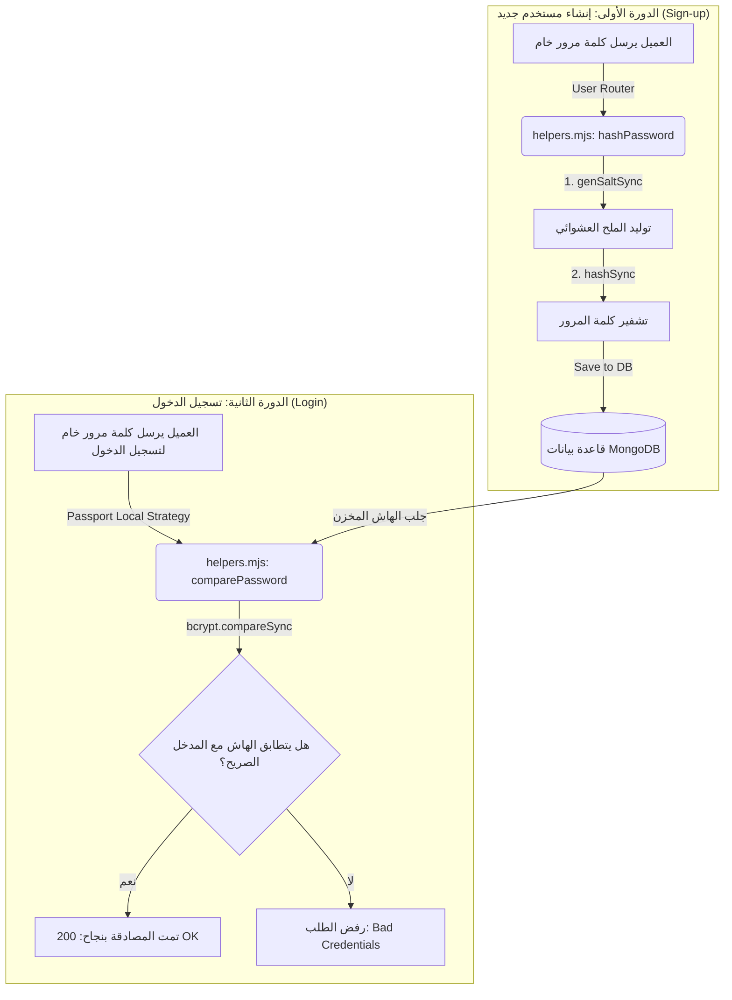

# تشفير ومقارنة كلمات المرور (Password Hashing) في Express.js باستخدام Bcrypt

يُغطي هذا الدرس مفهوم **تشفير كلمات المرور (Password Hashing)** باستخدام مكتبة **Bcrypt** في إطار العمل **Express.js**، وكيفية دمج التشفير في دورتي حياة التطبيق الأساسيتين: **إنشاء الحساب (Registration)**، و**التحقق من الهوية (Authentication/Login)** .

---

### القسم الأول: المفاهيم الأساسية والفلسفة الأمنية

#### 1. تشفير كلمات المرور (Password Hashing)
*   **التعريف:** هو عملية رياضية أحادية الاتجاه (One-Way Cryptographic Function) تحول كلمة المرور المدخلة بنصها الصريح (Plain-text Password) إلى سلسلة عشوائية ثابتة الطول من الرموز (Hash) غير قابلة للقراءة أو الإرجاع لأصلها.
*   **لماذا نستخدمها؟** إن حفظ كلمات المرور بنصها الخام (Raw) في قواعد البيانات يُعد ثغرة أمنية فادحة (Huge Red Flag)؛ فإذا نجح مخترق في الوصول إلى قاعدة البيانات، فإنه سيتطلع مباشرة على كافة كلمات المرور الخاصة بالمستخدمين. التشفير يضمن أنه حتى لو تم تسريب قاعدة البيانات، فإن كلمات المرور تظل غير مقروءة ومحمية.

#### 2. جزيئات التمليح (Salt Rounds)
*   **التعريف:** هي معلمة (Parameter) تحدد مقدار الوقت والجهد الحسابي (CPU Time) اللازمين لتوليد الهاش عبر خوارزمية **Bcrypt**.
*   **الفكرة الأساسية:** إضافة "ملح" (Salt) - وهو سلسلة عشوائية من البيانات - إلى كلمة المرور قبل تشفيرها، مما يمنع هجمات جداول قوس قزح (Rainbow Table Attacks).
*   **توصية الأداء:** كلما زاد عدد الـSalt Rounds ، زادت معها درجة تعقيد التشفير وصعوبة فكه. توصي التوثيقات الرسمية (Documentation) باستخدام القيمة **`10`** كقيمة افتراضية متوازنة بين الأمان والأداء الحسابي للخادم.

#### 3. مكتبة Bcrypt
*   **التعريف:** هي حزمة برمجية متخصصة ومصممة خصيصاً لتشفير ومقارنة كلمات المرور بطريقة آمنة ومقاومة لهجمات القوة الغاشمة (Brute Force Attacks) .
*   **خيارات التشغيل:** توفر المكتبة نسختين من دالاتها:
    *   **الدوال غير المتزامنة (Asynchronous):** تعتمد على الوعود (Promises) وتتطلب استخدام `async/await` .
    *   **الدوال المتزامنة (Synchronous):** تنتهي باللاحقة `Sync` وتقوم بالتنفيذ المباشر على خيط المعالجة الرئيسي دون الحاجة لوعود.

---

### القسم الثاني: المقارنة البرمجية (متزامن مقابل غير متزامن في Bcrypt)

|        السمة (Feature)        |         الدوال المتزامنة (Synchronous Methods)          |              الدوال غير المتزامنة (Asynchronous Methods)               |
| :---------------------------: | :-----------------------------------------------------: | :--------------------------------------------------------------------: |
| **اسم الدالة لتوليد الـsalt** |                  `genSaltSync(rounds)`                  |                           `genSalt(rounds)`                            |
|    **اسم الدالة للتشفير**     |               `hashSync(password, salt)`                |                         `hash(password, salt)`                         |
|    **اسم الدالة للمقارنة**    |              `compareSync(plain, hashed)`               |                        `compare(plain, hashed)`                        |
|       **طبيعة الإرجاع**       |     تُرجع القيمة المطلوبة مباشرة (String/Boolean).      |              تُرجع وعداً (Promise) يتطلب انتظار `await` .              |
|      **بيئة الاستخدام**       | مناسبة للعمليات المتسلسلة والمبسطة في البيئة التعليمية. | **أفضل للمشاريع الكبيرة** لتجنب تجميد الـmain process thread للتطبيق . |

---

### القسم الثالث: هندسة تدفق البيانات والتشفير (Architecture Flow)

يوضح المخطط التالي دورتي حياة التشفير والمقارنة في الخلفية (Backend Setup):



---

### القسم الرابع: التطبيق العملي 1 (تشفير كلمة المرور عند التسجيل)

#### الخطوة الأولى: التثبيت والإعداد
نبدأ بتثبيت المكتبة في مجلد المشروع عبر موجه الأوامر (Terminal) :
```bash
npm i bcrypt
```

#### الخطوة الثانية: بناء ملف المساعدات (`helpers.mjs`)
من أفضل الممارسات البرمجية فصل منطق التشفير عن المسارات في ملف مستقل يوضع داخل مجلد المساعدات `utils` لتسهيل إعادة الاستخدام (Reusability) والصيانة.

```javascript
// ملف: src/utils/helpers.mjs
import bcrypt from 'bcrypt'; // استيراد مكتبة bcrypt

// تحديد عدد جزيئات التمليح الموصى بها في التوثيقات الرسمية
const saltRounds = 10; //

/**
 * دالة مساعدة لتشفير كلمات المرور بطريقة متزامنة
 * @param {string} password - كلمة المرور بالصيغة الخام المرسلة من العميل
 * @returns {string} كلمة المرور المشفرة (Hash)
 */
export const hashPassword = (password) => {
    // 1. توليد الملح العشوائي بناءً على جزيئات التمليح المحددة
    const salt = bcrypt.genSaltSync(saltRounds); //
    
    // طباعة الملح للتوضيح البرمجي (اختياري)
    console.log("Generated Salt: ", salt); //
    
    // 2. تشفير كلمة المرور الصريحة باستخدام الملح المتولد وإرجاع النتيجة
    return bcrypt.hashSync(password, salt); //
};
```

> `‏` **Important Note**
> **حالة استخدام الدوال غير المتزامنة (Asynchronous Options):**
> إذا قررت استخدام النسخة غير المتزامنة من دالات مكتبة Bcrypt، فيجب تعديل الدالة لتصبح مسبوقة بـ `async` واستخدام المعامل `await` كالتالي:
```javascript
 export const hashPassword = async (password) => {
     const salt = await bcrypt.genSalt(saltRounds);
     return await bcrypt.hash(password, salt);
 };
```

#### الخطوة الثالثة: دمج التشفير في مسار إنشاء مستخدم جديد (`users.mjs`)
يتم حقن دالة التشفير مباشرة قبل تمرير كائن البيانات إلى الـ (User Model Constructor) الخاص بـ Mongoose لحفظ الهاش بدلاً من النص الخام .

```javascript
// ملف: src/routes/users.mjs
import { Router } from 'express';
import { hashPassword } from '../utils/helpers.mjs'; // استيراد الدالة المساعدة
import User from '../mongoose/schemas/user.mjs'; // استيراد نموذج المستخدم

const router = Router();

router.post('/api/users', async (request, response) => {
    // استخراج البيانات الموثقة التي اجتازت Validation
    const { body: data } = request; //
    
    // أخذ كلمة المرور الخام وتشفيرها، ثم إعادة كتابة حقل كلمة المرور داخل الكائن
    data.password = hashPassword(data.password); //
    
    try {
        // تمرير كائن البيانات المحتوي على كلمة المرور المشفرة للمشيد
        const newUser = new User(data); //
        const savedUser = await newUser.save(); //
        
        return response.status(201).send(savedUser);
    } catch (err) {
        return response.sendStatus(400);
    }
});
```

> `‏` **Important Note**
> **خطأ تعطل استيراد الملفات (Import Extensions Bug):**
> واجه المحاضر مشكلة أوقفت عمل الخادم بسبب عدم كتابة الامتداد صراحة للملفات المحلية في بيئة **ES Modules**. 
> **قاعدة أمنية برمجية:** عند استيراد أي ملفات مساعدة محلية، يجب كتابة الامتداد كاملاً مثل:
> `‏` `import { hashPassword } from '../utils/helpers.mjs'` بدلاً من `js.` لتفادي أخطاء التشغيل.

---

### القسم الخامس: التطبيق العملي 2 (مقارنة وتحليل الكلمات عند تسجيل الدخول)

#### المشكلة المعمارية (The Verification Discrepancy)
بمجرد تشفير كلمات المرور في قاعدة البيانات، سيفشل كود التحقق القديم؛ فإذا حاول مستخدم يدعى "Johnny" تسجيل الدخول بكلمة المرور الصريحة `"hello123"`، سيقوم النظام بمقارنة الكلمة الصريحة بالهاش المخزن `"$2b$10$..."` وستفشل المقارنة (Bad Credentials) لأن القيمتين مختلفتان تماماً.

#### الحل باستخدام `compareSync`
لا نقوم بمحاولة فك التشفير يدوياً، بل نستعين بالدالة المخصصة `compareSync` التي تستقبل الكلمة الصريحة والهاش، وتقوم بالتأكد من صحة التوقيع ومطابقتهما ذاتياً .

#### الخطوة الأولى: بناء دالة المقارنة في (`helpers.mjs`)

```javascript
// ملف: src/utils/helpers.mjs

/**
 * دالة مساعدة لمقارنة كلمة المرور الصريحة بالهاش المخزن
 * @param {string} plain - كلمة المرور المدخلة من العميل صراحة
 * @param {string} hashed - الهاش المسترجع من قاعدة البيانات الخاصة بالمستخدم
 * @returns {boolean} تُرجع true إذا كانت مطابقة، و false في حال عدم التطابق
 */
export const comparePassword = (plain, hashed) => {
    // تقوم الدالة داخلياً بتحليل الهاش والملح للتأكد من المطابقة
    return bcrypt.compareSync(plain, hashed); //
};
```

#### الخطوة الثانية: ربط دالة المقارنة بـ Passport Local Strategy (`local-strategy.mjs`)
نقوم بتحديث استراتيجية التحقق المحلية لاستبدال المقارنة التقليدية (أوبجكت المصفوفات) بدالة المقارنة المتوافقة مع قاعدة البيانات .

```javascript
// ملف: src/strategies/local-strategy.mjs
import passport from 'passport';
import { Strategy } from 'passport-local';
import User from '../mongoose/schemas/user.mjs';
import { comparePassword } from '../utils/helpers.mjs'; // استيراد دالة المقارنة

export default passport.use(
    new Strategy(async (username, password, done) => {
        try {
            // 1. استعلام قاعدة البيانات للبحث عن اسم المستخدم
            const findUser = await User.findOne({ username: username }); //
            if (!findUser) throw new Error('User not found'); //
            
            // 2. مقارنة كلمة المرور الخام المستلمة مع الهاش المخزن في findUser.password
            const isMatch = comparePassword(password, findUser.password); //
            
            // 3. التحقق من تطابق النتيجة المرجعة (Boolean)
            if (!isMatch) {
                // إذا لم تتطابق (إرجاع false)، نرمي خطأ credentials خاطئة
                throw new Error('Invalid credentials'); //
            }
            
            // 4. حالة نجاح التطابق بنجاح
            done(null, findUser); //
            
        } catch (err) {
            done(err, null); //
        }
    })
);
```

---

### القسم السادس: الأخطاء الشائعة والآثار الجانبية

1.  **خطأ المستخدمين القدامى في قاعدة البيانات (Legacy Raw Passwords Issue):**
    *   **الخلل:** عند محاولة مستخدم قديم (مثل "Anson") تسجيل الدخول، والذي سُجلت كلمة مروره سابقاً بنص مكشوف في قاعدة البيانات، سيفشل النظام ويرمي استثناء `Bad credentials`.
    *   **التفسير العلمي:** يحاول التابع `comparePassword` فك شفرة الهاش من كلمة المرور القديمة، وبما أن الكلمة القديمة نص صريح وليست هاش مصنع بـ Bcrypt، سيفشل الميثود فوراً.
    *   **الحل :** يجب تنظيف قاعدة البيانات أو تحديث جميع كلمات المرور القديمة الصريحة وتمريرها بدالة التشفير `hashPassword` لتوحيد بنية البيانات في النظام.

---

*   **لماذا لا نستخدم فك التشفير (Decrypt) لكلمات المرور؟** لأن خوارزميات التجزئة (Hashing) في Bcrypt هي دالات رياضية أحادية الاتجاه (One-Way) مصممة لتكون غير قابلة للفك بشكل رياضي لأسباب أمنية.
*   **ماذا يفعل التابع `compareSync` تحديداً؟** يستخلص الملح وجزيئات التمليح المدمجين تلقائياً داخل الهاش المخزن، ثم يعيد تشفير كلمة المرور الصريحة الجديدة بنفس الملح ويقارن المخرجات ليعيد القيمة المنطقية .
*   **القيمة المقترحة لـ Salt Rounds:** هي القيمة `10` لضمان أمان معقول وسرعة معالجة مريحة للخوادم.

---

