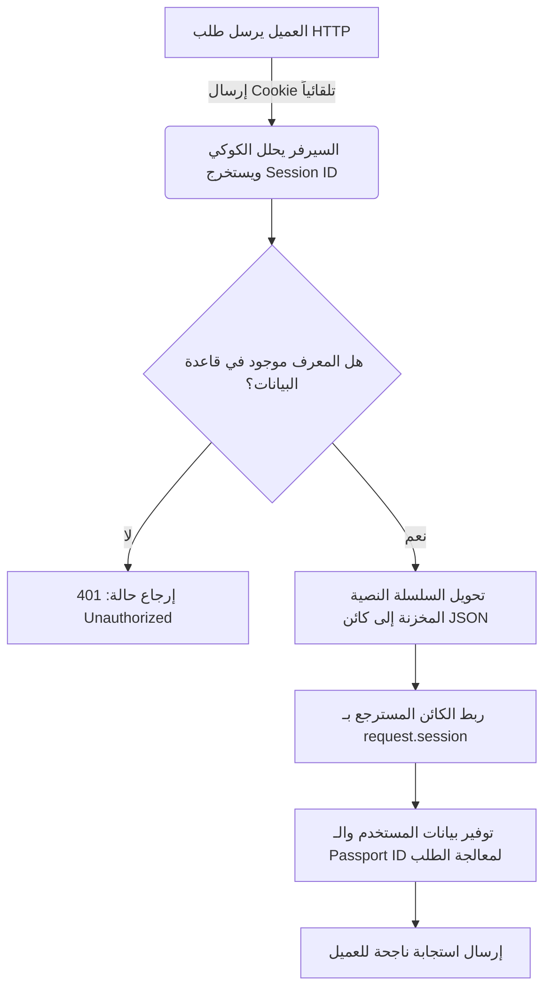

# مخازن الجلسات (Session Stores) وإدارة استمرارية البيانات في Express.js

هذا الدرس مُعد خصيصاً لتغطية مفهوم **مخازن الجلسات (Session Stores)**، وكيفية ربط الجلسات بقاعدة البيانات **MongoDB** لضمان استمرارية بيانات المستخدمين، بالإضافة إلى الضبط المتقدم لخصائص الجلسة الأساسية .

---

### أولاً: المفاهيم الأساسية (Core Concepts)

#### 1. مخزن الجلسات في الذاكرة (In-Memory Session Store)
*   **التعريف:** هو الآلية الافتراضية التي يتبعها تطبيق Express.js للاحتفاظ ببيانات جلسات المستخدمين مؤقتاً داخل الذاكرة العشوائية (RAM) الخاصة بنظام تشغيل السيرفر .
*   **الفكرة الأساسية:** يتم حفظ كائنات الجلسات (Session Objects) في مصفوفة أو هيكل بيانات مؤقت طوال فترة تشغيل السيرفر.
*   **العيوب:** 
    *   **غير مستمر (Non-Persistent):** الذاكرة العشوائية متطايرة بطبيعتها. بمجرد توقف السيرفر لأي سبب أو إعادة تشغيله (مثل التحديث التلقائي عبر Nodemon أثناء التطوير)، تُمحى كافة بيانات الجلسات تماماً .
    *   **تجربة مستخدم سيئة:** يُجبر العميل على تسجيل الدخول مجدداً في كل مرة يتم فيها إعادة تشغيل السيرفر، حيث تُرجع الـendpoints المحمية مثل `/api/auth/status` حالة غير مصرح بها (Unauthorized).

#### 2. مخزن الجلسات المعتمد على قاعدة البيانات (Database-Backed Session Store)
*   **التعريف:** هي آلية برمجية يتم من خلالها تخزين بيانات الجلسات بشكل مستمر (Persistent Store) داخل قاعدة بيانات حقيقية بدلاً من ذاكرة السيرفر العشوائية .
*   **لماذا نستخدمها؟** لضمان استقرار التطبيق واستمرارية بقاء المستخدمين مسجلين الدخول حتى لو واجه السيرفر توقفاً مفاجئاً أو خضع لعملية صيانة وإعادة تشغيل .
*   **كيف تعمل؟**
    1. يتلقى السيرفر طلباً يتضمن معرف الجلسة (Session ID) الممرر تلقائياً عبر ملف تعريف الارتباط (Cookie) .
    2. يقوم السيرفر بتحليل (Parsing) الكوكي واستخراج الـID .
    3. بدلاً من البحث في ذاكرة الرام، يتوجه السيرفر إلى قاعدة البيانات (مثل MongoDB) للبحث عن Document يطابق هذا الـID .
    4. يستخرج السيرفر الكائن النصي المحفوظ، ويحوله إلى كائن JSON، ثم يحقنه داخل كائن الطلب `request.session`.

#### 3. حزمة Connect Mongo
*   **التعريف:** هي مكتبة وسيطة ومخزن جلسات متوافق مع إطار العمل Express.js ومصمم خصيصاً للتعامل مع قاعدة بيانات **MongoDB** .
*   **المميزات:** تتيح إعادة استخدام اتصال قاعدة البيانات الحالي (Mongoose Connection) دون الحاجة لفتح قنوات اتصال جديدة ومستقلة، مما يوفر موارد السيرفر.

---

### ثانياً: المقارنة البرمجية (Memory Store مقابل Database Store)

|    وجه المقارنة (Feature)     |            التخزين في الذاكرة (In-Memory Store)            |        التخزين في قاعدة البيانات (Database Store)         |
| :---------------------------: | :--------------------------------------------------------: | :-------------------------------------------------------: |
| **الوضع الافتراضي (Default)** |      نعم، يتم تفعيله تلقائياً عند غياب خاصية `store`.      |       لا، يتطلب تهيئة وإعداد يدوي عبر خصائص الجلسة.       |
| **الاستمرارية (Persistence)** |       مؤقت ومتطاير؛ يُفقد عند إعادة تشغيل السيرفر .        | دائم ومستمر؛ يحتفظ بالبيانات بصرف النظر عن حالة السيرفر . |
|     **البيئة الموصى بها**     |   مناسب للاختبارات السريعة والبيئات التعليمية المحدودة.    |  **إلزامي ومستمر** في كافة التطبيقات التجارية الحقيقية.   |
|      **استهلاك الموارد**      | يستهلك ذاكرة السيرفر العشوائية بشكل مباشر وقد يسبب تعطلها. |     ينقل عبء التخزين إلى قاعدة البيانات المخصصة لذلك.     |

---

### ثالثاً: هندسة استرجاع الجلسة من قاعدة البيانات

يوضح المخطط التالي دورة حياة الطلب والتحقق من الجلسة ومطابقتها من قاعدة البيانات:



---

### رابعاً: التطبيق العملي للربط (Step-by-Step Implementation)

لحفظ وتأمين استمرارية الجلسة، اتبع الخطوات البرمجية التالية بدقة:

#### `‏` Step 1: تثبيت حزمة التخزين المخصصة لـ MongoDB
عبر موجه الأوامر داخل مجلد المشروع، قم بتثبيت الحزمة :
```bash
npm i connect-mongo
```

####  `‏` Step 2: استيراد المكتبة وإعداد تهيئة الاتصال
نقوم باستيراد `MongoStore` وإعادة استخدام اتصال قاعدة البيانات القائم لتفعيل الحفظ التلقائي.

```javascript
// ملف: src/index.mjs
import express from 'express';
import session from 'express-session';
import MongoStore from 'connect-mongo'; // استيراد المخزن المتوافق مع MongoDB
import mongoose from 'mongoose'; // استيراد كائن الاتصال القائم بقاعدة البيانات

const app = express();

// إعداد البرمجية الوسيطة للجلسات
app.use(session({
    // المفتاح السري لتوقيع ملفات الارتباط
    secret: 'my_development_secret_key', 
    
    // منع الحفظ القسري غير المبرر للجلسات
    resave: false, 
    
    // منع امتلاء قاعدة البيانات بجلسات فارغة
    saveUninitialized: false, 
    
    // === الجزء الأهم: تحديد مخزن الجلسات بقاعدة البيانات ===
    store: MongoStore.create({
        // استخدام خاصية client لتوفير محرك العميل للاتصال
        // نستدعي التابع getClient() من كائن اتصال mongoose لإعادة استخدام نفس الاتصال القائم
        client: mongoose.connection.getClient() //
    }),
    
    cookie: {
        // تحديد مدة بقاء الكوكي (مثال: ساعة واحدة)
        maxAge: 60000 * 60 
    }
}));
```

#### `‏` Step 3: اختبار سلوك التطبيق والتحقق من قاعدة البيانات
1. قم بتشغيل السيرفر والتوجه لنقطة تسجيل الدخول `/api/auth` وإرسال بيانات صحيحة (مثال: المستخدم `Johnny` بكلمة مرور `hello123`) .
2. افتح أداة إدارة قاعدة البيانات (MongoDB Compass)، وستلاحظ تلقائياً ظهور مجموعة (Collection) جديدة تم إنشاؤها باسم **`sessions`**.
3. عند تمديد وثيقة الجلسة داخل المجموعة، ستجد البنية التالية محفوظة بالكامل كـ Document داخل قاعدة البيانات :
    * `‏`  `id_`: يمثل ID الجلسة الفعلي (Session ID) المطابق تماماً للـ ID المخزن في ملف الكوكي لدى العميل .
    * `‏`  `session`: يحتوي على كائن الجلسة المحول إلى نص (Stringified JSON) ويتضمن إعدادات الكوكي وبيانات المصادقة لـ Passport ومعرف المستخدم الفريد .

---

### خامسًا: التهيئة المتقدمة للخصائص (saveUninitialized & resave)

سنوضح الفروق الجوهرية لآثار تفعيل وتعطيل خصائص الجلسة عند ربطها بقاعدة البيانات:

#### 1. خاصية `saveUninitialized`
تحدد ما إذا كان يجب حفظ الجلسات "غير المهيأة" (أي الجلسات الجديدة التي لم يطرأ عليها أي تعديل أو لم يتم حفظ بيانات مستخدم فيها بعد) داخل مخزن قاعدة البيانات .

*   **عند ضبطها على `false` (الوضع المثالي):**
    *   لا يتم حفظ أي جلسة في قاعدة البيانات إلا إذا تم التعديل عليها برمجياً (مثل نجاح عملية تسجيل الدخول وقيام Passport بحقن معرّف المستخدم).
    *   **الميزة:** تحمي قاعدة البيانات من الازدحام وامتلائها بسجلات فارغة لا فائدة منها.
*   **عند ضبطها على `true` (سلوك تدميري في التخزين):**
    *   بمجرد قيام أي زائر عشوائي بزيارة أي رابط في موقعك (حتى لو لم يسجل دخوله)، سيتم إنشاء سجل جلسة فارغ وحفظه في قاعدة البيانات مباشرة .
    *   **المشكلة:** إذا قام العميل بمسح الكوكيز وزيارة الصفحة مجدداً، فسيقوم النظام بإنشاء سجل فارغ جديد في كل مرة، مما يستهلك سعة التخزين (Storage) في قاعدة البيانات بلا جدوى .

> `‏` **Important Note**
> **حالة الاستثناء لخاصية `saveUninitialized: true`:**
> قد تكون هذه الخاصية مفيدة في تطبيقات محددة؛ مثل رغبتك في تتبع عمليات الزوار المجهولين (Guest Users) كإضافتهم لمنتجات داخل سلة المشتريات (Cart)، بحيث ترغب في الاحتفاظ بالسلة واستعادتها لهم فور قيامهم بتسجيل الدخول الفعلي لاحقاً.

#### 2. خاصية `resave`
تحدد ما إذا كان يجب إجبار الجلسة وملف الكوكي على إعادة الحفظ والتحديث في قاعدة البيانات مع كل طلب HTTP يرسله العميل، حتى لو لم يحدث أي تغيير في البيانات .

*   **عند ضبطها على `true`:**
    *   يقوم السيرفر بتحديث حقل تاريخ انتهاء الصلاحية (Expiration Date) الخاص بالملف في قاعدة البيانات بشكل قسري ومستمر مع كل طلب.
*   **عند ضبطها على `false` (الأفضل للأداء الحسابي):**
    *   لا يتم تحديث تاريخ انتهاء الصلاحية أو كائن الجلسة في قاعدة البيانات طالما لم يطرأ أي تعديل أو تغيير حقيقي في بيانات الجلسة . ويتم تحديثها فقط وتوليد معرف جديد عند حدوث تغيير حقيقي كعملية تسجيل الدخول.

---

### سادساً: الأخطاء الشائعة والتحذيرات (Common Pitfalls)

> `‏` **Important Note**
> **فقدان الاتصال وقاعدة البيانات:**
> عند استخدام `connect-mongo` وتحديد خيار الموائمة عبر `()mongoose.connection.getClient`، تأكد تماماً من أن كود تفعيل الاتصال بقاعدة البيانات يسبق كود إعداد الـ Middleware الخاص بالجلسة. إذا حاول التطبيق تشغيل المخزن قبل إتمام الاتصال الفعلي بالسيرفر، سيتعطل تشغيل تطبيق Express بالكامل ويقذف استثناء خطأ في الاتصال.

---

