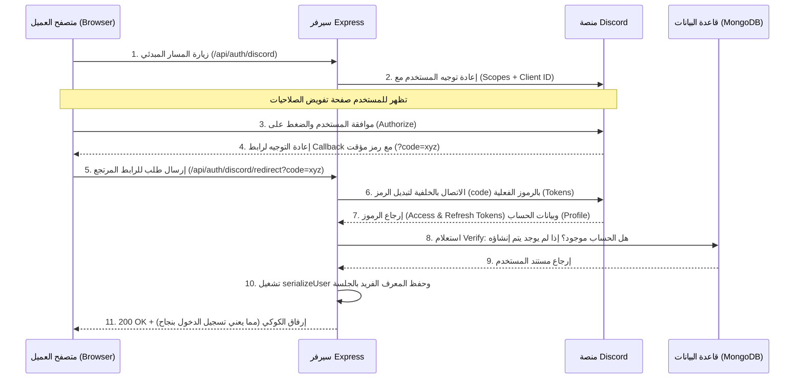

# المصادقة وإدارة الهوية المفتوحة (OAuth2) باستخدام Passport.js في Express.js

هذا الدرس مصمم  لتغطية بروتوكول المصادقة المفتوح **OAuth2** (اختصار لـ **Open Authorization 2**) وكيفية دمجه مع إطار العمل **Express.js** باستخدام مكتبة **Passport.js** والاستراتيجية المخصصة لمنصة **Discord**. يهدف هذا الدرس إلى تمكينك من فهم وتطبيق مصادقة الطرف الثالث (Third-Party Providers) بشكل كامل وعميق دون الحاجة للرجوع إلى أي مراجع أخرى.

---

### أولاً: المفاهيم الأساسية لبروتوكول OAuth2

#### 1. بروتوكول المصادقة المفتوح OAuth2 (Open Authorization 2)
*   **التعريف:** هو معيار صناعي مفتوح (Industry Standard Protocol) لتفويض الصلاحيات (Authorization).
*   **الفكرة الأساسية:** يسمح للتطبيقات بالحصول على وصول محدود (Limited Access) إلى حسابات المستخدمين على مواقع أو منصات أخرى (مثل Discord, Facebook, Google, GitHub) نيابة عن المستخدم، ولكن **دون** الحاجة لمعرفة كلمة مرور حساباتهم أو مشاركتها مع تطبيقك.
*   **لماذا نستخدمه؟** 
    1.  **تحسين تجربة المستخدم (User Experience):** تمكين المستخدم من تسجيل الدخول بضغطة زر واحدة باستخدام حساباته الحالية، بدلاً من الاضطرار لإنشاء حساب جديد وتذكر كلمة مرور جديدة.
    2.  **الأمان المتقدم (Security):** تقليل مسؤولية السيرفر الخاص بك تجاه إدارة وحماية كلمات المرور، ونقل عبء التحقق الأمني لشركات كبرى متخصصة.
    3.  **الوصول إلى البيانات (Data Integration):** يسمح للتطبيق بالتفاعل مع ميزات ومجموعات بيانات على منصات خارجية (مثل معرفة السيرفرات المشترك بها المستخدم) .
*   **متى نستخدمه؟** عندما ترغب في توفير خيار "تسجيل الدخول بواسطة منصة خارجية" (Social Login)، أو عندما يتطلب تطبيقك التفاعل برمجياً مع حسابات المستخدم الخارجية.

#### 2. معرف العميل ومفتاح السر (Client ID & Client Secret)
*   **معرف العميل (Client ID):** هو عبارة عن معرف فريد عام (Public Identifier) يُعطى لتطبيقك من قبل منصة الطرف الثالث لتحديد هويته لديهم. (ملاحظة: لا ضرر من رؤية الآخرين له لأنه يُستخدم فقط لتحديد التطبيق).
*   **مفتاح السر للعميل (Client Secret):** هو عبارة عن مفتاح تشفير خاص وسري جداً (Private Cryptographic Key) يُستخدم لتوثيق هوية تطبيقك لدى السيرفر ومطابقته.

> `‏` **Important Note**
> **حماية مفتاح السر (Secret Security):**
> يجب الحفاظ على سرية الـ **Client Secret** بشكل مطلق وعدم مشاركته أو دفعه إلى ريبوهات الكود العامة (مثل GitHub). في التطبيقات الإنتاجية، **يُمنع منعاً باتاً** كتابته صراحة داخل الكود (Hardcoding). ويجب وضعه دائماً داخل ملف متغيرات البيئة (Environment Variables).

#### 3. رابط إعادة التوجيه (Redirect URL / Callback URL)
*   **التعريف:** هو المسار (Endpoint) المخصص على سيرفرك والذي تخبر منصة الطرف الثالث بإرسال المستخدم إليه تلقائياً بعد نجاح تفويض الصلاحيات .
*   **الوظيفة:** يستقبل المعامل المؤقت للرمز التجاري (`code`) الذي يرسله المزود لاستبداله لاحقاً برموز الوصول.

#### 4. النطاق والمجال (Scope)
*   **التعريف:** هي الصلاحيات المحددة التي يطلبها تطبيقك من المستخدم للموافقة عليها (مثل: `identify` لقراءة الهوية الشخصية، أو `email` لجلب البريد، أو `guilds` لجلب الخوادم المشترك بها).

> `‏` **Important Note**
> **الوضع الافتراضي للنطاقات (Scopes):**
> إذا تركت حقل الـ `scope` فارغاً ولم تحدد أي قيمة، فلن تتمكن من الوصول لبيانات المستخدم الأساسية (مثل الاسم أو المعرف)، وستكون عملية المصادقة عديمة الفائدة.

#### 5. رموز الوصول والتحديث (Access Token & Refresh Token)
*   **رمز الوصول (Access Token):** رمز مشفر قصير الأجل (Short-lived) يعمل كبديل لـ API Key المؤقت لإثبات امتلاك الصلاحية للوصول لبيانات العميل عند الاستعلام من الـ API الخاص بالطرف الثالث.
*   **رمز التحديث (Refresh Token):** رمز طويل الأجل (Long-lived - يستمر لعدة أشهر) يتم حفظه في قاعدة البيانات لغرض استبداله برمز وصول جديد تلقائياً عند انتهاء صلاحية الرمز القديم دون إجبار المستخدم على تكرار تسجيل الدخول.

---

### ثانياً: مقارنة أكاديمية (رمز الوصول مقابل رمز التحديث)

| وجه المقارنة (Feature) | رمز الوصول (Access Token) | رمز التحديث (Refresh Token) |
| :--- | :--- | :--- |
| **الهدف الأساسي (Primary Purpose)** | المصادقة وجلب بيانات العميل المباشرة من الـ API. | توليد رمز وصول جديد بدون تفاعل من المستخدم. |
| **مدة الصلاحية (Lifespan)** | قصيرة المدى (Short-lived). | طويلة المدى جداً (تصل أحياناً إلى 6 أشهر). |
| **التخزين البرمجي (Storage)** | يرسل مباشرة في طلبات الاتصال ورؤوس الطلب (Headers). | يُحفظ بأمان داخل قاعدة البيانات ويستدعى عند الحاجة فقط. |

---

### ثالثاً: هندسة تدفق عملية المصادقة (OAuth 2.0 Dance)

يوضح المخطط التالي دورة حياة الطلب المتسلسلة برمجياً بين العميل، وتطبيق Express، ومزود الخدمة (Discord):



---

### رابعاً: الخطوات المنهجية لإعداد وتطبيق الاستراتيجية

#### Step 1: تهيئة التطبيق على بوابة مطوري منصة الطرف الثالث (Discord)
1.  التوجه إلى موقع المطورين الرسمي (`discord.com/developers`).
2.  إنشاء تطبيق جديد وتسميته (مثال: `Anson OAuth 2`).
3.  التوجه لقسم **OAuth2** ونسخ قيم **Client ID** و **Client Secret** وحفظهما.
4.  إضافة رابط إعادة توجيه (Redirect URL) محلي للاختبار وصيغته: `http://localhost:3000/api/auth/discord/redirect`.

#### Step 2: تثبيت الحزم المطلوبة (Installation)
نقوم بتثبيت حزمة المصادقة المحلية الخاصة بالمنصة المختارة عبر سطر الأوامر:
```bash
npm i passport-discord
```

#### Step 3: إنشاء مخطط مستند مستخدم الطرف الثالث (`discord-user.mjs`)
نقوم بإنشاء نموذج مخصص لحفظ حسابات مستخدمي الـ OAuth2 في قاعدة بيانات **MongoDB** لربط بياناتهم الداخلية مستقبلاً.

```javascript
// ملف: src/mongoose/schemas/discord-user.mjs
import mongoose from 'mongoose';

const discordUserSchema = new mongoose.Schema({
    // حقل اسم المستخدم المسترجع من الحساب الخارجي
    username: {
        type: mongoose.Schema.Types.String,
        required: true,
    },
    // المعرف الفريد الثابت والخاص بمنصة Discord (لا يتغير أبداً)
    discordId: {
        type: mongoose.Schema.Types.String,
        required: true,
        unique: true // قيد تفرد المعرّف
    }
});

// تجميع المخطط وتحويله لنموذج برمجى للتفاعل
const DiscordUser = mongoose.model('DiscordUser', discordUserSchema);

export default DiscordUser;
```

> `‏` **Important Note**
> **لماذا نحفظ حسابات OAuth2 في قاعدة البيانات الخاصة بنا؟**
> يجب حفظ حسابات تسجيل دخول الطرف الثالث في قاعدة بياناتك الخاصة. الفائدة من ذلك هي تمكينك من إنشاء علاقات برمجية (One-to-Many أو One-to-One Relationships) وربطها بالهوية الخارجية؛ مثل ربط المنشورات، أو الرسائل، أو الأنشطة التي يقوم بها المستخدم على منصتك بملفه المستورد وتذكرها في المرات القادمة.

> `‏` **Important Note**
> **معيار البحث الآمن للمستخدم (Immutable ID):**
> عند البحث عن مستخدم مسجل مسبقاً، **يُمنع** استخدام الاسم (Username) كمعيار للبحث في قاعدة البيانات لأن الاسم قابل للتغيير من قبل المستخدم على منصته. يجب دائماً البحث باستخدام المعرّف الرقمي الحصري والثابت للمنصة (مثل الـ `discordId`) لضمان الأمان وعدم تشابك الحسابات.

---

### خامساً: التطبيق البرمجي المتكامل للاستراتيجية (`discord-strategy.mjs`)

في هذا الملف، سنقوم بإعداد منطق تفعيل استراتيجية Passport وضبط إعدادات النطاق والمحلل، مع معالجة الأخطاء عبر ممارسات فصل محاولات صيد الأخطاء (Double Try-Catch Pattern) الموصى بها أكاديمياً.

```javascript
// ملف: src/strategies/discord-strategy.mjs
import passport from 'passport';
import { Strategy } from 'passport-discord'; // استيراد كلاس الاستراتيجية المخصص لـ Discord
import DiscordUser from '../mongoose/schemas/discord-user.mjs'; // نموذج قاعدة البيانات

// 1. تحديد آلية تسلسل بيانات الهوية لربطها بذاكرة الجلسة
passport.serializeUser((user, done) => {
    // نقوم بحفظ معرّف الكائن الخاص بـ MongoDB (_id) لتوفير الذاكرة
    done(null, user.id); //
});

// 2. إلغاء تسلسل الهوية وإعادة استرجاع السجل من المعرّف عند كل طلب جديد
passport.deserializeUser(async (id, done) => { //
    try {
        // البحث عن مستند المستخدم باستخدام معرّف أوبجكت MongoDB الفريد
        const findUser = await DiscordUser.findById(id); //
        
        // التحقق من وجود المستخدم، وتمريره في دالة done ليحقن في request.user
        return findUser ? done(null, findUser) : done(null, null); //
    } catch (err) {
        done(err, null); //
    }
});

// 3. تهيئة الاستراتيجية وحقن خيارات الإعداد ودالة التحقق
export default passport.use(
    new Strategy({
        clientID: '128264...', // استبدالها بـ Client ID الخاص بك
        clientSecret: 'YOUR_SECRET', // استبدالها بـ Client Secret الخاص بك
        callbackURL: 'http://localhost:3000/api/auth/discord/redirect', // رابط العودة
        scope: ['identify', 'guilds', 'email'] // الصلاحيات المطلوبة من الحساب
    }, 
    // دالة التحقق غير المتزامنة (Verify Function)
    async (accessToken, refreshToken, profile, done) => { //
        
        let findUser;
        
        // === صيد أخطاء عملية البحث الأولى لـ findOne ===
        try {
            findUser = await DiscordUser.findOne({ discordId: profile.id }); //
        } catch (err) {
            // في حال حدوث عطل أثناء الاتصال بقاعدة البيانات للبحث
            return done(err, null); //
        }
        
        // === معالجة منطق الإنشاء وصيد أخطاء الحفظ save ===
        try {
            // إذا لم يكن المستخدم موجوداً في قاعدة بياناتنا مسبقاً، نقوم بإنشائه
            if (!findUser) {
                const newUser = new DiscordUser({
                    username: profile.username, // استخراج الاسم من كائن الملف الشخصي
                    discordId: profile.id // استخراج معرّف ديسكورد
                });
                
                const newSavedUser = await newUser.save(); // حفظ المستند في MongoDB
                return done(null, newSavedUser); // نجاح العملية وإرسال المستخدم الجديد
            }
            
            // في حال وجود المستخدم مسبقاً، نمرره مباشرة دون إنشاء جديد
            return done(null, findUser); //
            
        } catch (err) {
            // التقاط أي عطل قد يحدث أثناء محاولة الحفظ في قاعدة البيانات
            return done(err, null); //
        }
    })
);
```

> `‏` **Important Note**
> **لماذا فصل الـ (Double Try-Catch blocks)؟**
> يوضح المحاضر ممارسة أمنية برمجية ممتازة للتعامل مع معالجة البيانات : دمج كافة العمليات البرمجية غير المتزامنة (مثل `findOne` و `save`) في كتلة `try-catch` واحدة ضخمة يُصعّب من عملية كشف المشاكل (Debugging). فصل الكتل يتيح لك عزل وتحديد سبب الفشل البرمجي بدقة؛ هل نتج عن مشاكل الاستعلام والبحث أم عطل في الصلاحيات وقواعد حفظ المستندات الجديدة.

---

### سادساً: تسجيل الاستراتيجية وإنشاء نقاط النهاية (`index.mjs`)

لإتمام هيكل النظام، يجب تسجيل الاستراتيجية في ملف التطبيق الأساسي وإنشاء نقاط النهاية للتوجيه وإرجاع الحالة.

```javascript
// ملف: src/index.mjs
import express from 'express';
import session from 'express-session';
import passport from 'passport';

// استيراد ملف الاستراتيجية للتأكد من تشغيلها وتحميلها داخل التطبيق
import './strategies/discord-strategy.mjs'; //

const app = express();

app.use(session({
    secret: 'my_session_key',
    resave: false,
    saveUninitialized: false,
    cookie: { maxAge: 60000 * 60 }
}));

// تهيئة Passport وربطها بنظام الجلسات
app.use(passport.initialize()); //
app.use(passport.session()); //

// 1. مسار تسجيل الدخول الأولي لتوجيه المستخدم لمنصة الطرف الثالث
app.get('/api/auth/discord', passport.authenticate('discord')); //

// 2. مسار رابط العودة واستقبال طلب الاستجابة
// يستدعي التابع authenticate مرة أخرى لتحليل كود التحقق واستبداله بالرموز والملف الشخصي
app.get('/api/auth/discord/redirect', 
    passport.authenticate('discord'), //
    (request, response) => {
        // بعد نجاح التبادل والتخزين من قبل passport، نُرجع كود 200 للمستخدم
        response.sendStatus(200); //
    }
);

// 3. مسار فحص الحالة الحالية للمصادقة واستعراض بيانات المستخدم المسجل
app.get('/api/status', (request, response) => {
    // استرجاع الكائن request.user الذي تم فك تسلسله بنجاح من قاعدة البيانات
    return request.user ? response.send(request.user) : response.sendStatus(401); //
});
```

---

### سابعاً: تتبع الأخطاء الشائعة وحلها (Troubleshooting Guide)

#### 1. خطأ الفشل في تسلسل بيانات المستخدم بالجلسة (`Failed to serialize user into session`)
*   **سبب المشكلة:** حدوث نجاح في دالة التحقق واستدعاء `done(null, user)`، مع نسيان تفعيل أو استيراد دالة `passport.serializeUser` في كود الاستراتيجية.
*   **الحل :** تأكد من كتابة كود `passport.serializeUser` و `passport.deserializeUser` صراحة وتجنب الأخطاء الإملائية فيها لتمكين Passport من التخزين السليم للجلسات .

#### 2. خطأ تعذر تسجيل الدخول لوجود كوكيز قديمة في المتصفح
*   **سبب المشكلة:** بقاء كوكيز جلسة سابقة منتهية الصلاحية أو تالفة ومحاولة معالجتها من قبل دالة إلغاء التسلسل دون تنظيفها .
*   **الحل:** يتطلب الأمر تصفية ملفات تعريف الارتباط بالمتصفح (Clear Cookies) للعميل، ثم إعادة تشغيل دورة تسجيل دخول OAuth2 نظيفة تماماً.

---

