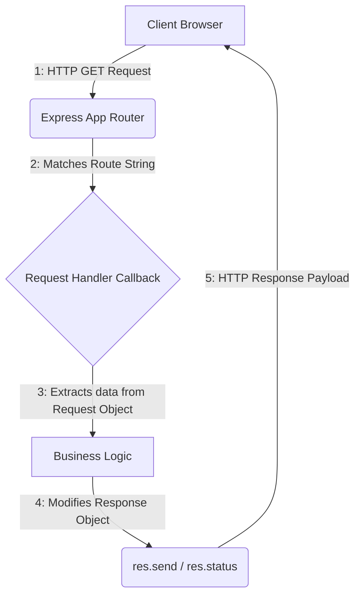

##  المسارات (Routes) وطلبات الجلب (GET Requests) في Express.js

### المفاهيم الأساسية (Core Concepts)

#### 1. المسار (Route / Endpoint)
**التعريف:** 
المسار (Route) ويُطلق عليه أيضاً نقطة النهاية (Endpoint) كلاهما مترادفان في هذا السياق؛ هو عبارة عن "طريق" أو مسار محدد داخل تطبيق Express الخاص بك، يحدد الوجهة التي يقصدها العميل للحصول على مخرجات (Outputs) أو بيانات معينة.

**الفكرة الأساسية وكيف يعمل؟**
يقوم العميل بالوصول إلى المسار عن طريق إضافة "شرطة مائلة" (Forward Slash `/`) متبوعة باسم المسار في نهاية اسم المضيف (Host name) ورقم المنفذ (Port). 
عندما يطلب العميل مساراً معيناً، يقوم الخادم بتحديد المخرجات المناسبة لهذا المسار بالتحديد .

**أمثلة لتوضيح الفكرة:**
- طلب مسار المستخدِمين (`users/`) سيعيد قائمة بالمستخدِمين.
- طلب مسار المنتجات (`products/`) سيعيد قائمة بالمنتجات.

> `‏` **Important Note**
> **الخطأ الشائع ` / Cannot GET`:** 
> عند محاولة زيارة المسار الأساسي (Base Route) للتطبيق مثل `localhost:3000/` وظهور رسالة `Cannot GET /`، فهذا لا يعني وجود عطل، بل يحدث لأنك لم تقم ببرمجة "مُحلل" (Resolver) أو معالج (Handler) يقوم بربط استجابة محددة بهذا المسار الأساسي.

> `‏` **Important Note**
> **ملاحظة حول بيئة الإنتاج (Production):**
> في التطبيقات الحقيقية المنشورة على الإنترنت، عادة لا يكون رقم المنفذ (Port) مكشوفاً للمستخدم في الرابط. بدلاً من `localhost:3000/products`، يكون الرابط مشابهاً لـ `localhosttest.com/products`.

#### 2. أفعال بروتوكول HTTP (HTTP Verbs / Methods)
**التعريف:**
هي أنواع مختلفة من طلبات HTTP تُستخدم كطريقة لإخبار الخادم (Server) بنوع العملية المراد تنفيذها على البيانات.

**لماذا نستخدمها؟**
العميل لا يحتاج دائماً إلى "جلب" أو قراءة البيانات فقط، بل يحتاج إلى التفاعل معها بأشكال مختلفة مثل الإضافة، التعديل، أو الحذف. أفعال HTTP توفر معياراً واضحاً لتحديد نية الطلب .

**جدول مقارنة عمليات HTTP المذكورة:**

| العملية (Operation) |    HTTP Verb    |                      الاستخدام (When to use)                       |
| :-----------------: | :-------------: | :----------------------------------------------------------------: |
|   القراءة / الجلب   |     **GET**     | عندما تريد استرجاع بيانات أو قائمة من الServer (مثل جلب المنتجات)  |
|  الإنشاء (Create)   |    **POST**     | عندما تريد إنشاء بيانات جديدة بحفظها في قاعدة البيانات (Database). |
|  التحديث (Update)   | **PUT / PATCH** |           عندما تريد تحديث وتعديل بيانات موجودة مسبقاً.            |
|   الحذف (Delete)    |   **DELETE**    |                  عندما تريد مسح بيانات من الخادم.                  |

---
 
### هندسة معالجة الطلبات (Request Handling Architecture)

لإنشاء مسار يتفاعل مع طلبات GET، نستخدم الدالة `()app.get`. تتكون هذه الدالة من جزأين رئيسيين:

#### كائنات معالجة الطلب (The Request Handler)
ال (Argument) الثاني في دالة المسار هو "معالج الطلب" (Request Handler). هو عبارة عن  (Callback Function) تستقبل كائنين أساسيين لعملية التواصل بين الclient والserver :

**1. كائن الطلب (Request Object - `req`):**
*   **التعريف:** كائن يحتوي على كافة المعلومات والبيانات المتعلقة بطلب HTTP القادم من جهة العميل.
*   **محتوياته الأساسية:**
    * `‏`  `Headers`: الترويسات المرسلة من العميل.
    *  `‏` `Body`: البيانات المُرسلة داخل جسم الطلب.
    *  `‏` `Cookies`: ملفات تعريف الارتباط.
    * `‏`  `IP Address`: عنوان الآي بي الخاص بالعميل.

**2. كائن الاستجابة (Response Object - `res`):**
*   **التعريف:** كائن يُستخدم لتعديل وصياغة الاستجابة التي سيتم إرسالها وإعادتها إلى العميل.
*   **الاستخدامات (ماذا يمكن أن نرسل؟):**
    *   نصوص عادية (Plain Text) .
    *   كود HTML.
    *   كائنات بصيغة JSON .
    *   تحديد رموز الحالة (Status Codes).

**رسم توضيحي لدورة الطلب والاستجابة (Request-Response Cycle):**


---

### دوال الاستجابة (Response Methods)

هناك طريقتين أساسيتين للتعامل مع كائن الاستجابة `Response`:

**1. دالة الإرسال `()res.send`:**
*   تُستخدم لإرسال المخرجات النهائية للعميل. يمكن تمرير سلسلة نصية (String) أو مصفوفة (Array) أو كائن (JSON Object) بداخلها .

**2. دالة كود الحالة `()res.status`:**
*   تُستخدم لتحديد كود حالة HTTP (HTTP Status Code) للاستجابة.
*   **الملاحظات المهمة:**
    *   بشكل افتراضي (By default)، إذا نجح الطلب فإن كود الحالة يكون `200`.
    *   كود `201` يُستخدم علمياً مع طلبات `POST` عند نجاح "إنشاء" مورد جديد. (استخدمه المحاضر في الشرح لأغراض التوضيح والتجربة فقط).

> `‏` **Important Note**
> **خاصية السلسلة (Chaining Methods):**
> يمكنك ربط (Chain) دوال كائن الاستجابة ببعضها البعض في سطر واحد بدلاً من كتابتها منفصلة. 
> مثال: `(...)response.status(201).send`.

---

### التطبيق العملي (Practical Implementation)

#### `‏`Step 1: إعداد المسار الأساسي (Base Route)

```javascript
// تعريف مسار GET الأساسي (Base Route)
app.get('/', (request, response) => {
    // تحديد كود الحالة 201 ثم إرسال كائن JSON كاستجابة باستخدام ميزة الربط (Chaining)
    response.status(201).send({ hello: "world" });
});
```
**الشرح:** 
البرامتر الأول هو `الرابط النصي "/"`، والمعامل الثاني هو دالة الـ Callback التي تأخذ `request` و `response`. يتم إرسال الاستجابة بصيغة JSON مع كود حالة 201 .

#### `‏`Step 2: تطبيق أفضل الممارسات في تسمية المسارات

> `‏` **Important Note**
> **معيار الصناعة (Industry Standard):**
> عند بناء واجهات برمجة التطبيقات (APIs)، من أفضل الممارسات المتبعة في الشركات الكبرى أن تقوم بوضع بادئة (Prefix) لجميع نقاط النهاية (Endpoints) الخاصة بك بـ `/api/`. 
> مثال: بدلاً من استخدام `/users`، يجب استخدام `/api/users`. يُنصح بشدة باتباع هذا النهج .

#### `‏`Step 3: إنشاء مسار للمستخدمين (Users Route)

```javascript
// تعريف المسار مع اتباع أفضل الممارسات بوضع /api/
app.get('/api/users', (request, response) => {
    // إرسال مصفوفة من كائنات المستخدمين (JSON)
    response.send([
        { id: 1, username: 'anson', displayName: 'Anson' },
        { id: 2, username: 'jack', displayName: 'Jack' },
        { id: 3, username: 'adam', displayName: 'Adam' }
    ]);
});
```
**الشرح:** 
عندما يقوم المتصفح (الclient) بطلب المسار `localhost:3000/api/users`، سيقوم الserver بإرجاع مصفوفة (Array) تحتوي على 3 مستخدمين وهميين. إذا كنت تستخدم تقنيات الواجهة الأمامية (مثل React)، فسيتم استقبال هذه البيانات وعرضها للمستخدم النهائي .

#### Step 4: إنشاء مسار للمنتجات (Products Route)

```javascript
// تعريف مسار آخر للحصول على المنتجات
app.get('/api/products', (request, response) => {
    // إرسال استجابة عبارة عن مصفوفة تحتوي على منتج واحد
    response.send([
        { id: 123, name: 'chicken breast', price: 12.99 }
    ]);
});
```
**الشرح:**
تأكيداً على فهم المبدأ، تم إنشاء endpoint إضافية `/api/products` تتولى إرجاع مصفوفة لبيانات المنتجات (تتضمن المعرف ID، الاسم Name، والسعر Price) عند الوصول إليها عبر المتصفح .

