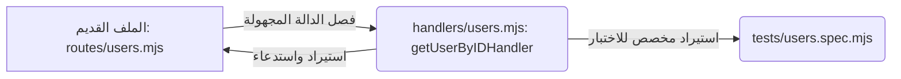

# اختبار الوحدات (Unit Testing) باستخدام Jest في Express.js

صمم هذا الدرس لتغطية منهجية **اختبار الوحدات (Unit Testing)** وإعداد بيئة عمل الاختبارات في تطبيقات **Express.js** التي تعتمد على وحدات جافا سكريبت الحديثة (**ES Modules**). سنركز على أداة الاختبار الشهيرة **Jest** وكيفية تهيئة المترجمات الحركية وتزييف البيانات والوحدات في الخلفية .

---

### أولاً: المفاهيم الأساسية واختبار الوحدات (Core Testing Concepts)

#### 1. اختبار الوحدات (Unit Testing)
*   **التعريف:** هو عملية اختبار برمجية يتم فيها فحص أصغر جزء قابل للاختبار من الكود البرمجي (مثل دالة فردية أو طريقة معينة) بشكل مستقل تماماً ومعزول عن بقية أجزاء النظام.
*   **الفكرة الأساسية:** التأكد من أن الدالة البرمجية تسلك السلوك المتوقع وتتعامل مع الشروط والمتغيرات البرمجية بدقة، بحيث تعود بالاستجابة الصحيحة بناءً على الشروط البرمجية المطروحة داخلها .
*   **لماذا نستخدمه؟**
    *   لضمان سلامة الأكواد البرمجية الفردية وخلوها من الأخطاء أثناء التطوير أو عند إعادة الهيكلة (**Refactoring**).
    *   عزل المكونات واختبار منطق التطبيق الحركي دون الحاجة لاستدعاء قاعدة البيانات الفعلية أو واجهات برمجة التطبيقات (**APIs**) الخارجية .
*   **متى نستخدمه؟** طوال مرحلة بناء وتطوير التطبيق لضمان سلامة كل معالج طلب أو دالة برمجية تابعة للنظام بشكل منفصل.

#### 2. إطار عمل Jest
*   **التعريف:** هو إطار عمل شامل ومشهور جداً مخصص لاختبار تطبيقات جافا سكريبت (**JavaScript**)، تم تطويره من قبل شركة **Meta** (فيسبوك سابقاً) ويتميز بمرونته وسهولة إعداده.
*   **الاستخدام:** يُستخدم لاختبار تطبيقات جافا سكريبت من جهة الخادم (**Node.js**)، بالإضافة إلى تطبيقات الواجهات الأمامية مثل **React** و **Angular**.

---

### ثانياً: معضلة وحدات ES Modules وحلول التهيئة (Babel Transpiler Setup)

#### المشكلة المعمارية (The ES Modules Dilemma in Jest)
بما أن مشروع التطوير يعتمد على وحدات جافا سكريبت الحديثة (**ES Modules**)، حيث تُمثّل الملفات بامتداد `mjs.` ويُحدد نوع المشروع كـ `"type": "module"` داخل ملف `package.json`، فإن إطار عمل **Jest** لا يدعم استيراد هذه الوحدات تلقائياً بشكل مستقر افتراضياً، ويتطلب تشغيل أعلام برمجية تجريبية (**Experimental Flags**) قد تفشل في بعض الحالات البرمجية الخاصة.

#### الخيارات التقنية المتاحة للمطور:

|       الخيار التقني       |                                                                          طريقة التطبيق                                                                          |                                         العيوب والآثار الجانبية                                          |
| :-----------------------: | :-------------------------------------------------------------------------------------------------------------------------------------------------------------: | :------------------------------------------------------------------------------------------------------: |
| **التراجع إلى CommonJS**  |                    إزالة القيمة `"type": "module"`، وتبديل كافة عبارات `import` إلى `require`، وتغيير عبارات التصدير إلى `module.exports` .                     | **غير عملي إطلاقاً** في المشاريع الكبيرة والمستمرة التي تحتوي على كميات ضخمة من الأكواد المكتوبة مسبقاً. |
| **استخدام المترجم Babel** | الإبقاء على الأكواد وامتدادات `mjs.` كما هي، والاعتماد على مترجم (**Transpiler**) يقوم بتحويل الأكواد ديناميكياً أثناء تشغيل الاختبارات لتفهمها أداة **Jest** . |  **هو الخيار المثالي** والموصى به من قبل المطورين لتفادي المساس ببنية الأكواد الرئيسية في بيئة العمل .   |

---

### ثالثاً: الخطوات البرمجية المتسلسلة لتثبيت وإعداد بيئة الاختبار

لتهيئة بيئة العمل ومترجم **Babel** ليعمل بتوافق كامل مع **Jest**، اتبع الخطوات البرمجية التالية بدقة:

#### `‏` Step 1: تثبيت حزم التطوير (Dev Dependencies)
عبر موجه الأوامر (Terminal) الخاص بالمشروع، نقوم بتثبيت حزم المترجم وأداة Jest كحزم تطوير:
```bash
npm i -D @babel/core @babel/node @babel/preset-env jest
```

#### `‏` Step 2: إنشاء وضبط ملف إعدادات المترجم (`babelrc.`)
نقوم بإنشاء ملف باسم `babelrc.` في المجلد الجذري للمشروع، ونقوم بتهيئة الحزمة المسبقة للبيئة الحالية كالتالي :

```json
{
  "presets": [
    [
      "@babel/preset-env",
      {
        "targets": {
          "node": "current"
        }
      }
    ]
  ]
}
```

#### `‏` Step 3: تهيئة ملف إعدادات Jest وتوليده
نقوم بتشغيل أمر البناء التفاعلي لتهيئة الإعدادات وإنتاج ملف `jest.config.js`:
```bash
npm init jest@latest
```
**الخيارات المتبعة أثناء الإجابة التفاعلية:**
1.  هل ترغب في استخدام Jest لتشغيل سيناريوهات الاختبار؟ **Yes**.
2.  هل ترغب في استخدام TypeScript؟ **No** (في حالتنا التعليمية).
3.  اختر بيئة التشغيل المناسبة: **Node** (لأننا نختبر Back end server، بينما تستخدم بيئة jsdum للواجهات الأمامية).
4.  هل ترغب في توليد تقارير تغطية الأكواد (Coverage Reports)؟ **No**.
5.  هل ترغب في مسح المسبقات والمحاكاة والنتائج تلقائياً قبل تشغيل كل اختبار فرعي؟ **Yes** (خيار مصيري وحساس لضمان عدم تسريب البيانات التجريبية بين الاختبارات).

#### `‏` Step 4: تعديل ملف الإعدادات الفرعي `jest.config.js`
يجب فتح ملف الإعدادات الناتج وتعديل الخصائص البرمجية التالية لضمان قيام أداة **Babel** بتحويل ملفات `mjs.` :

```javascript
// jest.config.js
module.exports = {
  // تفعيل خيار التحويل البرمجي لملفات mjs لتتم معالجتها بواسطة babel-jest
  transform: {
    "^.+\\.mjs$": "babel-jest"
  },
  // إلغاء تفعيل امتدادات اللغات والمنصات غير المستخدمة لتسريع التشغيل
  moduleFileExtensions: ["js", "mjs", "json"]
};
```
(ملاحظة: حزمة `babel-jest` يتم تثبيتها تلقائياً مع حزمة `jest` الرئيسية فلا داعي لتثبيتها يدوياً).

#### `‏` Step 5: تحديث ملف `package.json`
نقوم بالتأكد من توجيه أمر الاختبار برمجياً للبحث عن ملفات Jest التشغيلية :
```json
"scripts": {
  "test": "jest"
}
```

---

### رابعاً: تهيئة أنواع الكود والبحث التلقائي (TypeScript/JS Declarations)

لتسهيل عملية كتابة الاختبارات في محرر الكود (مثل VS Code) واستخدام الإكمال التلقائي لدوال Jest دون الحاجة لاستيرادها يدوياً عند كل ملف، نقوم بما يلي :

1.  إنشاء ملف `jsconfig.json` في المجلد الجذري للمشروع لتمكين جلب الأنواع:
    ```json
    {
      "typeAcquisition": {
        "include": ["jest"]
      }
    }
    ```
2.  تثبيت حزمة الأنواع الخاصة بالـ API الخاص بـ Jest كحزمة تطوير:
    ```bash
    npm i -D @types/jest
    ```

---

### خامساً: استكشاف واجهة برمجة تطبيقات Jest (Jest API Explorer)

*   **الدالة `describe(name, callback)`:** دالة تجميعية تُستخدم لإنشاء مجموعات اختبارية (Test Suites). تُسهل تنظيم وعزل الاختبارات المتعلقة بكيان أو مسار محدد برمجياً.
*   **الدالة `it(name, callback)` أو `test`:** دالة فرعية تُستخدم لتمثيل سيناريو اختبار منفرد وتطبيق واجهات الفحص بداخلها.
*   **الدالة `expect(value)`:** نقطة الانطلاق الأساسية لإثبات الفرضيات والتحقق من صحة المخرجات البرمجية باستخدام أدوات المطابقة البرمجية (Matchers).

#### أدوات المطابقة المشهورة (Common Matchers):
*  `‏` `()toHaveBeenCalled`: للتحقق من أن دالة المحاكاة تم استدعاؤها على الأقل مرة واحدة.
*  `‏` `()not.toHaveBeenCalled`: تخدم عملية النفي؛ وتتحقق من عدم استدعاء الدالة إطلاقاً.
*  `‏` `toHaveBeenCalledWith(arg1, arg2...)`: تفرض التحقق من أن الدالة تم استدعاؤها بمدخلات ووسائط محددة بعينها.
*  `‏` `toHaveBeenCalledTimes(number)`: تحدد وبصرامة عدد مرات استدعاء الدالة للتأكد من مطابقة الأداء الحسابي.

---

### سادساً: هندسة عزل دوال معالجة الطلبات (Refactoring Request Handlers)

#### المشكلة التقنية (The Anonymous Handlers Obstacle)
عند كتابة المسارات البرمجية في Express بالطريقة التقليدية التالية:
```javascript
router.get('/api/users/:id', (req, res) => { ... })
```
يكون معالج الطلب عبارة عن دالة مجهولة الهوية (Anonymous Function)، مما يجعل من المستحيل استيرادها وعزلها داخل ملفات الاختبار لكتابة اختبارات وحدات مستقلة لها.

#### الحل الأكاديمي والعملي (Named Handlers Refactoring)
إعادة هيكلة الأكواد البرمجية عبر إنشاء مجلد مخصص باسم `handlers` ونقل المنطق البرمجي الخاص بالدوال بداخل ملف مخصص مع كتابتها كدوال مسماة ومصدرة لضمان استقلاليتها التامة وإمكانية استيرادها بأريحية كاملة.



---

### سابعاً: التطبيق العملي الأول (جلب مستخدم بواسطة المعرّف GET User By ID)

سنقوم في هذا القسم باختبار الدالة المسماة `getUserByIDHandler` والتي تبحث عن مستخدم في مصفوفة البيانات الوهمية بناءً على معرّفه .

#### 1. بنية الكود البرمجي للدالة المجرّدة وموقعها:
```javascript
// file: src/handlers/users.mjs
import { mockUsers } from '../utils/constants.mjs';

export const getUserByIDHandler = (request, response) => {
    // استخراج الفهرس الذي تم معالجته وحقنه بواسطة البرمجية الوسيطة مسبقاً
    const { findUserIndex } = request; //
    const findUser = mockUsers[findUserIndex]; // البحث في مصفوفة البيانات
    
    // السيناريو الأول: عدم العثور على المستخدم
    if (!findUser) {
        return response.sendStatus(404); // إرجاع كود 404
    }
    
    // السيناريو الثاني: نجاح العثور على المستخدم وإرساله
    return response.send(findUser); // إرجاع كود 200 والبيانات
};
```

#### 2. تزييف كائنات الطلب والاستجابة (Mocking Request and Response)
بما أننا نختبر الدالة برمجياً بمعزل عن خادم الويب الفعلي، فنحن بحاجة لتمرير كائنات تماثل كائنات Express الحقيقية.
*   **كائن الطلب المزيف (`mockRequest`):** نقوم بتعريف وتضمين الخصائص المستخدمة فقط من قبل الدالة الفردية، وتجاهل البقية.
*   **كائن الاستجابة المزيف (`mockResponse`):** نعتمد على محاكي التابع الجاهز من Jest وهو `jest.fn()` لمحاكاة التوابع البرمجية مثل `send` و `sendStatus` لمراقبة استدعائهما ومخرجاتهما البرمجية.

#### 3. كود ملف الاختبار المتكامل لجميع الشروط (`users.spec.mjs`)

```javascript
// file: src/__tests__/users.spec.mjs
import { getUserByIDHandler } from '../handlers/users.mjs';
import { mockUsers } from '../utils/constants.mjs';

// تعريف كائن الاستجابة العام المزيف وتطبيق محاكي الوظائف jest.fn
const mockResponse = {
    send: jest.fn(),
    sendStatus: jest.fn()
};

describe('Get User By ID Suite', () => {
    
    // سيناريو الاختبار الأول: نجاح استرجاع بيانات مستخدم من المصفوفة
    it('should return user object when user is successfully found', () => {
        // تزييف الطلب برمجياً وتحديد فهرس حقيقي (1 يعود على المستخدم Jack)
        const mockRequest = {
            findUserIndex: 1 //
        };
        
        // استدعاء الدالة المجرّدة وتمرير الكائنات المزيفة إليها
        getUserByIDHandler(mockRequest, mockResponse);
        
        // الفحص والتحقق: نتوقع استدعاء التابع send
        expect(mockResponse.send).toHaveBeenCalled(); //
        // نتوقع أن يستدعى التابع send محملاً ببيانات السجل الفرعي المحدد
        expect(mockResponse.send).toHaveBeenCalledWith(mockUsers); //
        expect(mockResponse.send).toHaveBeenCalledTimes(1); //
        // نتوقع قطعياً عدم استدعاء التابع sendStatus الخاص بالأخطاء
        expect(mockResponse.sendStatus).not.toHaveBeenCalled(); //
    });

    // سيناريو الاختبار الثاني: عدم وجود المستخدم في المصفوفة
    it('should return sendStatus of 404 when user is not found', () => {
        // تمرير فهرس خيالي غير متوفر في البيانات (مثال: الفهرس 100)
        const mockRequest = {
            findUserIndex: 100 //
        };
        
        getUserByIDHandler(mockRequest, mockResponse);
        
        // نتوقع استدعاء التابع sendStatus محملاً برمز الخطأ 404
        expect(mockResponse.sendStatus).toHaveBeenCalledWith(404); //
        expect(mockResponse.sendStatus).toHaveBeenCalledTimes(1); //
        // نتوقع قطعياً عدم استدعاء التابع send في هذا السيناريو
        expect(mockResponse.send).not.toHaveBeenCalled(); //
    });
});
```

> `‏` **Important Note**
> **الخطأ الشائع - تسريب تزييف البيانات البرمجية (Mock Pollution):**
> إذا تم تعطيل خيار `clearMocks: true` في الإعدادات، فإن بيانات استدعاء التوابع التجريبية ستتسرب من الاختبار الأول لتلوث بيئة الاختبار الثاني. 
> **الأثر السلبي:** سيفشل الاختبار الثاني برمجياً ويصرح بأن الميثود `send` قد تم استدعاؤه بالفعل على الرغم من أن السيناريو الثاني يمنع وصوله برمجياً؛ وذلك بسبب تذكر المحاكي لطلب السيناريو الأول . تأكد دائماً من تنظيف المحاكيات ذاتياً.

---

### ثامناً: التطبيق العملي الثاني (متقدم: إنشاء مستخدم ومحاكاة الوحدات المستقلة وقواعد البيانات)

في هذا القسم سنقوم باختبار منطق إنشاء حساب مستخدم جديد `createUserHandler`. تكمن الصعوبة هنا في أن الدالة تحتوي على ثلاث تبعيات حيوية تعتمد على ملفات وحزم خارجية، ويجب محاكاتها بالكامل لتفادي استدعاء الخوادم الفعلية أو الاتصال بقاعدة بيانات حقيقية .

#### التبعيات المطلوب محاكاتها (Dependencies Mocking):
1.  **حزمة `express-validator`:** حزمة طرف ثالث تقوم بفحص المدخلات.
2.  **ملف `helpers.mjs`:** يحتوي على دالة تشفير كلمات المرور يدوياً.
3.  **نموذج Mongoose المسمى `User`:** كلاس الكائن الهيكلي المسؤول عن حفظ وتخزين البيانات في MongoDB.

#### الكود البرمجي لمعالج الإنشاء الأساسي المراد اختباره:
```javascript
// file: src/handlers/users.mjs
import { validationResult, matchedData } from 'express-validator';
import { hashPassword } from '../utils/helpers.mjs';
import User from '../mongoose/schemas/user.mjs';

export const createUserHandler = async (request, response) => {
    // 1. استخراج أخطاء التحقق من المدخلات
    const result = validationResult(request);
    
    // في حال وجود أخطاء في المدخلات (السيناريو الأول)
    if (!result.isEmpty()) {
        return response.status(400).send(result.array());
    }
    
    // 2. تصفية البيانات واستخراج الحقول الصالحة
    const data = matchedData(request);
    // تشفير كلمة المرور الصريحة
    data.password = hashPassword(data.password);
    
    // 3. بناء مستند المستخدم ومحاولة الحفظ غير المتزامن في MongoDB
    try {
        const newUser = new User(data);
        const savedUser = await newUser.save();
        // إرسال كود النجاح للإنشاء 210 مع كائن المستخدم المحفوظ (السيناريو الثاني)
        return response.status(201).send(savedUser);
    } catch (err) {
        // في حال فشل الحفظ والاتصال بقاعدة البيانات (السيناريو الثالث)
        return response.sendStatus(400);
    }
};
```

---

#### 1. آلية تزييف حزم الطرف الثالث ومودولات الأكواد المحلية يدوياً:
لتزييف الحزم والملفات قبل البدء في كتابة كود الاختبارات، نستدعي دالة المحاكاة المخصصة لـ Jest في المجلد الأعلى لملف الاختبار لتجاوز الهيكل الافتراضي .

```javascript
// تزييف حزمة express-validator البرمجية بالكامل
jest.mock('express-validator', () => ({
    // تحديد الدوال المستخدمة فقط وإرجاع محاكيات تابعة لها
    validationResult: jest.fn(),
    matchedData: jest.fn()
}));

// تزييف المودول المحلي لمساعدات التشفير وتمرير دالة محاكاة مخصصة (Factory)
jest.mock('../utils/helpers.mjs', () => ({
    // جعل دالة التشفير تلصق كلمة 'hashed_' قبل كلمة المرور الخام المدخلة برمجياً لتأكيد تشفيرها
    hashPassword: jest.fn((password) => `hashed_${password}`) //
}));

// تزييف نموذج مستند Mongoose بالكامل لعزل عمليات MongoDB
jest.mock('../mongoose/schemas/user.mjs'); //
```

---

#### 2. كود ملف الاختبار المتقدم الشامل لجميع سيناريوهات وحالات الإنشاء

سنقوم هنا ببناء اختبار يحتوي على ثلاث قنوات فرعية لفحص معالجة الأخطاء، والنجاح، وفشل عمليات الاتصال بقاعدة البيانات.

```javascript
// file: src/__tests__/createUser.spec.mjs
import { createUserHandler } from '../handlers/users.mjs';
import validator from 'express-validator'; // استيراد الحزمة المزيفة لمراقبتها
import helpers from '../utils/helpers.mjs'; // استيراد المودول المزيّف
import User from '../mongoose/schemas/user.mjs'; // استيراد النموذج المزيّف لمراقبة المشيّد

// تزييف كائن استجابة يدعم استرجاع الكائن نفسه عند تكرار طلب التوابع (Chaining)
const mockResponse = {
    status: jest.fn().mockReturnThis(), // إرجاع نفس الكائن لتنفيذ .send لاحقاً
    send: jest.fn(),
    sendStatus: jest.fn()
};

describe('Create User Suite (Advanced Mocks)', () => {

    // السيناريو الأول: وجود أخطاء في مدخلات العميل ورفض الطلب بكود 400
    it('should return status of 400 and validation errors array', async () => {
        const mockRequest = {}; // لا حاجة لبيانات محددة لأننا سنزيف الاسترجاع
        
        // إرجاع محاكاة تخبر النظام بوجود أخطاء (isEmpty تعود بـ false)
        validator.validationResult.mockImplementationOnce(() => ({
            isEmpty: () => false,
            array: () => [{ msg: 'Invalid password' }]
        }));
        
        await createUserHandler(mockRequest, mockResponse);
        
        // نتوقع أن يعود الخادم بكود 400
        expect(mockResponse.status).toHaveBeenCalledWith(400);
        // نتوقع أن يرسل تفاصيل مصفوفة الأخطاء التي تم تزييفها
        expect(mockResponse.send).toHaveBeenCalledWith([{ msg: 'Invalid password' }]);
    });

    // السيناريو الثاني: نجاح فحص المدخلات وتشفير الكلمات وحفظ المستخدم بنجاح في MongoDB
    it('should return status of 201 and the saved user document', async () => {
        const mockRequest = {};
        
        // 1. محاكاة نجاح التحقق (isEmpty يعود بـ true)
        validator.validationResult.mockImplementationOnce(() => ({
            isEmpty: () => true
        }));
        
        // 2. محاكاة تصفية واستخراج حقول المستخدم الصالحة
        validator.matchedData.mockImplementationOnce(() => ({
            username: 'Johnny',
            displayName: 'John Developer',
            password: 'hello123'
        }));

        // 3. التجسس برمجياً على وظائف النموذج الفرعي لـ Mongoose ومحاكاة دالة save الخاصة بالـ Prototype
        const saveSpy = jest.spyOn(User.prototype, 'save')
            .mockResolvedValueOnce({
                id: '64b5f8...', // معرّف الكائن الافتراضي لمطابقة مخرجات قاعدة البيانات
                username: 'Johnny',
                displayName: 'John Developer',
                password: 'hashed_hello123'
            });

        await createUserHandler(mockRequest, mockResponse);

        // التحقق من صحة ومطابقة استدعاء دالة التشفير ووسائطها
        expect(helpers.hashPassword).toHaveBeenCalledWith('hello123');
        // التحقق من أن مشيّد الكلاس الخاص بالمستخدم تم استدعاؤه بنجاح
        expect(User).toHaveBeenCalled();
        // تأكيد استدعاء دالة save غير المتزامنة لحفظ المستند في قاعدة البيانات
        expect(saveSpy).toHaveBeenCalled();
        // نتوقع إرجاع كود النجاح للإنشاء 201 ومستند المستخدم محملاً بالتحديثات والهاش والـ ID المولد
        expect(mockResponse.status).toHaveBeenCalledWith(201);
        expect(mockResponse.send).toHaveBeenCalledWith({
            id: '64b5f8...',
            username: 'Johnny',
            displayName: 'John Developer',
            password: 'hashed_hello123'
        });
    });

    // السيناريو الثالث: نجاح التحقق والتشكيل مع تعطل وفشل الحفظ والاتصال بقاعدة البيانات (MongoDB Failure)
    it('should send status code of 400 when database save fails', async () => {
        const mockRequest = {};
        
        // محاكاة نجاح التحقق وتخطي المنطق الأول
        validator.validationResult.mockImplementationOnce(() => ({
            isEmpty: () => true
        }));
        validator.matchedData.mockImplementationOnce(() => ({
            password: 'hello123'
        }));

        // تجسس ومحاكاة تدميرية قسرية لرفض الاتصال بقاعدة البيانات
        const saveSpy = jest.spyOn(User.prototype, 'save')
            .mockRejectedValueOnce(new Error('Failed to save user')); // رمي استثناء فشل الحفظ

        await createUserHandler(mockRequest, mockResponse);

        expect(saveSpy).toHaveBeenCalled();
        // التأكد من قيام كتلة catch بالتقاط الاستثناء بنجاح وإرجاع كود الأخطاء 400
        expect(mockResponse.sendStatus).toHaveBeenCalledWith(400);
    });
});
```

---


> `‏` **Important Note**
> **لماذا لا نختبر دوال الاتصال والـ API بالكامل في اختبارات الوحدة؟**
> اختبار الوحدة مصمم لقياس جودة وهيكلية المنطق البرمجي الخاص بدوالك بشكل محدد وسريع، والاتصال بالخارج يعرض الاختبارات لتبطئة الأداء أو التوقف بسبب مشاكل الشبكة. تُقاس دورة تدفق واجهات برمجة التطبيقات بالكامل باستخدام **اختبارات التكامل (Integration Tests)** أو **الاختبارات من الطرف للطرف (End-to-End Tests)** والتي سنتطرق إليها لاحقاً.

*   **مبدأ فصل الاهتمامات (Separation of Concerns):** احرص دائماً على تصميم الدوال بشكل يجعلها خفيفة وتفعل شيئاً واحداً رئيساً، وتفويض بقية المهام لدوال مساعدة خارجية وتصديرها لتسهيل تزييفها واختبارها بشكل مستقل.
*   **تصفية التزييف اليدوي قبل تشغيل كل سيناريو اختبار:** تأكد دائماً من أنك تستخدم `mockImplementationOnce` أو تفعّل دالة `()jest.clearAllMocks` لقطع الطريق على تراكم آثار استدعاء التوابع البرمجية وتزييفها لتوفير جدار حماية صارم وصادق لجميع الوحدات .

---

