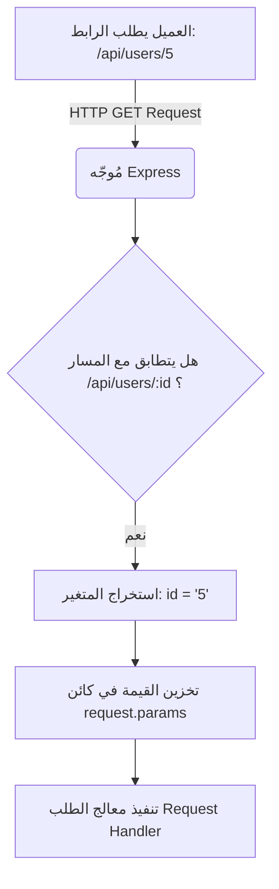

## متغيرات المسار (Route Parameters) في Express.js

### المفاهيم الأساسية (Core Concepts)

#### 1. متغيرات المسار (Route Parameters)
**التعريف:** 
هي قيم ديناميكية (Dynamic Values) يتم تمريرها كجزء من مسار الرابط (URL Path) لغرض إرسال بيانات متغيرة إلى الخادم (Server).

**الفكرة الأساسية:** 
بدلاً من إنشاء static path لكل عنصر (مثلاً path للمستخدم الأول وpath للمستخدم الثاني)، نقوم بإنشاء path واحد يحتوي على "متغير" أو "عنصر نائب" (Placeholder). يقوم الserver بالتقاط القيمة الممررة في هذا المتغير واستخدامها لتحديد المطلوب .

**لماذا نستخدمها؟**
تُستخدم لتجنب تكرار الكود ولجعل ال (Endpoint) مرنة وقابلة للتعامل مع أي مُعرّف (Identifier). على سبيل المثال، لجلب مستخدم واحد محدد بناءً على معرّفه الفريد (ID) أو اسم المستخدم (Username) من قاعدة البيانات أو مصفوفة بدلاً من جلب قائمة المستخدمين بالكامل.

**كيف تعمل؟**
يتم تعريف متغير الpath في مسار الطلب باستخدام رمز النقطتين الرأسيتين (`:`) متبوعاً باسم المتغير (مثل `id:`). عندما يستقبل الserver الطلب، يقوم بتخزين القيمة الممررة في كائن `request.params` .

**متى نستخدمها؟**
عند الحاجة إلى إجراء عمليات على عنصر واحد محدد (جلب، تعديل، حذف) يمتلك مُعرّفاً فريداً ضمن مجموعة من البيانات.

> `‏` **Important Note**
> يمكنك تمرير أكثر من متغير مسار واحد في نفس الرابط (على سبيل المثال: المعرف ID واسم المستخدم Username معاً)، لست مقيداً بمتغير واحد فقط، رغم أن استخدام متغير واحد هو الأكثر شيوعاً لجلب سجل محدد.

---

### هندسة دورة الطلب مع متغيرات المسار

الرسم التالي يوضح كيف يقوم Express.js بمطابقة المسار الديناميكي واستخراج القيم:



---

### التطبيق العملي (Practical Implementation)

سنقوم بشرح العملية من خلال حالة عملية (Case Study) تعتمد على مصفوفة وهمية للمستخدمين (`mockUsers`).

#### الخطوات (Steps)

`‏` **Step 1: إعداد البيانات الوهمية (Mock Data)**
سننقل مصفوفة المستخدمين `mockUsers` إلى أعلى الملف (Top Level) لتصبح متاحة كمتغير عام (Global Variable) يمكن الوصول إليه من أي مكان داخل الكود.

`‏` **Step 2: تعريف المسار الديناميكي (Defining the Route)**
نقوم بإنشاء مسار جديد باستخدام `app.get` ونضيف المتغير `id:` في نهاية المسار.

`‏` **Step 3: استخراج القيمة (Extracting the Parameter)**
الوصول إلى القيمة الممررة عبر `request.params.id`.

> `‏` **Important Note**
> جميع القيم التي يتم استخراجها من كائن `request.params` تكون دائماً من نوع **نص (String)** حتى لو قام المستخدم بتمرير رقم .

`‏`**Step 4: التحقق من صحة البيانات (Validation)**
بما أن مُعرّفات المستخدمين (IDs) في التطبيق هي أرقام، يجب تحويل القيمة النصية المستخرجة إلى رقم صحيح باستخدام دالة `()parseInt`. ثم يجب التأكد من أن القيمة المدخلة هي رقم صالح وليست حروفاً عشوائية باستخدام دالة `()isNaN` .

`‏`**Step 5: البحث عن المستخدم (Finding the User)**
استخدام دالة `()find` الخاصة بالمصفوفات للبحث عن المستخدم الذي يتطابق مُعرّفه مع المُعرّف المُمرر.

`‏`**Step 6: إرجاع الاستجابات (Returning Responses)**
تحديد الاستجابة المناسبة (رقم وحالة) بناءً على نتيجة الخطوات السابقة .

---

### الشرح التفصيلي للكود (Code Explanation)

إليك الكود المكتمل الذي يوضح كيفية تطبيق الخطوات السابقة، مع شرح كل سطر بناءً على تفصيل المحاضر:

```javascript
// Step 2: تعريف المسار باستخدام متغير المسار :id
app.get('/api/users/:id', (request, response) => {
    
    // Step 3 & 4: استخراج المتغير وتحويله إلى رقم
    // request.params هو كائن يحتوي على كل متغيرات المسار
    const parsedId = parseInt(request.params.id); 
    
    // التحقق مما إذا كانت القيمة المدخلة ليست رقماً (Not a Number)
    if (isNaN(parsedId)) {
        // إذا كان الإدخال غير صالح (مثلاً حروف بدلاً من رقم)
        // نُعيد رمز الحالة 400 (طلب سيء) مع رسالة خطأ
        return response.status(400).send({ msg: "Bad request. Invalid ID" });
    }
    
    // Step 5: البحث عن المستخدم في المصفوفة
    // نستخدم دالة find التي تمر على كل مستخدم (user) وتقارن المعرّف
    const findUser = mockUsers.find(user => user.id === parsedId);
    
    // Step 6: التعامل مع حالة عدم العثور على المستخدم
    if (!findUser) {
        // إذا لم يتم العثور على المستخدم نرسل حالة 404 (غير موجود)
        // يمكن استخدام دالة sendStatus لإرسال الحالة مباشرة دون رسالة نصية
        return response.sendStatus(404);
    }
    
    // الخطوة الأخيرة: إذا كان الرقم صالحاً والمستخدم موجوداً، نقوم بإرسال بيانات المستخدم
    return response.send(findUser);
});
```

#### ملاحظات هامة على الكود:
1. **دالة `()isNaN`:** اختصار لـ (Is Not a Number). دالة مدمجة في الجافاسكريبت تُرجع `true` إذا كانت القيمة الممررة غير رقمية (مثلاً إذا أرسل المستخدم `/api/users/abc`)، وتُرجع `false` إذا كانت رقماً صحيحاً ].
2. **الـ Predicate (الشرط):** في دالة `()find`، نمرر دالة  (Callback) تسمى منطقياً (Predicate Function) وظيفتها اختبار كل عنصر وإرجاع `true` عند تطابق العنصر المطلوب.

---

### مقارنة رموز الحالة (HTTP Status Codes) المذكورة

في هذه الوظيفة بالتحديد، أصبح لدينا 3 مسارات محتملة (Outputs) لمعالج الطلب. يشير المحاضر إلى أن فهم هذه المسارات الثلاثة سيفيد لاحقاً في عمليات اختبار الكود (Unit Testing).

| رقم الحالة (Status Code) |     المعنى (Meaning)      |                                             متى ظهر في هذا المثال؟ (When used)                                              |
| :----------------------: | :-----------------------: | :-------------------------------------------------------------------------------------------------------------------------: |
|    **200 (افتراضي)**     |       **نجاح (OK)**       |              عندما يكون الـ ID صالحاً، ويتم العثور على المستخدم في المصفوفة بنجاح، ويتم إرسال بياناته [9، 10].              |
|         **400**          | **طلب سيء (Bad Request)** |        عندما يُدخل العميل مُعرّفاً غير رقمي (مثل حروف عشوائية)، مما يعني أن بنية الطلب غير صالحة من الأساس [7، 10].         |
|         **404**          | **غير موجود (Not Found)** | عندما يُدخل العميل مُعرّفاً رقمياً صالحاً، لكن هذا الرقم غير مرتبط بأي مستخدم مسجل في قاعدة البيانات (أو المصفوفة) [9، 10]. |

> `‏` **Important Note**
> في هذا المسار `/api/users/:id`، لا نحتاج إلى برمجة كود للتحقق من "ما إذا كان المتغير `id` موجوداً أم لا" (Undefined check). السبب هو أنه إذا لم يقم العميل بكتابة أي شيء بعد السلاش (أي زار `/api/users` فقط)، فإن الطلب سيذهب تلقائياً إلى المسار العام الخاص بجميع المستخدمين ولن يدخل إلى هذا المسار من الأساس.


```javascript
app.get("/api/users/:id", (req,res) =>{

  const parseID = parseInt(req.params.id);

  if (parseID) {

    const user = users.find(u => u.id === parseID);

    if (user) {

      res.send(user);

    } else {

      res.status(404).send({error: "User not found"});

    }

  } else {

    res.send(users);

  }

});
```
