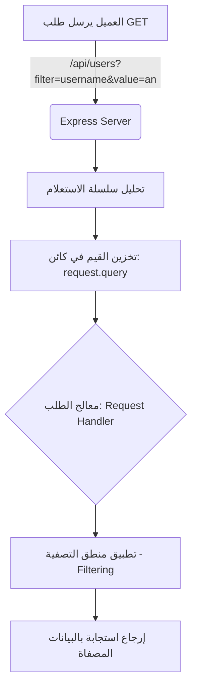

## متغيرات الاستعلام (Query Parameters) في Express.js

### المفاهيم الأساسية (Core Concepts)

#### 1. سلسلة الاستعلام (Query String) ومتغيرات الاستعلام (Query Parameters)
**التعريف:** 
سلسلة الاستعلام (Query String) هي جزء يُضاف في نهاية رابط عنوان الويب (URL) بعد تحديد المسار (Route)، وتُستخدم لإرسال بيانات إضافية إلى الخادم (Server) على شكل أزواج من "المفتاح والقيمة" (Key-Value pairs). 

**الفكرة الأساسية وكيف تعمل؟**
- تبدأ سلسلة الاستعلام دائماً بعلامة الاستفهام (`?`) التي تُعلم المتصفح والخادم بأن ما يليها هو بيانات استعلام.
- يتم تمرير البيانات بصيغة `المفتاح = القيمة` (Key=Value)، وهو ما يُشبه إسناد قيمة لمتغير في البرمجة ولكن داخل شريط العنوان.
- لربط أكثر من متغير استعلام في نفس الرابط، نستخدم علامة العطف (`&` Ampersand) كفاصل (Delimiter) بين المتغيرات.
  
*مثال تطبيقي على الرابط:* 
`localhost:3000/api/users?key=value&key2=value2`

**لماذا ومتى نستخدمها؟**
1. **في الواجهة الأمامية (Client-side):** لإرسال البيانات وتمريرها بين صفحات الويب المختلفة أثناء تنقل المستخدم.
2. **في الواجهة الخلفية (Server-side):** لإضافة بيانات إضافية لطلب HTTP (HTTP Request) من الclient إلى الserver، لتوجيه الserver حول كيفية معالجة البيانات قبل إرجاعها.
3. **في طلبات الجلب (GET Requests):** نظراً لأن طلب GET يُستخدم لقراءة البيانات فقط (Read-only format) ولا يُستخدم للتلاعب بالبيانات أو تعديلها، فإنه عادةً لا يحتوي على "جسم الطلب" (Request Body). لذلك، تُعد ال Query parameters الطريقة المثلى لإرسال تعليمات إضافية للخادم.

**أمثلة على حالات الاستخدام (Use Cases):**
- **الترتيب (Sorting):** طلب إرجاع قائمة المستخدمين مرتبة أبجدياً بناءً على اسم المستخدم (Username)، أو ترتيبها تصاعدياً/تنازلياً بناءً على رقم المُعرّف (ID).
- **التصفية (Filtering):** بدلاً من جلب قاعدة البيانات بأكملها، تطلب فقط المستخدمين الذين يحتوي اسمهم على حرف أو مقطع معين (Substring).

---

### هندسة معالجة متغيرات الاستعلام (Handling Query Parameters Architecture)

عندما يستقبل خادم Express.js طلباً يحتوي على سلسلة استعلام، فإنه يقوم تلقائياً بتحليل (Parsing) هذه السلسلة وتحويلها إلى كائن (JSON Object) يسهل التعامل معه برمجياً.

|  كائن الاستخراج  |           المسار المستخدم            |                           الاستخدام                           |
| :--------------: | :----------------------------------: | :-----------------------------------------------------------: |
| `request.params` |  متغيرات المسار (Route Parameters)   | يُستخدم لجلب متغيرات من صلب المسار نفسه (مثل `/api/users/5`). |
| `request.query`  | متغيرات الاستعلام (Query Parameters) | يُستخدم لجلب البيانات الممررة بعد علامة `?` في نهاية الرابط.  |
|                  |                                      |                                                               |

**رسم توضيحي لدورة الطلب مع Query Parameters:**


---

### التطبيق العملي: بناء نظام تصفية (Filtering System)

كيفية استخدام ال Query parameters لبناء نظام تصفية يبحث عن المستخدمين الذين يحتوي اسمهم على مقطع نصي (Substring) محدد.

#### الخطوات (Steps)

`‏`**Step 1: تحديد متغيرات الاستعلام المطلوبة**
سنحتاج إلى متغيرين من العميل:
1. `‏` `filter`: لتحديد الحقل المراد البحث فيه (مثل `username` أو `displayName`).
2. `‏` `value`: النص أو المقطع المراد البحث عنه (Substring).
مثال للرابط: `/api/users?filter=username&value=an`

`‏`**Step 2: استخراج المتغيرات من كائن الطلب**
يتم استخراج المتغيرين `filter` و `value` من كائن `request.query` باستخدام تقنية (Destructuring).

`‏`**Step 3: التحقق من وجود المتغيرات (Validation)**
يجب التأكد من أن كلا المتغيرين (filter و value) قد تم تمريرهما. لا يمكننا التصفية إذا كنا نملك النص دون معرفة الحقل، والعكس صحيح. 
إذا كان أحدهما أو كلاهما غير موجود (`undefined`)، يجب إرجاع القائمة الأصلية بالكامل (`mockUsers`) دون تصفية.

`‏`**Step 4: تطبيق منطق التصفية (Filtering Logic)**
نستخدم دالة `()filter` الخاصة بالمصفوفات، ونمرر لها دالة شرطية (Predicate Function) تختبر كل مستخدم. 
للوصول إلى الحقل الديناميكي داخل كائن المستخدم، نستخدم الأقواس المربعة `user[filter]`. 
ثم نستخدم دالة `()includes` للتحقق مما إذا كان النص المطلوب موجوداً داخل قيمة الحقل أم لا.

> `‏` **Important Note**
> **الخطأ الشائع (Hanging/Pending Request):** 
> إذا لم تقم ببرمجة حالة (Edge Case) تعالج ما يحدث إذا أرسل العميل متغيراً واحداً فقط (مثل `?filter=username` دون `value`) ولم تقم بإرسال استجابة (Response) في هذه الحالة، سيبقى الطلب مُعلقاً (Pending Request) ولن يكتمل أبداً. يجب دائماً التأكد من تغطية جميع المسارات الشرطية وإرجاع استجابة.

---

### الشرح التفصيلي للكود (Code Implementation)

إليك الكود المكتمل مع شرح كل سطر بناءً على الخطوات السابقة والمفاهيم المشروحة:

```javascript
// تعريف مسار GET للحصول على المستخدمين
app.get('/api/users', (request, response) => {
    
    // Step 2: استخراج (Destructure) المتغيرات من request.query في خطوة واحدة
    const { filter, value } = request.query; 

    // Step 3: التحقق من صحة المتغيرات (Validation)
    // نتأكد أن كلاً من filter و value موجودان (مُعرفان)
    if (filter && value) {
        
        // Step 4: تطبيق التصفية
        // نستخدم دالة filter على المصفوفة الأصلية mockUsers
        // نمرر دالة Callback (Predicate Function) لاختبار كل كائن (user)
        const filteredUsers = mockUsers.filter(user => {
            
            // نستخدم user[filter] للوصول إلى الحقل المطلوب (مثل user['username'])
            // نستخدم دالة includes للتحقق مما إذا كان هذا الحقل يحتوي على الـ value
            return user[filter].includes(value);
        });

        // إرجاع المصفوفة الجديدة التي تحتوي على نتائج التصفية فقط
        return response.send(filteredUsers);
    }

    // معالجة الخطأ الشائع (Edge Case):
    // إذا فشل الشرط أعلاه (أي أن المتغيرين أو أحدهما غير موجود)
    // نقوم بإرجاع المصفوفة الأصلية بالكامل دون أي تصفية لمنع تعليق الطلب (Pending Request)
    return response.send(mockUsers);
});
```

#### المفاهيم التقنية المستخدمة في الكود:
- **دالة `()includes`:** هي دالة مدمجة في سلاسل النصوص (Strings) تُرجع القيمة المنطقية `true` إذا كانت السلسلة النصية المراد البحث عنها تظهر كجزء (Substring) من النص الأساسي، وتُرجع `false` إذا لم تكن موجودة.
- **الوصول الديناميكي للخصائص (Bracket Notation `user[filter]`):** عندما يكون اسم الخاصية (Property key) متغيراً وديناميكياً (يمكن أن يكون username أو displayName)، لا يمكننا استخدام النقطة (`user.filter`) لأنها ستبحث عن خاصية اسمها الحرفي "filter"، لذلك نستخدم الأقواس المربعة لتقييم المتغير أولاً.

#### نتائج اختبار الكود عملياً (Testing Scenarios):
1. **بدون متغيرات** (`/api/users`): يعود التطبيق بالمصفوفة كاملة غير مرتبة ولا مصفاة.
2. **متغير واحد فقط** (`/api/users?filter=username`): يعود التطبيق بالمصفوفة كاملة (تم إصلاح خطأ الطلب المُعلق عبر معالجة الشرط).
3. **متغيرات صحيحة** (`/api/users?filter=username&value=an`): تعود المصفوفة فقط بالمستخدمين الذين يحتوي اسمهم على حرفي "an" (مثل المستخدم Anson).
4. **تغيير القيمة** (`/api/users?filter=username&value=e`): تعود المصفوفة بالمستخدمين الذين يحتوي اسمهم على حرف "e" (مثل المستخدم Henry).


---


تُستخدم الدالة `app.use()` في إطار العمل **Express.js** (الخاص بـ Node.js) ==لإضافة وتفعيل دوال **الوسيط (Middleware)**==. تعمل هذه الدوال كحلقة وصل لمعالجة الطلبات القادمة (Requests) قبل وصولها إلى المسار النهائي. 
الوظائف الأساسية لـ `app.use()`:

- **التعامل مع البيانات:** قراءة وتحويل البيانات القادمة من المستخدم (مثل تحويل جسم الطلب إلى صيغة JSON).

- **المصادقة والتفويض:** التحقق مما إذا كان المستخدم مسجل الدخول قبل السماح له بفتح صفحات معينة.

- **التسجيل (Logging):** تسجيل معلومات حول كل طلب يصل للخادم (مثل وقت الطلب وعنوان الرابط).

- **الملفات الثابتة:** عرض الملفات الثابتة مثل الصور و CSS.

- **التقاط المسارات:** تنطبق على جميع أنواع طلبات الـ HTTP (مثل `GET`, `POST`). 