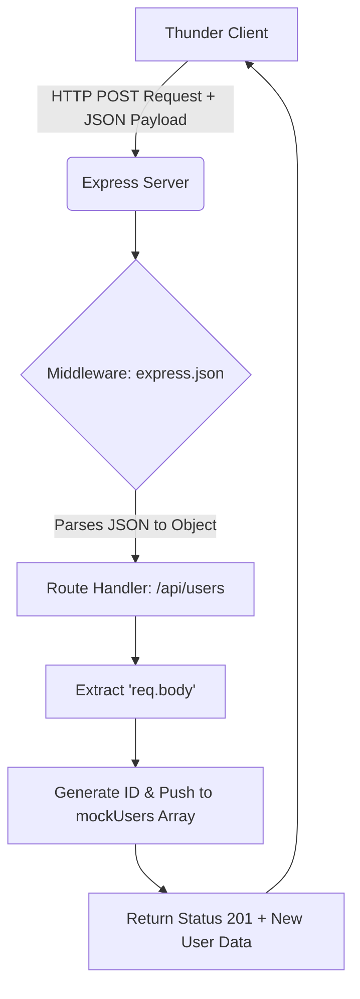

## طلبات الإنشاء (POST Requests) في إطار العمل Express.js

### المفاهيم الأساسية (Core Concepts)

#### 1. طلب الإنشاء (POST Request)
**التعريف:** 
هو أحد أنواع طلبات بروتوكول HTTP يُستخدم عندما ترغب في إنشاء مورد (Resource) أو بيانات جديدة على الخادم (Backend) وحفظها في قاعدة بيانات (Database)، أو ملف، أو أي مكان آخر.

**الفكرة الأساسية ومثال عملي:**
تخيل أن تطبيق الواجهة الأمامية (Front-end Client) يحتوي على نموذج تسجيل مستخدم جديد (User Sign-up Form) يطلب إدخال اسم المستخدم، كلمة المرور، والبريد الإلكتروني. 
عندما ينقر المستخدم على زر "تسجيل"، سيقوم العميل (Client) بإرسال طلب من نوع **POST** إلى الخادم (Server).

**كيف تعمل دورة الطلب؟**
1. الخادم يستقبل الطلب ويستخرج البيانات المُرسلة.
2. يقوم الخادم بإجراء العمليات اللازمة مثل التحقق من صحة البيانات (Validation)، والتحليل (Parsing)، والتأكد من وجود الحقول المطلوبة.
3. بعد حفظ السجل بنجاح، يُرجع الخادم استجابة (Response) تحمل رمز الحالة `201` (أي تم الإنشاء)، وقد يُرجع أيضاً السجل الجديد الذي تم إنشاؤه لكي يستخدمه العميل إذا لزم الأمر .

#### 2. جسم الطلب (Request Body / Payload)
**التعريف:** 
هي البيانات الفعلية التي يتم إرسالها من العميل إلى الخادم (Backend Server) عبر طلب الـ POST.

> `‏` **Important Note**
> **ملاحظة حول المصطلحات:** يُطلق على البيانات المُرسلة اسمان: `Payload` و `Request Body`. يجب أن تعلم أن هذين المصطلحين مترادفان (Interchangeable Terms) ويحملان نفس المعنى تماماً في هذا السياق.

#### 3. البرمجيات الوسيطة (Middleware)
**التعريف:** 
هي عبارة عن دوال (Functions) يتم استدعاؤها وتنفيذها قبل أن تتم معالجة طلبات الـ API المعينة (Route Handlers).

**لماذا نستخدمها هنا (`express.json`)؟**
بشكل افتراضي (By default)، إطار العمل Express لا يقوم بتحليل (Parsing) بيانات جسم الطلب (Request Bodies) الواردة بصيغة JSON. 
إذا حاول العميل إرسال بيانات JSON إلى الخادم دون وجود وسيط يقوم بتحليلها، فإن قيمة الكائن `request.body` ستكون `undefined` (غير مُعرّفة). لذلك نستخدم الدالة المدمجة `()express.json` كوسيط لتحليل الطلبات التي يكون نوع المحتوى (Content-Type) الخاص بها هو `application/json`.

> `‏` **Important Note**
> **قاعدة هامة:** يجب دائماً تسجيل البرمجيات الوسيطة (Middlewares) في وقت مبكر قدر الإمكان في الكود (مباشرة بعد تهيئة كائن تطبيق Express)، لضمان تنفيذها قبل وصول الطلب إلى المسارات (Routes) .

---

### أدوات اختبار واجهات برمجة التطبيقات (HTTP Clients)

بما أن متصفح الويب لا يمتلك أداة مدمجة تتيح لك إرسال طلبات POST مع جسم طلب (Request Body) بسهولة (إلا عن طريق كتابة كود JavaScript في الـ Console)، يجب استخدام برامج خارجية تسمى عملاء HTTP (HTTP Clients).

**خيارات الأدوات المتاحة:**
1. `‏` **Postman:** أداة شهيرة ومنفصلة لاختبار واجهات الـ API.
2. `‏`**Hopscotch:** بديل ممتاز لأداة Postman.
3. `‏`**Thunder Client:** إضافة (Extension) خفيفة الوزن يتم تثبيتها مباشرة داخل محرر الأكواد VS Code. 

**جدول مقارنة سريع (بناءً على الشرح):**

|             الميزة              |  المتصفح العادي (Browser)  |          أداة Thunder Client           |
| :-----------------------------: | :------------------------: | :------------------------------------: |
| **نوع الطلبات المدعومة بسهولة** | GET فقط (عبر شريط العنوان) |         GET, POST, PUT, DELETE         |
|    **إرسال Payload / Body**     |      غير ممكن بسهولة       | مدعوم بالكامل (عبر تبويب Body -> JSON) |
|         **بيئة العمل**          |          المتصفح           |           مدمج داخل VS Code            |

---

### هندسة وتدفق البيانات (Data Flow Architecture)

الرسم التالي يوضح تدفق البيانات عند إرسال طلب POST مع بيانات JSON:



---

### التطبيق العملي (Practical Implementation)

#### `‏`Step 1: تثبيت وإعداد Thunder Client

1. اذهب إلى قائمة الإضافات (Extensions) في VSS Code.
2. ابحث عن `Thunder Client` وقم بتثبيته.
3. افتح الأداة، انقر على `New Request`، اختر نوع الطلب `POST`، واكتب الرابط: `localhost:3000/api/users` .

####`‏` Step 2: تسجيل البرمجية الوسيطة (Registering the Middleware)
قبل تعريف أي path، يجب تفعيل مُحلل JSON.

```javascript
// استدعاء الدالة use لتسجيل الـ Middleware
// الدالة express.json() تأتي مدمجة مع إطار العمل Express
app.use(express.json()); 
```
الشرح: الكود يقرأ الطلبات الواردة، وإذا كان الـ Header يحتوي على `application/json`، فإنه يقوم بتحليلها وإضافتها إلى الكائن `request.body`.

#### `‏` Step 3: إنشاء مسار POST (Creating the POST Route)
نقوم باستخدام دالة `()app.post` لبناء الpath .

> `‏` **Important Note**
> **هل يمكن استخدام نفس الرابط (Path) مع GET و POST؟**
> نعم! يمكنك أن تمتلك مساراً `app.get('/api/users')` وآخر `app.post('/api/users')` دون أي تعارض (Conflict). الخادم يستطيع التمييز بينهما بناءً على نوع فعل HTTP (HTTP Verb) المستخدم في الطلب.

#### `‏`Step 4: استخراج البيانات وإنشاء المستخدم (The Business Logic)

```javascript
// تعريف مسار POST على نفس الرابط المستخدم سابقاً لطلبات GET
app.post('/api/users', (request, response) => {
    
    // 1. استخراج (Destructure) كائن الـ body من الطلب
    // بفضل الـ Middleware، الكائن body لن يكون undefined
    const { body } = request;

    // 2. إنشاء مُعرّف (ID) جديد
    // نظراً لعدم وجود قاعدة بيانات تتولى إنشاء الـ IDs تلقائياً
    // سنقوم بجلب آخر عنصر في المصفوفة وإضافة 1 إلى المعرف الخاص به
    // ملحوظة: المصفوفات تبدأ من صفر، لذلك نستخدم length - 1
    const newId = mockUsers[mockUsers.length - 1].id + 1; 

    // 3. تجميع بيانات المستخدم الجديد
    // نستخدم الـ Spread Operator (...) لنسخ جميع الخصائص الواردة في الـ body
    // ونضيف إليها الـ ID الجديد
    const newUser = { id: newId, ...body };

    // 4. حفظ المستخدم الجديد (في حالتنا: إضافته إلى المصفوفة الوهمية)
    mockUsers.push(newUser);

    // 5. إرسال الاستجابة (Response)
    // نحدد كود الحالة 201 (تم الإنشاء) ونُرجع بيانات المستخدم الجديد للعميل
    return response.status(201).send(newUser);
});
```

**شرح الأخطاء والملاحظات في الكود:**
- **مشكلة الـ Undefined:** إذا لم تقم بتنفيذ (Step 2)، سيطبع الخادم كلمة `undefined` ولن يتمكن من قراءة `request.body`.
- **رمز الحالة (Status Code):** من أفضل الممارسات (Good Practice) عند نجاح طلب الـ POST في إنشاء مورد جديد، أن تُرسل رمز الحالة `201` بدلاً من الرمز الافتراضي `200`.
- **طريقة توليد المُعرّف (Hack):** يوضح المحاضر أن طريقة توليد الـ ID بهذه الطريقة `mockUsers.length - 1` هي طريقة ملتوية (Hacky) وتُستخدم فقط في بيئة التجربة التعليمية لعدم وجود قاعدة بيانات حقيقية تتولى هذه المهمة (Auto-increment) .

---


الـ `body` لا يتم استخراجه من الرابط (URL)؛ الـ `body` هو جزء منفصل تماماً يأتي مخفياً داخل نص الطلب نفسه (HTTP Request Body)، ويُستخدم لإرسال البيانات الكبيرة أو الحساسة مثل ملفات الـ JSON في طلبات الـ `POST` والـ `PUT`.

إذا كنت تقصد استخراج البيانات المكتوبة في الرابط بعد علامة الاستفهام (مثل: `?name=Mustafa&email=test@gmail.com`)، فهذه تسمى Query Parameters، ويتم استخراجها في Express باستخدام `req.query`.

إليك الطريقتين والفرق بينهما لتختار ما تحتاجه:

## 1. إذا كنت تريد استخراج البيانات من الرابط (Query Parameters)

إذا كان الرابط في Postman هكذا: `http://localhost:3000/api/users?name=Mustafa&email=test@gmail.com`

تستخرج البيانات في الكود هكذا:

```javascript
app.put('/api/users/:id', (req, res) => {
  const parseID = parseInt(req.params.id);
  
  // استخراج البيانات القادمة في الرابط بعد علامة الـ ?
  const { name, email } = req.query; 

  console.log(name);  // سيعطيك: Mustafa
  console.log(email); // سيعطيك: test@gmail.com

  // تحديث البيانات بناءً عليها
  const userIndex = users.findIndex(u => u.id == parseID);
  if (userIndex != -1) {
    users[userIndex] = { id: parseID, name, email };
    res.send(users[userIndex]);
  } else {
    res.status(404).send({ error: "User not found" });
  }
});
```

---

## 2. إذا كنت تريد الطريقة الصحيحة لـ `PUT` (باستخدام الـ Body والـ Params)

في معايير الـ REST API، الطريقة الاحترافية والصحيحة هي إرسال الـ `id` في الرابط، وبيانات التعديل داخل الـ `Body`:

- الرابط في Postman: `http://localhost:3000/api/users/2`
- الـ Body في Postman (تحت تبويب Body واختيار JSON):
    
    ```json
    {
      "name": "Mustafa",
      "email": "test@gmail.com"
    }
    ```
    

وتستخرجهم في الكود كالتالي (وهذا هو كودك الحالي بعد التعديل):

```javascript
// 1. الـ id يأتي من الرابط عبر (req.params)
const parseID = parseInt(req.params.id); 

// 2. البيانات تأتي من الـ Body المخفي عبر (req.body)
const { body } = req; 
```

---

