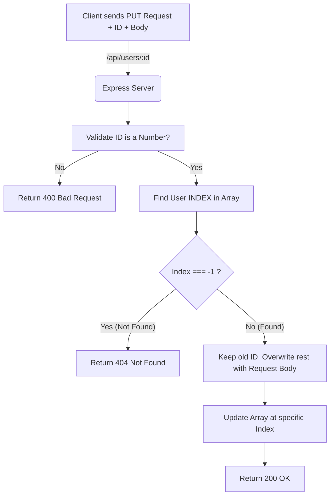

## طلبات التحديث (PUT Requests) وعمليات HTTP المتقدمة في Express.js

### المفاهيم الأساسية (Core Concepts)

بالإضافة إلى طلبات الجلب (GET) والإنشاء (POST)، تعتمد واجهات برمجة التطبيقات (APIs) على مجموعة أخرى من أفعال بروتوكول HTTP (HTTP Request Methods) للتعامل مع البيانات. من أهم هذه العمليات التي ستصادفها بكثرة في التوثيقات (Documentation) وتستخدمها في بناء الخوادم هي: **PUT**, **PATCH**, و **DELETE**.

#### 1. طلب التحديث الكلي (PUT Request)
*   **التعريف:** هو طلب HTTP يُستخدم لتحديث مورد (Resource) أو سجل بأكمله في قاعدة البيانات .
*   **الفكرة الأساسية:** عند استخدام PUT، فإنك تقوم فعلياً باستبدال الكيان القديم بالكيان الجديد بالكامل.
*   **كيف يعمل؟** يتطلب منك إرسال **جميع** حقول الكائن في جسم الطلب (Request Body)، حتى الحقول التي لا ترغب في تعديلها.
*   **العيوب والأخطاء الشائعة:** إذا نسيت تضمين حقل معين في طلب الـ PUT (مثلاً قمت بإرسال `username` فقط ولم ترسل `displayName`)، سيتم مسح الحقل المفقود. في قواعد بيانات SQL سيصبح الحقل `Null`، وفي قواعد بيانات MongoDB سيتم إزالته من المستند (Document) تماماً ولن يظهر عند جلب البيانات مرة أخرى .

#### 2. طلب التحديث الجزئي (PATCH Request)
*   **التعريف:** هو طلب HTTP يُستخدم لتحديث السجلات بشكل جزئي (Partially).
*   **كيف يعمل؟** تقوم بتمرير الحقل المراد تحديثه فقط (مثلاً ترغب بتغيير اسم المستخدم من Anson إلى Anon123). لن تحتاج إلى إرسال باقي الحقول (مثل الاسم المعروض)، وستبقى تلك الحقول سليمة دون أن تُحذف أو تتأثر .
*   **المميزات:** يمنع عناء تمرير كائن ضخم يحتوي على حقول كثيرة (Nuisance) إذا كنت ترغب بتعديل حقل واحد فقط.

#### 3. طلب الحذف (DELETE Request)
*   **التعريف:** طلب بديهي (Straightforward) يُستخدم حصرياً لحذف السجلات (Records) والموارد من قاعدة البيانات (سواء كان المستخدم، المنتج، أو الطلب).

---

### المقارنة الشاملة: PUT مقابل PATCH

لتوضيح متى نستخدم كل منهما، إليك هذا الجدول المقارن:

|          السمة (Feature)           |        PUT Request (التحديث الكلي)         |             PATCH Request (التحديث الجزئي)              |
| :--------------------------------: | :----------------------------------------: | :-----------------------------------------------------: |
|          **حجم التحديث**           |       يحدّث الكيان (Entity) بأكمله .       |            يحدّث جزءاً محدداً فقط من الكيان.            |
| **البيانات المطلوبة في الـ Body**  | يجب إرسال **كل الحقول** سواء تغيرت أم لا . |         ترسل **فقط الحقول** التي تريد تغييرها .         |
|   **ماذا يحدث للحقول المفقودة؟**   |      يتم حذفها أو تحويلها إلى `Null`.      |            لا تتأثر، وتحتفظ بقيمتها السابقة.            |
| **الاستخدام الأمثل (When to use)** |    عند استبدال سجل بالكامل بنسخة جديدة.    | عند تعديل خاصية أو خاصيتين فقط (مثل تغيير كلمة المرور). |

> `‏` **Important Note**
> **حفظ المُعرّفات (IDs):**
> عند تحديث البيانات، يجب **ألا تقوم أبداً** بتعديل المُعرّف (ID) الخاص بالسجل. في بيئات العمل الحقيقية، يتم توليد هذه المُعرّفات تلقائياً (Autogenerated) بواسطة خادم قاعدة البيانات، ولذلك يجب تركها كما هي وعدم السماح للعميل بتعديلها عبر الـ Request Body .

---

### هندسة التحديث باستخدام PUT (Architecture)

الرسم التالي يوضح تدفق البيانات عند إرسال طلب PUT لتحديث مستخدم:



---

### التطبيق العملي: بناء مسار PUT (Practical Implementation)

لإنشاء مسار تحديث، سنستخدم نفس الرابط الذي استخدمناه مسبقاً لجلب المستخدم بناءً على رقمه (GET by ID)، ولكن باستخدام دالة `()app.put`. 
ملاحظة: استخدام نفس الرابط لا يسبب مشكلة طالما أن أنواع الطلبات (Methods) مختلفة.

#### الخطوات البرمجية (Steps):

**`‏` Step 1: تهيئة المسار واستخراج البيانات (Destructuring)**
نستخرج كلاً من المتغيرات (Params) لاستخراج الـ `id`، وجسم الطلب (Body) الذي يحتوي على البيانات الجديدة .

`‏` **Step 2: معالجة البيانات والتحقق منها (Validation)**
نقوم بتحويل الـ `id` إلى رقم صحيح باستخدام `parseInt`. ثم نتحقق مما إذا كان المدخل ليس رقماً `()isNaN`. إذا كان كذلك، نُرجع كود الحالة `400` (Bad Request) .

`‏` **Step 3: البحث عن موقع العنصر (Finding the Index)**
هنا **لا نستخدم** دالة `()find` العادية التي تعيد الكائن، بل نستخدم دالة `()findIndex` لأننا نحتاج لمعرفة "موقع" المستخدم داخل المصفوفة لكي نتمكن من استبدال الكائن القديم بالكائن الجديد كلياً.
إذا لم نعثر عليه (أي أعادت الدالة `-1`)، نُرجع كود `404` (Not Found).

`‏` **Step 4: استبدال الكائن بالكامل (Overwriting)**
نصل إلى العنصر باستخدام الفهرس: `mockUsers[findUserIndex]`. ونقوم بتعيين كائن جديد يمتلك نفس الـ `id` القديم، بالإضافة إلى تفريغ `...body` داخله لتحديث باقي البيانات.

`‏` **Step 5: إرسال الاستجابة (Sending Response)**
نرسل كود الحالة `200` للدلالة على نجاح العملية (يمكن أيضاً استخدام 204).

#### الشرح التفصيلي للكود (Code Block):

```javascript
// Step 1: تعريف مسار PUT على نفس رابط استعلام الـ GET
app.put('/api/users/:id', (request, response) => {
    
    // استخراج body (البيانات الجديدة) و params (المتغيرات من الرابط)
    const { body, params } = request;
    const { id } = params;
    
    // Step 2: تحويل النص إلى رقم والتحقق من صحته
    const parsedId = parseInt(id);
    if (isNaN(parsedId)) {
        // إذا كان الـ ID حروفاً وليس رقماً، أرجع 400 طلب سيء
        return response.sendStatus(400); 
    }
    
    // Step 3: البحث عن فهرس (Index) المستخدم داخل المصفوفة الوهمية
    // نمرر Predicate function لتقارن المعرف المحول (parsedId) بالمعرفات الموجودة
    const findUserIndex = mockUsers.findIndex(user => user.id === parsedId);
    
    // دالة findIndex ترجع -1 إذا لم تجد العنصر
    if (findUserIndex === -1) {
        // إذا لم يتم العثور عليه، أرجع 404 غير موجود
        return response.sendStatus(404);
    }
    
    // Step 4: عملية التحديث الكلي (PUT Logic)
    // الوصول للمستخدم في المصفوفة وتعيين كائن جديد له
    mockUsers[findUserIndex] = {
        // نحافظ على الـ ID القديم كما هو (لأنه من المفترض أن قاعدة البيانات تديره)
        id: parsedId, 
        
        // نستخدم عامل النشر (Spread Operator) لتفريغ محتويات الـ body فوق الكائن
        // هذا سيؤدي إلى استبدال كل الحقول بالحقول المرسلة من العميل
        ...body 
    };
    
    // Step 5: إرسال استجابة بنجاح التحديث
    return response.sendStatus(200);
});
```

---

### تجربة واختبار السلوك عملياً (Testing & Case Studies)

سنقوم باختبار الكود عبر أداة لعملاء HTTP. لفهم الطبيعة "التدميرية" لتحديث PUT إذا تم استخدامه بشكل خاطئ، لاحظ السيناريوهات التالية على مستخدم اسمه "Jack" ومعرفه `2`:

**الحالة الأولى: الاستخدام الصحيح (تحديث مع إبقاء الحقول)**
*   **الطلب المرسل:** `{"username": "Jackson", "displayName": "Jack"}`
*   **النتيجة:** يتحدث الاسم إلى Jackson، ويبقى الاسم المعروض Jack. التطبيق يعمل بامتياز.

**الحالة الثانية: نسيان تمرير حقل (الخطر في PUT)**
*   **الطلب المرسل:** تم إرسال حقل `username` فقط، وتم تجاهل / حذف حقل `displayName` من جسم الطلب.
*   **النتيجة:** عند الاستعلام عن المستخدم لاحقاً، ستجد أن خاصية `displayName` قد اختفت تماماً وتم مسحها من كائن المستخدم لأن طلب الـ PUT أعاد بناء الكائن دونها.

**الحالة الثالثة: إرسال Body فارغ**
*   **الطلب المرسل:** بدون إرسال أي حقول.
*   **النتيجة:** سيتحول المستخدم إلى كائن يحتوي على `id` فقط، وتم مسح كافة بياناته الأخرى.

**الحالة الرابعة: محددات خاطئة (Edge Cases)**
*   إرسال رقم مستخدم غير موجود (مثال `ID = 999`) سيعيد حالة `404`.
*   إرسال مسار خاطئ بنص بدلاً من رقم (مثال `ID = abc`) سيعيد حالة `400`.