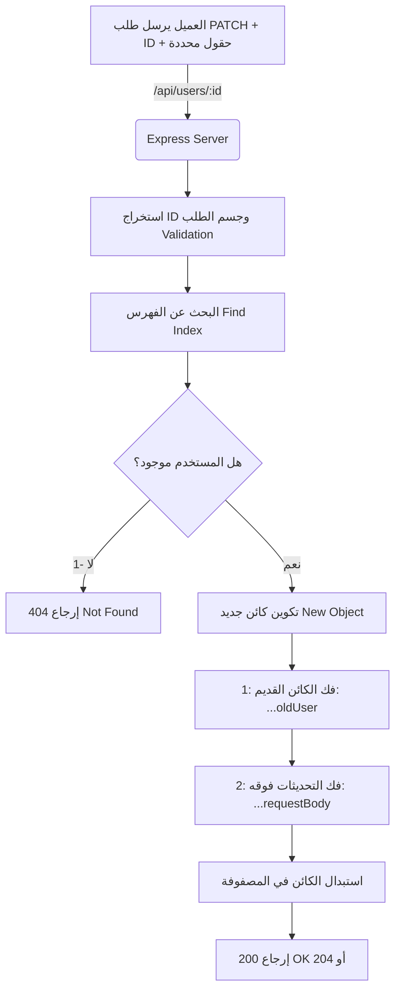

## طلبات التحديث الجزئي (PATCH Requests) في إطار العمل Express.js

### المفاهيم الأساسية (Core Concepts)

#### 1. طلب التحديث الجزئي (PATCH Request)
*   **التعريف:** هو أحد أفعال بروتوكول HTTP (HTTP Request Methods) الذي يُستخدم لتحديث كيان (Entity) أو مورد (Resource) أو سجل (Record) بشكل جزئي (Partially).
*   **الفكرة الأساسية:** بدلاً من استبدال الريكورد بالكامل وتحديث كل البيانات الموجودة فيه بناءً على ما يتم إرساله، نقوم بتحديث حقل واحد أو عدة حقول محددة فقط، مع الحفاظ على بقية الحقول كما هي دون المساس بها .
*   **لماذا نستخدمها؟** لتجنب الإزعاج (Nuisance) الناتج عن الاضطرار لتضمين كل حقول الكائن في جسم الطلب (Request Body) في كل مرة نريد فيها إجراء تعديل بسيط. على سبيل المثال، إذا كان لدينا مستخدم يمتلك 10 حقول مختلفة، ونريد تغيير حقل واحد فقط، فليس من المنطقي إرسال الـ 10 حقول بالكامل.
*   **متى نستخدمها؟** عندما نرغب في تعديل قيمة أو قيمتين فقط داخل كائن كبير (مثل تغيير اسم المستخدم فقط أو تغيير كلمة المرور فقط) دون التأثير على البيانات الأخرى .
*   **مميزاتها:**
    *   لا تتطلب إرسال كل بيانات السجل.
    *   تحمي الحقول غير المشمولة في الطلب (Request Body) من الحذف أو الاستبدال، حيث تحتفظ بقيمتها الأصلية .

#### 2. عامل النشر (Spread Operator `...`) في التحديث
*   **التعريف:** أداة في JavaScript تُستخدم لفك (Unpack) وتوزيع محتويات الكائنات (Objects) أو المصفوفات.
*   **كيف يعمل هنا؟** نستخدمه مرتين: الأولى لأخذ جميع قيم الحقول (Key-Value pairs) الخاصة بالمستخدم الحالي ووضعها في كائن جديد، والثانية لأخذ جميع قيم الحقول المُرسلة في جسم الطلب (Request Body) ووضعها في نفس الكائن. الحقول القادمة من جسم الطلب ستطغى (Override) على الحقول القديمة التي تحمل نفس الاسم، بينما ستبقى الحقول الأخرى دون تغيير.

> `‏` **Important Note**
> **حفظ البيانات (Data Retention):** 
> يجب أن تتذكر دائماً أن أي حقل متواجد مسبقاً في السجل (مثل `displayName`) ولم تقم بتضمينه في جسم طلب الـ PATCH، لن يتم لمسه على الإطلاق وسيبقى محتفظاً بقيمته الأصلية .

---

### المقارنة الشاملة: PUT مقابل PATCH

يشرح المحاضر بوضوح الفرق بين آلية عمل كلا الطلبين لتحديث البيانات، وإليك هذا الجدول الأكاديمي للمقارنة:

|             السمة (Feature)              |                     PUT Request (التحديث الكلي)                     |                PATCH Request (التحديث الجزئي)                |
| :--------------------------------------: | :-----------------------------------------------------------------: | :----------------------------------------------------------: |
|             **آلية التحديث**             |    يُحدّث المورد أو السجل بأكمله ككتلة واحدة (Entire resource) .    | يُحدّث حقولاً محددة ومعينة فقط داخل السجل (Certain fields) . |
|    **البيانات المطلوبة في الـ Body**     |            يجب إدراج كل الحقول التي يتكون منها الكائن .             |   يمكنك إدراج حقل واحد أو أكثر دون الحاجة لإدراج الجميع .    |
| **الحقول غير المُدرجة (Omitted Fields)** | يتم استبدال الكائن بالكامل، مما يؤدي لضياع/حذف الحقول غير المُرسلة. |        تظل آمنة، ولا يتم المساس بها، وتحتفظ بقيمتها .        |

---

### هندسة التحديث باستخدام PATCH (Architecture)

الرسم التالي يوضح مسار عمل (Workflow) طلب الـ PATCH وكيفية دمج البيانات باستخدام عامل النشر (Spread Operator):



---

### التطبيق العملي: بناء مسار PATCH (Practical Implementation)

لإنشاء مسار التحديث الجزئي، سنستخدم دالة `()app.patch`. يشير المحاضر إلى أننا سنعيد استخدام نفس المسار (Path) المستخدم سابقاً للـ PUT وهو `/api/users/:id`، وهذا ممكن ومسموح به تماماً لأننا نستخدم فعل HTTP مختلفاً (HTTP Method) .
#### الخطوات البرمجية (Steps):

`‏`**Step 1: تعريف المسار واستخراج البيانات**
تحديد المسار وتمرير دالة معالج الطلب (Request Handler). ثم استخراج (Destructuring) كائن جسم الطلب (`request.body`) ومتغير المسار (`id`) من كائن الطلب.

`‏`**Step 2: التحقق من صحة المُعرّف (ID Validation)**
استخدام دالة `()parseInt` لتحويل الـ `id` إلى قيمة رقمية صالحة. ثم التأكد عبر دالة `()isNaN` من أن القيمة الناتجة هي رقم فعلي، وإذا كانت غير ذلك (مثلاً أرسل المستخدم اسماً بدلاً من رقم)، يتم إرسال استجابة فشل.

`‏`**Step 3: البحث عن موقع المستخدم (Finding the User Index)**
استخدام دالة `findIndex()` للبحث في المصفوفة (مثل `mockUsers`). إذا فشل البحث، تُرجع الدالة `-1`، وعندها نرسل كود الحالة `404` (Not Found) .

`‏`**Step 4: دمج البيانات وتحديثها (Data Merging)**
نقوم بإنشاء كائن جديد. نستخدم عامل النشر (`...`) لنسخ جميع قيم المستخدم القديم، ثم نستخدم عامل النشر مرة أخرى لنسخ قيم جسم الطلب (Request Body) فوقها.

`‏`**Step 5: إرسال الاستجابة (Sending the Response)**
إرسال كود الحالة `200` أو `204` كدلالة على نجاح عملية التحديث .

---

### الشرح التفصيلي للكود (Code Block)

إليك الكود المكتمل بناءً على الشرح، مع توضيح آلية عمل التحديث الجزئي:

```javascript
// Step 1: تعريف مسار التحديث الجزئي باستخدام app.patch
app.patch('/api/users/:id', (request, response) => {
    
    // استخراج جسم الطلب (body) ومتغيرات المسار في خطوة واحدة
    const { body, params: { id } } = request; //
    
    // Step 2: تحويل الـ ID إلى رقم والتحقق من صحته
    const parsedId = parseInt(id); //
    if (isNaN(parsedId)) {
        // إذا كان المدخل نصاً عشوائياً وليس رقماً، نتوقف هنا
        return response.sendStatus(400); //
    }
    
    // Step 3: البحث عن موقع (Index) السجل المراد تحديثه
    const findUserIndex = mockUsers.findIndex(user => user.id === parsedId); //
    
    if (findUserIndex === -1) {
        // -1 تعني أن المستخدم غير موجود في المصفوفة
        return response.sendStatus(404); //
    }
    
    // Step 4: جوهر عملية الـ PATCH (التحديث الجزئي)
    mockUsers[findUserIndex] = {
        // أولاً: ننسخ كل الحقول (Key-Value pairs) الخاصة بالمستخدم الحالي
        // هذا يضمن أن الحقول التي لا نريد تحديثها (مثل display name) ستبقى كما هي
        ...mockUsers[findUserIndex], //
        
        // ثانياً: ننسخ الحقول المُرسلة في جسم الطلب (Request body)
        // إذا كان هناك حقل يحمل نفس الاسم (مثل username)، سيقوم بالكتابة فوق القيمة القديمة (Override)
        ...body //
    };
    
    // Step 5: إرسال حالة النجاح
    // في طلبات الـ PATCH يمكن إرسال حالة 200 (OK) أو 204 (No Content)
    return response.sendStatus(200); //
});
```

---

### حالات عملية وتجارب (Case Studies & Tests)

للتأكد من فهم الفرق العملي بين PUT و PATCH، سنقوم بإجراء عدة تجارب باستخدام مستخدم وهمي يحمل المعرّف رقم `2` (وهو المستخدم الذي بياناته كالتالي: `username: 'jack'`, `displayName: 'Jack'`) .

**التجربة الأولى: تحديث حقل واحد فقط (`username`)**
*   **ما تم إرساله في الطلب:** `{"username": "Jackson"}`.
*   **النتيجة السابقة في (PUT):** كان سيتم تغيير الـ `username` إلى Jackson، ولكن سيتم **حذف/فقدان** حقل `displayName` لأنه لم يُدرج في الطلب.
*   **النتيجة الحالية في (PATCH):** تم تغيير الـ `username` إلى Jackson، **وبقي** حقل `displayName` يحمل القيمة "Jack" دون أي تأثر.

**التجربة الثانية: تحديث حقل آخر بمفرده (`displayName`)**
*   **ما تم إرساله في الطلب:** `{"displayName": "Jackson"}`.
*   **النتيجة:** سيتم تغيير حقل `displayName` فقط، ويبقى حقل `username` محتفظاً بقيمته الحالية دون تدخل.

**التجربة الثالثة: تحديث كلا الحقلين معاً**
*   **ما تم إرساله في الطلب:** `{"username": "Jack", "displayName": "Jack"}`.
*   **النتيجة:** يتم تحديث كلا الحقلين بنجاح بناءً على البيانات الجديدة الممررة في جسم الطلب.

> `‏` **Important Note**
> **رموز الحالة (Status Codes) لطلبات PATCH:** 
> يوضح المحاضر أنه من الشائع والمقبول (Standard Practice) أن تُرجع إما كود الحالة `200` (والذي يعني نجاح العملية، ومعه يمكن إرسال بيانات)، أو كود الحالة `204` (والذي يعني نجاح العملية ولكن دون وجود محتوى يتم إرجاعه للعميل "No Content") .