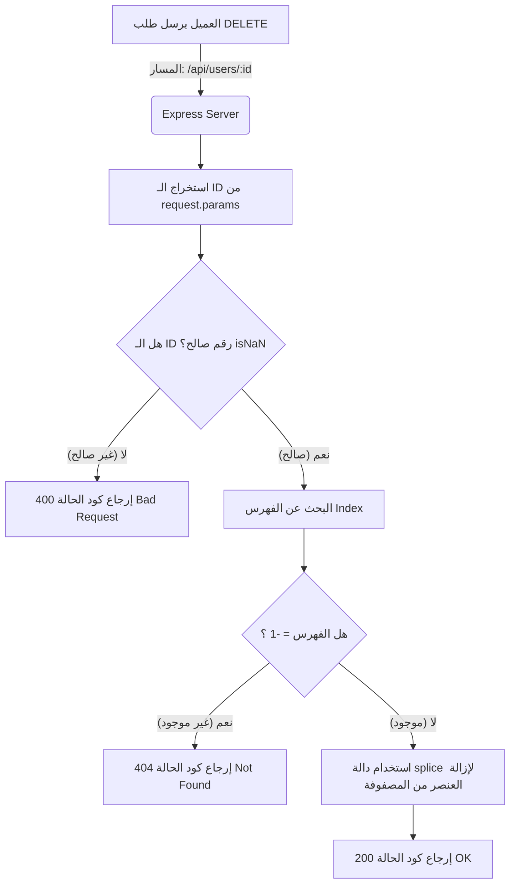

## طلبات الحذف (DELETE Requests) في إطار العمل Express.js

### المفاهيم الأساسية (Core Concepts)

#### 1. طلب الحذف (DELETE Request)

- **التعريف:** هو أحد أفعال بروتوكول HTTP (HTTP Request Methods) المباشرة جداً والبديهية (Straightforward)، يُستخدم بشكل حصري لحذف البيانات أو الموارد الموجودة على الخادم (Backend Server).
- **كيف يعمل؟** في بيئات العمل الحقيقية، يقوم الخادم باستلام هذا الطلب وتوجيهه لحذف السجل من مصدر البيانات (Data Source) المرتبط به، مثل قواعد بيانات SQL أو MongoDB. في بيئة التطوير الحالية (التي تعتمد على الذاكرة)، نقوم بحذف العنصر من المصفوفة الوهمية.
- **متى نستخدمه؟** عندما يرغب العميل في التخلص من سجل معين (مثل حذف حساب مستخدم، أو إلغاء طلب شراء).

#### 2. جسم الطلب (Request Body / Payload) في عمليات الحذف

يوجد قاعدة هامة في طلبات الـ DELETE يجب استيعابها لتجنب الأخطاء:

- **الوضع الافتراضي (Typically):** أنت **لا تحتاج** إلى إرسال جسم طلب (Request Body / Payload) مع طلبات الحذف. كل ما تحتاجه عادةً هو المُعرّف (ID) الخاص بالعنصر المراد حذفه والذي يتم تمريره عبر مسار الرابط (Route Parameter) .
- **الاستثناء (Exceptions):** ومع ذلك، **يُسمح لك** بإرسال بيانات إضافية في جسم الطلب إذا كان منطق الخادم (Server-side logic) الخاص بك يتطلب وجود بيانات معينة (Payload) لتنفيذ عمليات إضافية أثناء الحذف. ال framework لن يمنعك من ذلك.

---

### هندسة معالجة الحذف (Deletion Architecture)

الرسم التالي يوضح تدفق البيانات ودورة حياة الطلب عند استخدام `app.delete()`:



---

### التطبيق العملي: بناء مسار الحذف (Practical Implementation)

لإنشاء مسار الحذف، سنستخدم دالة `app.delete()`. كما فعلنا في طلبات `PUT` و `PATCH`، سنقوم بإعادة استخدام نفس المسار `/api/users/:id`. لا توجد مشكلة في ذلك لأن الخادم يفرق بين المسارات بناءً على نوع الطلب (HTTP Method).

#### الخطوات البرمجية (Steps)

`‏`**Step 1: تعريف المسار واستخراج المُعرّف** نقوم بتسجيل المسار. وبما أننا لا نحتاج لاستخراج جسم الطلب (Body)، سنقوم فقط بفك بنية (Destructuring) الـ `id` من الكائن `request.params` ليكون الكود أكثر نظافة (Cleaner) .
`‏`**Step 2: التحقق من صحة المُعرّف (Validation)** تحويل المُعرّف إلى قيمة رقمية صالحة عبر دالة `()parseInt`. إذا كان الناتج غير رقمي (Not a Number - `isNaN`)، نعيد الاستجابة بحالة `400` (Bad Request) والتي تعني طلب سيء بسبب خطأ في المدخلات.

`‏`**Step 3: البحث عن موقع العنصر (Finding the Index)** نستخدم دالة `findIndex()` للبحث عن موقع المستخدم داخل المصفوفة `mockUsers`. إذا أرجعت الدالة `-1`، فهذا يعني أن المستخدم المراد حذفه غير موجود، فنقوم بإرجاع رمز الحالة `404` (Not Found).

`‏`**Step 4: حذف العنصر من المصفوفة (Deletion Logic)** هنا نقوم باستخدام دالة المصفوفات المدمجة `splice()` لإزالة العنصر من المصفوفة.

> `‏` **Important Note** **الخطأ الشائع مع دالة `splice` (تجربة المحاضر):** دالة `splice` تأخذ معاملين أساسيين: (الفهرس الذي سيبدأ منه الحذف، وعدد العناصر المراد حذفها `deleteCount`). في بداية التطبيق، نسي المحاضر تمرير المُعامل الثاني `deleteCount`، مما أدى إلى حذف العنصر المحدد **وجميع العناصر التي تليه** في المصفوفة [4، 5، 7]. **الحل الصحيح:** يجب تمرير الرقم `1` كعدد لعناصر الحذف (`mockUsers.splice(findUserIndex, 1)`) لضمان إزالة المستخدم المطلوب فقط.

`‏`**Step 5: إرسال الاستجابة (Sending Response)** بمجرد الحذف بنجاح، نستخدم دالة `sendStatus(200)` لإخبار العميل بتمام العملية.

---

### الشرح التفصيلي للكود (Code Block)

إليك الكود المكتمل بناءً على الشرح والأخطاء التي تم تصحيحها:

```javascript
// Step 1: تسجيل مسار החذف باستخدام دالة app.delete
app.delete('/api/users/:id', (request, response) => {

    // استخراج الـ ID من متغيرات المسار
    const { params: { id } } = request; // [2، 3]

    // Step 2: تحويل النص إلى رقم والتحقق من صحته
    const parsedId = parseInt(id); //
    if (isNaN(parsedId)) {
        // إذا كان المدخل غير صالح، أرجع 400
        return response.sendStatus(400); //
    }

    // Step 3: تحديد فهرس (Index) المستخدم المراد حذفه
    const findUserIndex = mockUsers.findIndex(user => user.id === parsedId); //

    if (findUserIndex === -1) {
        // إذا لم يُعثر على المستخدم، أرجع 404
        return response.sendStatus(404); //
    }

    // Step 4: إزالة المستخدم من المصفوفة
    // استخدمنا الرقم 1 كـ deleteCount لتجنب خطأ مسح باقي المصفوفة
    mockUsers.splice(findUserIndex, 1); //

    // Step 5: إرجاع حالة النجاح
    return response.sendStatus(200); //
});
```

---

### ملاحظات وأدوات هامة للمطورين (Developer Tools & Tips)

خلال الشرح، تطرق المحاضر لبعض النقاط المهمة المتعلقة ببيئة التطوير:

1. **أدوات التحليل اللغوي (Linters):** أثناء كتابة الكود، أخطأ المحاضر في كتابة اسم المتغير `parsedId` وكتبه `parse ID` مما تسبب في توقف التطبيق. النصيحة الأكاديمية: يوصي المحاضر بشدة باستخدام أداة **Linter** (مثل ESLint في JavaScript). هذه الأدوات تقوم باكتشاف الأخطاء المطبعية (Typos) والأخطاء الإملائية في المتغيرات قبل تشغيل الكود، مما يوفر الكثير من وقت التصحيح (Debugging).
    
2. **اختبار واجهة برمجة التطبيقات عبر Thunder Client:** لاختبار طلب الـ DELETE، استخدم المحاضر أداة Thunder Client داخل VS Code:
    
    - اختر نوع الطلب `DELETE`.
    - أدخل الرابط: `localhost:3000/api/users/2` (لإزالة المستخدم رقم 2).
    - **لا تقم** بتضمين أي شيء في تبويب الـ Body.
    - اضغط Send وتأكد من استلام الرد `200 OK`.
    - عند محاولة طلب `GET` لنفس المستخدم لاحقاً، سيرد الخادم بـ `404 Not Found` مما يؤكد نجاح الحذف .

---

### نظرة على أفعال HTTP المتقدمة (Advanced HTTP Request Methods)

بإتمام دراسة طلبات الحذف، تكون قد أتقنت أهم 5 أفعال رئيسية في بروتوكول HTTP تستخدم في بناء واجهات برمجة التطبيقات وهي: (GET, POST, PUT, PATCH, DELETE).

يشير المحاضر إلى وجود أفعال أخرى أقل شيوعاً يمكن العثور عليها في توثيقات موزيلا (Mozilla Docs)، ورغم أنك لن تستخدمها بكثرة، إلا أنه من الجيد معرفة بوجودها:

| الفعل (HTTP Method) |                                                  الاستخدام (Use Case Overview)                                                  |
| :-----------------: | :-----------------------------------------------------------------------------------------------------------------------------: |
|      **HEAD**       | يُستخدم لجلب ترويسات الاستجابة (Headers) فقط دون استرجاع جسم الاستجابة (Body). مفيد لفحص الروابط أو معرفة حجم الملف قبل تحميله. |
|     **OPTIONS**     |                        يُستخدم لمعرفة خيارات الاتصال المتاحة والمدعومة من قبل الخادم ل(Endpoint) معينة.                         |
|     **CONNECT**     |                       يُستخدم لإنشاء نفق (Tunnel) إلى الخادم، يُستخدم عادةً مع الخوادم الوكيلة (Proxies).                       |
|      **TRACE**      |                    يُستخدم لإجراء اختبار استرجاع لرسالة الطلب (Loop-back test) لأغراض التشخيص وتتبع المسار.                     |

> `‏` **Important Note** يوضح المحاضر أنك لن تحتاج غالباً للتعامل مع الأفعال (HEAD, OPTIONS, CONNECT, TRACE) في مهامك اليومية كمطور Backend، ولكن إذا ظهرت حالة استخدام (Use Case) تتطلبها مستقبلاً، يمكنك ببساطة قراءة توثيقها واستخدامها بناءً على الحاجة.