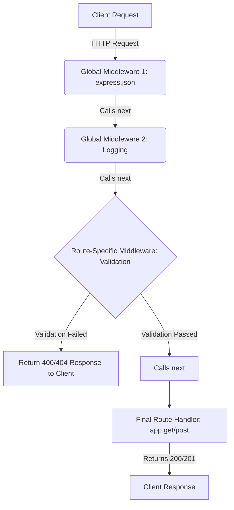

## البرمجيات الوسيطة (Middleware) في Express.js

### المفاهيم الأساسية (Core Concepts)

#### 1. البرمجية الوسيطة (Middleware)
*   **التعريف العام:** في بيئات العمل المختلفة، يُقصد بها أي عملية أو معالجة تقع في المنتصف (Middle Process) بين دالة أو دالتين أو عدة دوال وعمليات أخرى.
*   **التعريف في Express.js:** هي دالة (Function) تحتوي على منطق برمجي (Logic) وتعمل كمعالج طلبات (==Request Handler==). هذه الدالة تمتلك صلاحية الوصول إلى كائنات الطلب (Request) والاستجابة (Response)، ويمكن استخدامها لإرجاع استجابة للعميل مباشرة.
*   **لماذا نستخدمها؟**
    *   تُستخدم لكتابة منطق برمجي قابل لإعادة الاستخدام (Reusable Logic) وتطبيقه على  (Endpoints) متعددة تشترك في نفس الاحتياجات.
    *   توفر تحكماً كاملاً في دورة حياة الطلب (Request Lifecycle).
*   **متى نستخدمها؟**
    *   لتسجيل بيانات الطلبات (Logging).
    *   لتحليل البيانات الواردة (مثل `express.json`).
    *   للتحقق من صلاحيات الدخول، مثل التأكد من وجود رمز توثيق (Authorization Token). وإذا لم يكن موجوداً، تقوم الدالة برفض الطلب بإرسال كود `401`.
    *   لاستخراج البيانات المشتركة من قاعدة البيانات والتحقق منها قبل وصول الطلب للمسار النهائي.

#### 2. دالة الانتقال (Next Function)
*   **التعريف:** هي دالة تُمرر ك (Argument) ثالث إلى البرمجية الوسيطة بعد `request` و `response`. 
*   **الفكرة الأساسية وكيف تعمل؟** وظيفتها الأساسية هي إخبار إطار العمل Express بأن البرمجية الوسيطة الحالية قد انتهت من عملها، ويجب الانتقال لتنفيذ البرمجية الوسيطة أو معالج الطلب الذي يليها في السلسلة (Sequential Order).

> `‏` **Important Note**
> **الخطأ الشائع - حالة التعليق (Pending State):**
> إذا لم تقم باستدعاء الدالة `()next` داخل البرمجية الوسيطة (ولم تقم بإرجاع استجابة `response` للعميل)، سيبقى الطلب عالقاً في "حالة تعليق" (Pending State) إلى ما لا نهاية. الخادم سينفذ الكود، لكن العميل لن يتلقى أي استجابة أبداً. يجب دائماً التأكد من استدعاء `()next` لاستكمال السلسلة.

> `‏` **Important Note**
> **خيارات دالة `()next` والتعامل مع الأخطاء:**
> 1. الاستدعاء الفارغ `next()`: ينتقل للمحطة التالية بسلام مفترضاً نجاح العملية.
> 2. الاستدعاء مع خطأ `next(new Error(...))`: إذا مررت كائن خطأ (Error Instance) بداخلها، ستقوم Express برمي خطأ (Throw an error) على مستوى ال frame work.
> 3. عدم استدعائها اختيارياً: تمتلك البرمجية الوسيطة **خيار** عدم استدعاء `()next` إذا أرادت إيقاف الطلب تماماً (مثلاً: إرجاع استجابة فشل `res.status(401)` لعدم وجود توثيق).

---

### هندسة وتدفق البرمجيات الوسيطة (Middleware Flow Architecture)

يتم استدعاء البرمجيات الوسيطة بتسلسل متتابع (Sequential Order). الرسم التالي يوضح تدفق الطلب من العميل عبر عدة برمجيات وسيطة وصولاً إلى نقطة النهاية (Endpoint):


*(ملاحظة: معالج الطلب النهائي هو أيضاً Middleware، ولكنه غالباً لا يحتاج لمعامل `next` لأنه المحطة الأخيرة).*

---

### تسجيل البرمجيات الوسيطة (Registering Middleware)

هناك طريقتان لتسجيل البرمجية الوسيطة في Express:

|        الميزة        |               التسجيل العام (Globally)                |               التسجيل المخصص (Route-Specific)                |
| :------------------: | :---------------------------------------------------: | :----------------------------------------------------------: |
| **الأداة المستخدمة** |                   دالة `()app.use`                    |              دالة المسار `()app.get` أو أخواتها              |
|     **التأثير**      | يتم تنفيذها على **جميع** ال(Endpoints) المسجلة بعدها. |      يتم تنفيذها حصراً على المسار الذي تم تمريرها إليه.      |
|  **طريقة التنفيذ**   |             `app.use(middlewareFunction)`             | `app.get('/route', middlewareFunction, (req, res) => {...})` |

> `‏` **Important Note**
> **الترتيب يهم جداً (Order Matters):**
> عند استخدام `()app.use` لتسجيل برمجية عامة، ==يجب أن تضع الكود **قبل** دوال المسارات== (مثل `app.get` و `app.post`). إذا قمت بتسجيل البرمجية الوسيطة أسفل مسار معين في الكود، فإن هذا المسار العلوي لن يمر عبر البرمجية الوسيطة إطلاقاً .

---

### التطبيق العملي 1: إنشاء برمجية تسجيل (Logging Middleware)

في هذا المثال، سنقوم بإنشاء برمجية وسيطة بسيطة لطباعة نوع الطلب ومساره في الطرفية (Console) عند كل طلب.

```javascript
// Step 1: إنشاء دالة البرمجية الوسيطة
// يجب أن تستقبل 3 معاملات: request, response, next
const loggingMiddleware = (request, response, next) => {
    
    // Step 2: كتابة المنطق البرمجي (طباعة نوع الطلب والرابط)
    console.log(request.method); // يطبع: GET, POST, PUT...
    console.log(request.url);    // يطبع مسار الرابط

    // Step 3: استدعاء دالة next للانتقال للمرحلة التالية
    // بدونها سيتعلق الطلب ولن يتم تنفيذ المسار المطلوب
    next(); 
};

// Step 4: تسجيل البرمجية لتشمل كل المسارات (تسجيل عام)
// يمكن أيضاً تمرير عدة دوال وسيطة متتابعة داخل app.use
app.use(loggingMiddleware); 
```

---

### التطبيق العملي 2: حالة عملية متقدمة (Advanced Case Study & Refactoring)

**المشكلة:**
 مسارات (PUT, PATCH, DELETE) تمتلك كوداً متكرراً للتحقق من صحة المُعرّف `id` (هل هو رقم أم لا؟)، وللبحث عن موقع المستخدم في المصفوفة (User Index). الكود المتكرر يقلل من جودة التطبيق.

**الحل:**
استخراج هذا المنطق البرمجي المتكرر ووضعه داخل برمجية وسيطة مخصصة أطلق عليها المحاضر اسم `resolveIndexByUserId`.

#### معضلة تمرير البيانات (The Data Passing Dilemma)
البرمجية الوسيطة ستقوم باستخراج الفهرس (Index)، ولكن كيف ستتمكن البرمجية التي تليها (وهي معالج الطلب النهائي) من معرفة هذا الفهرس لاستخدامه في تحديث البيانات؟
*   **القاعدة:** لا توجد طريقة مباشرة (Direct way) لتمرير المتغيرات من دالة Middleware إلى دالة أخرى.
*   **الحل التقني:** بفضل طبيعة لغة JavaScript الديناميكية، يمكننا إنشاء وإرفاق خصائص جديدة (Properties) بداخل كائن الطلب `request` ديناميكياً. وبما أن كائن الطلب يعبر جميع محطات الـ Middleware، فإن أي تعديل عليه سيكون متاحاً للمحطات اللاحقة .

#### الخطوات البرمجية لإعادة الهيكلة (Step-by-Step Refactoring):

`‏` **Step 1: بناء البرمجية الوسيطة `resolveIndexByUserId`**

```javascript
// تعريف الدالة كبرمجية وسيطة
const resolveIndexByUserId = (request, response, next) => {
    
    // استخراج ID من الرابط
    const { params: { id } } = request;
    const parsedId = parseInt(id);
    
    // التحقق من صحة المعرف وإرجاع رد مباشرة إذا كان خاطئاً (إنهاء الطلب هنا)
    if (isNaN(parsedId)) {
        return response.sendStatus(400); 
    }
    
    // البحث عن الفهرس
    const findUserIndex = mockUsers.findIndex(user => user.id === parsedId);
    if (findUserIndex === -1) {
        return response.sendStatus(404);
    }
    
    // === الخطوة الأهم: إرفاق البيانات بكائن الطلب ===
    // نقوم بإنشاء خاصية جديدة (findUserIndex) داخل كائن الـ request
    // ونسند إليها قيمة الفهرس الذي وجدناه
    request.findUserIndex = findUserIndex;
    
    // الانتقال لمعالج الطلب النهائي
    next();
};
```

`‏` **Step 2: تطبيق البرمجية على المسارات (Routes Injection)**

الآن يمكننا تنظيف المسارات السابقة لتصبح أقصر بكثير، حيث تتولى البرمجية الوسيطة كل أعباء التحقق (Validation) ومعالجة الأخطاء (400, 404).

**مثال على مسار الـ PUT بعد التحسين:**

```javascript
// تمرير البرمجية الوسيطة كمعامل ثاني قبل معالج الطلب النهائي
app.put('/api/users/:id', resolveIndexByUserId, (request, response) => {
    
    // استخراج body للبيانات الجديدة
    const { body } = request;
    
    // === استخراج الفهرس الممرر من البرمجية الوسيطة ===
    const { findUserIndex } = request;
    
    // تحديث المستخدم باستخدام الفهرس
    mockUsers[findUserIndex] = {
        // الحفاظ على ID القديم (نستخرجه من المصفوفة مباشرة بدلاً من الـ params التي تم مسحها)
        id: mockUsers[findUserIndex].id, 
        ...body
    };
    
    // إرسال رد النجاح
    return response.sendStatus(200);
});
```

`‏`**Step 3: توحيد بيئة العمل (Consistency)**
قام المحاضر بتطبيق نفس البرمجية `resolveIndexByUserId` على مسارات الـ **PATCH** والـ **DELETE** والـ **GET**.
في مسار الـ GET، بدلاً من استخدام دالة `find` للبحث عن الكائن كاملاً، أصبح التطبيق يستخدم الفهرس المستخرج من البرمجية الوسيطة لجلب المستخدم من المصفوفة مباشرة هكذا `mockUsers[findUserIndex]`، لضمان اتساق العمليات (Consistency) عبر كافة المسارات.

### تجربة التطبيق (Testing)
تم اختبار الكود عبر أداة Thunder Client:
*   تم إرسال طلب PUT لتحديث المستخدم ذي الرقم `3` (Adam).
*   تم تمرير الاسم الجديد `Jackie` في الـ Body.
*   تم تحديث الاسم بنجاح وتم مسح باقي البيانات (حسب طبيعة عمل PUT).
*   عند إرسال معرف خاطئ أو غير موجود، قامت البرمجية الوسيطة بالتقاط الخطأ بنجاح وإرجاع `400` أو `404` دون الحاجة لتكرار كود التحقق في كل مسار .

